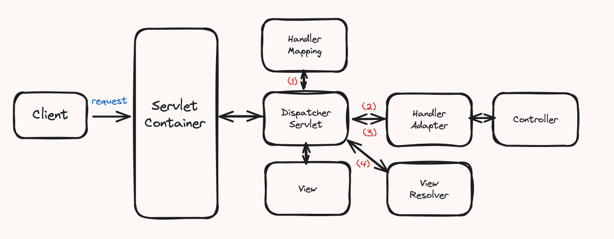
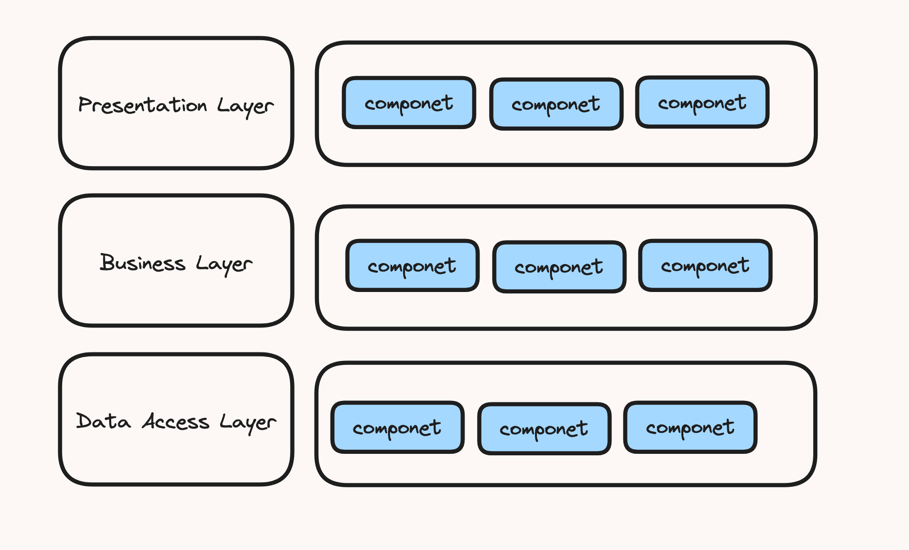
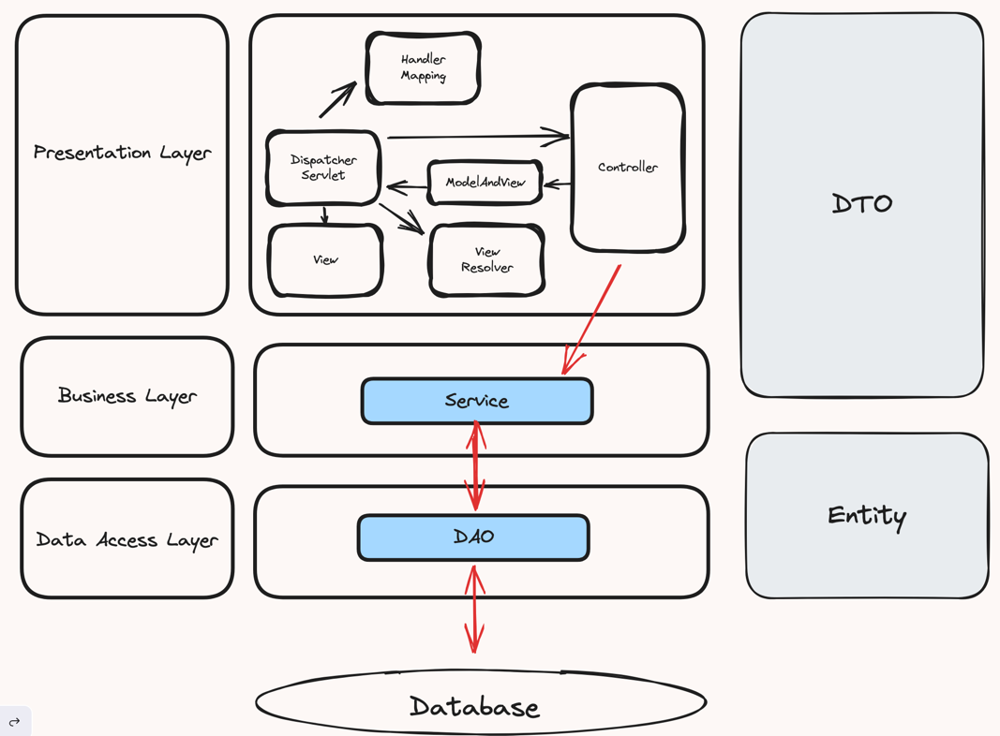

> [스프링부트 핵심가이드](https://ridibooks.com/books/1160000073?_s=search&_q=%EC%8A%A4%ED%94%84%EB%A7%81%EB%B6%80%ED%8A%B8+%ED%95%B5%EC%8B%AC&_rdt_sid=search&_rdt_idx=0)을 읽고 정리한 내용입니다.
>
> 위 책의 Part 1, 2, 3을 읽고 정리한 내용을 다루고 있습니다.

## Part 1. 스프링 부트란?

스프링 부트에 대해 알아보기 전, 스프링 프레임워크에 대해 알아보겠습니다.

> 스프링의 핵심 가치 : "애플리케이션 개발에 필요한 기반을 제공해서 개발자가 비즈니스 로직 구현에만 집중할 수 있게끔 하는 것"

### 스프링의 특징과 구조

#### 제어 역전(Inversion of Control, IoC)

- 일반적인 자바 코드에서의 객체 사용법
```java 
/// showLineNumber
/// title: code.java
@RestController
public class NoDIController {
    private MyService myService = new MyServiceImpl();
    
    @GetMapping("/no-di/hello")
    public String getHello() {
        return service.getHello();
    }
}
```

위 코드는 객체를 생성하고 사용하는 일련의 작업을 개발자가 직접 제어하는 구조입니다.

하지만, `IoC`을 특징으로 하는 스프링은 사용할 객체를 직접 생성하지 않고 객체의 생명주기 관리를 외부에 위임합니다.

여기서 **'외부'**는 `Spring Container` 또는 `IoC Container`를 의미합니다. 이처럼 객체의 관리를 컨테이너에 맡겨 제어권이
넘어간 것을 제어 역전이라고 부르며, 제어 역전을 통해 `의존성 주입(Dependency Injection, DI)`, `관점 지향 프로그래밍(Aspect Oriented Programming, AOP)` 등의 기능을 제공합니다.


이렇게 스프링을 사용하면 객체의 제어권을 컨테이너로 넘기기 때문에 개발자는 비즈니스 로직을 작성하는데 더 집중할 수 있습니다.

#### 의존성 주입(Dependency Injection, DI)

의존성 주입이란 IoC의 구현 방식 중 하나로, 사용할 객체를 직접 생성하지 않고 외부 컨테이너가 생성한 객체를 주입받아 사용하는 방식을 의미합니다.

스프링에서 의존성을 주입받는 방식은 세가지가 있습니다.

<details>
<summary><span style="color: red">생성자</span>를 통한 의존성 주입 <span style="color: #0a53be">(권장)</span></summary>
<div markdown="1">

```java 
/// showLineNumber
/// title: code.java
@RestController
public class DIController {
    private final MyService myService;
    
    public DIController(MyService myService) {
        this.myService = myService;
    }
    
    @GetMapping("/di/hello")
    public String getHello() {
        return service.getHello();
    }
}
```

</div>
</details>


<details>
<summary><span>필드 객체 선언</span>를 통한 의존성 주입</summary>
<div markdown="1">

```java
/// showLineNumber
/// title: code.java
@RestController
public class FieldInjectionController {
    @Autowired
    private MyService myService;
    
    @GetMapping("/field-injection/hello")
    public String getHello() {
        return service.getHello();
    }
}
```

</div>
</details>

<details>
<summary><span>setter 메서드</span>를 통한 의존성 주입</summary>
<div markdown="1">

```java
/// showLineNumber
/// title: code.java
@RestController
public class SetterInjectionController {
    private MyService myService;
    
    @Autowired
    public void setMyService(MyService myService) {
        this.myService = myService;
    }
    
    @GetMapping("/setter-injection/hello")
    public String getHello() {
        return service.getHello();
    }
}
```

</div>
</details>

#### 관점 지향 프로그래밍(Aspect Oriented Programming, AOP)

AOP는 관점을 기준으로 묶어 개발하는 방식을 의미합니다. 여기서 관점(aspect)이란 어떤 기능을 구현할 때 그 기능을
`핵심 기능`과 `부가 기능`으로 구분하여 각각을 하나의 관점으로 보는 것을 의미합니다.

- `핵심 기능` : 핵심 비즈니스 로직을 구현한 코드
  - ex) 상품 정보를 DB에 저장, 상품 정보를 DB에서 조회 ...
- `부가 기능` : 핵심 기능을 실행하기 위해 필요한 공통 기능
  - ex) 트랜잭션 처리, 로깅, 보안, 예외 처리 ...

즉, AOP는 여러 비즈니스 로직에서 반복되는 부가 기능을 하나의 공통 로직으로 처리하도록 모듈화하는 프로그래밍 기법입니다.

보통 AOP를 구현하는 방법은 `프록시 패턴`을 사용합니다.

### 스프링 프레임워크 vs 스프링 부트

스프링 프레임워크는 기존 개발 방식의 문제와 한계를 극복하기 위해 다양한 기능을 제공합니다.

하지만 기능이 많은 만큼 설정이 복잡한 편입니다. 이러한 문제를 해결하기 위해 스프링 부트가 등장했습니다.

#### 스프링 프레임워크의 특징

- 의존성 관리 
  - `spring-boot-starter`라는 이름의 의존성을 추가하면 스프링 부트에서 자동으로 필요한 의존성을 추가해줍니다.
- 자동 설정
  - @SpringBootApplication 어노테이션을 사용하면 스프링 부트에서 자동으로 설정을 해줍니다.
  - @SpringBootApplication 어노테이션은 @SpringBiitConfiguration, @EnableAutoConfiguration, @ComponentScan 어노테이션을 포함하고 있습니다.
- 내장 서버 (WAS)
  - `spring-boot-starter-web` 의존성은 톰캣 서버를 내장하고 있습니다.
- 모니터링
  - `Spring Boot Actuator`를 사용하면 애플리케이션의 상태를 모니터링할 수 있습니다. (11장에서 다룹니다.)

## Part 2. 개발에 앞서 알면 좋은 기초 지식

### 서버 간 통신

서버 간 통신은 한 서버가 다른 서버에 통신을 요청하는 것을 의미하며, 한 대는 서버, 다른 한대는 클라이언트가 되는 구조입니다.
몇 가지 프로토콜에 의해 다양한 통신 방식을 적용할 수 있지만, 가장 많이 사용되는 방식은 `HTTP/HTTPS` 입니다.

### 스프링 부트의 동작 방식

스프링 부트에서 `spring-boot-starter-web` 모듈을 사용하면 기본적으로 톰캣을 사용하는 스프링MVC 구조를 기반으로 동작합니다.
아래 그림은 일반적인 웹 요청이 들어왔을 때의 스프링 부트의 동작 구조입니다.



`서블릿(Servlet)`은 클라이언트의 요청을 처리하고 결과를 반환하는 자바 웹 프로그래밍 기술입니다.

일반적으로 서블릿은 서블릿 컨테이너에서 관리합니다. 서블릿 컨테이너는 서블릿 인스턴스를 생성하고 관리하는 역할을
수행하는 주체로서 톰캣은 WAS의 역할과 서블릿 컨테이너의 역할을 수행하는 대표적인 컨테이너입니다.

서블릿 컨테이너의 특징은 다음과 같습니다.
- 서블릿 객체를 생성, 초기화, 호출, 종료하는 생명주기를 관리합니다.
- 서블릿 객체는 `싱글톤 패턴`으로 관리됩니다.
- 멀티 스레딩을 지원합니다.

스프링에서는 `DispatcherServlet`이 서블릿의 역할을 수행합니다. 일반적으로 스프링은 톰캣을 embed해 사용합니다.
그렇기 때문에 서블릿 컨테이너와 DispatcherServlet은 자동 설정된 `web.xml`의 설정값을 공유합니다.

위 그림에 있는 `DispatcherServlet`의 동작을 간략히 살펴보겠습니다.
1. 클라이언트의 요청이 들어오면 `DispatcherServlet`이 요청을 받습니다.
2. `DispatcherServlet`은 `HandlerMapping`을 통해 요청 URI에 매핑된 `Handler`를 찾습니다. (여기서 Handler는 Controller를 의미합니다.)
3. `DispatcherServlet`은 `HandlerAdapter`를 통해 `Handler`를 호출합니다.
4. `HandlerAdapter`에 Controller(Handler)의 응답이 돌아오면 `ModelAndView`를 가공해 반환합니다.
5. `DispatcherServlet`은 `ViewResolver`를 통해 `ModelAndView`에 매핑된 뷰를 찾아 렌더링합니다.

### 레이어드 아키텍처

레이어드 아키텍처(Layered Architecture)란 애클리케이션의 컴포넌트를 유사 관심사를 기준으로 레이어로 묶어 수평적으로 구성한 구조를 의미합니다.
레이어드 아키텍처는 여러 방면에서 쓰이는 개념이며, 어떻게 설계하느냐에 따라 용어와 계층의 수가 달라집니다.

일반적으로 레이어드 아키텍처는 3계층 또는 4계층으로 이루어지는데, 이 차이는 인프라(데이터 베이스) 레이어의 추가 여부로 결정됩니다.
이번 장에서는 3계층으로 이뤄진 레이어드 아키텍처를 살펴보겠습니다.



1. `Presentation Layer`
  - 애플리케이션의 최상단 계층으로, 클라이언트의 요청을 해석하고 응답하는 역할입니다.
  - UI나 API를 제공합니다.
  - 프레젠테이션 계층은 별도의 비즈니스 로직을 포함하고 있지 않으므로 비즈니스 계층으로 요청을 위임하고 받은 결과를 응답하는 역할만 수행합니다.
2. `Business Layer`
  - 애플리케이션이 제공하는 기능을 정의하고 세부 작업을 수행하는 도메인 객체를 통해 업무를 위임하는 역할을 수행합니다.
3. `Data Access Layer`
   - 데이터베이스에 접근하는 일련의 작업을 수행합니다.



위 그림은 레이어디 아키텍처를 스프링에 적용한 모습입니다.

Spring MVC는 Model-View-Controller의 구조로 
- View, Controller를 Presentation Layer
- Model은 Business Layer, Data Access Layer로 구분할 수 있습니다.

다만, 스프링 MVC 모델로 레이어드 아키텍처를 구현하기 위해서는 역할을 세분화합니다.
Business Layer는 Service, Data Access Layer는 Repository로 구분합니다.

