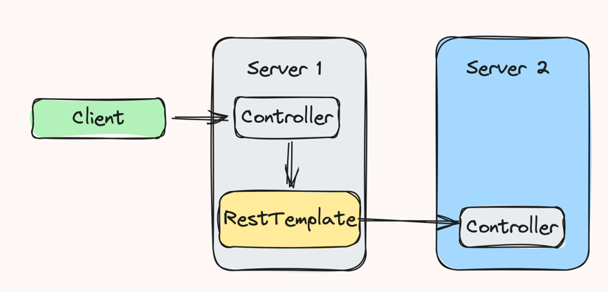

# Part 12. 서버 간 통신

이번 장에서는 다른 서버로 웹 요청을 보내고 응답을 받을 수 있게 도와주는 `RestTemplate`과 `WebClient`를 다룰 예정입니다.

## RestTemplate이란?

`RestTemplate`은 스프링에서 HTTP 통신 기능을 손쉽게 사용하도록 설계된 템플릿입니다. HTTP 서버와의 통신을 단순화한 이 템플릿을 이용하면 RESTful 원칙을 따르는 서비스를 편리하게 만들 수 있습니다.
기본적으로 **동기 방식**으로 처리되며, 비동기 방식으로 사용하고 싶을 경우 `AsyncRestTemplate`을 사용하면 됩니다. 다만 `RestTemplate`은 현업에서 많이 쓰이나 지원 중단된 상태라서
향후 빈번하게 쓰이게 될 `WebClient`를 사용하는 것을 권장합니다.

:::tip RestTemplate의 특징
- HTTP 프로토콜의 메서드에 맞는 여러 메서드를 제공합니다.
- RESTful 형식을 갖춘 템플릿입니다.
- HTTP 요청 후 JSON,XML,문자열 등의 다양한 형식으로 응답을 받을 수 있습니다.
- 블로킹(blocking) I/O 기반의 동기 방식을 사용합니다.
- 다른 API를 호출할 때 HTTP 헤더에 다양한 값을 설정할 수 있습니다.
:::

### RestTemplate 동작방식


1. Application : 우리가 직접 작성하는 애플리케이션 코드 구현부를 의미합니다. 여기서 RestTemplate을 선언하고 URI와 HTTP 메서드, Body 등을 설정합니다.
2. 그리고 외부 API로 요청을 보내게 되면 RestTemplate에서 `HttpMessageConverter를` 통해 `RequestEntity를` 요청 메시지로 변환합니다.
3. RestTemplate에서는 변환된 요청 메시지를 `ClientHttpRequestFactory`를 통해 `ClientHttpRequest`로 가져온 후 외부 API로 요청을 보냅니다.
4. 외부에서 요청에 대한 응답을 받으면 RestTemplate은 `ResponseErrorHandler`로 오류를 확인하고, 오류가 있다면 `ClientHttpResponse`에서 응답 데이터를 처리합니다.
5. 받은 응답 데이터가 정상적이라면 다시 한번 `HttpMessageConverter`를 통해 `ResponseEntity`로 변환합니다.

### RestTemplate 대표 메서드


## RestTemplate 사용하기

일반적으로 RestTemplate은 별도의 유틸리티 클래스로 생성하거나, 서비스 또는 비즈니스 계층에 구현됩니다.



### GET 형식의 RestTemplate 작성하기

```java
/// title: RestTemplateService.java
@Service
public class RestTemplateService {

    public String getName() {
    URI uri = UriConponentsBuilder // URI를 생성하는 빌더 클래스
        .fromUriString("http://localhost:8080")
        .path("/api/server/{name}")
        .encode() // default는 UTF-8
        .build()
        .expand("test") // {name}에 들어갈 값 (복수의 값을 넣을 경우 ','로 구분)
        .toUri();
        
    RestTemplate restTemplate = new RestTemplate();
    ResponseEntity<String> result = restTemplate.getForEntity(uri, String.class);
    
    return result.getBody();
    }
}
```

### POST 형식의 RestTemplate 작성하기

```java
/// title: RestTemplateService.java
// ...
public ResponseEntity<MemberDto> postWithParamAndBody() {
    URI uri = UriComponentsBuilder
        .fromUriString("http://localhost:8080")
        .path("/api/server/test")
        .queryParam("name", "test")
        .queryParam("age", 10)
        .encode()
        .build()
        .toUri();
        
    MemberDto memberDto = MemberDto.builder()
                                   .name("test")
                                   .age(10)
                                   .build();
 
    RequestEntity<MemberDto> requestEntity = RequestEntity
                                                .post(uri)
                                                .contentType(MediaType.APPLICATION_JSON) // 요청 헤더
                                                .header("x-authorization", "abcd") // 요청 헤더
                                                .header("custom-header", "ffff") // 요청 헤더
                                                .body(memberDto);
                                                
    RestTemplate restTemplate = new RestTemplate();
    ResponseEntity<MemberDto> responseEntity = restTemplate.exchange(requestEntity, MemberDto.class);
    
    return responseEntity;                                  
}
```

## WebClient란?

Spring WebFlux는 HTTP 요청을 수행하는 클라이언트로 `WebClient`를 제공합니다. 리액터(Reactor)를 기반으로 동작하며, 스레드와 동시성 문제를 벗어나 비동기 형식으로 사용할 수 있습니다.

> 리액터(Reactor)는 자바 8에서 소개된 리액티브 프로그래밍을 구현한 라이브러리입니다. 리액터는 비동기 스트림을 지원하며, 스트림을 통해 데이터를 처리할 수 있습니다.

:::tip WebClient의 특징
- 논블로킹(Non-Blocking) I/O 기반의 비동기 방식을 사용합니다.
- 리액티브 스트림(Reactive Stream)의 백 프레셔(Back Pressure)를 지원합니다.
- 적은 하드웨어 리소스로 동시성을 지원합니다.
- 함수형 API를 지원합니다.
- 동기,비동기 방식을 모두 지원합니다.
- 스트리밍을 지원합니다.
:::

### WebClient 사용하기

WebClient를 생성하는 방법은 크게 두 가지가 있습니다.

- create() 메서드를 이용한 생성
- builder()를 이용한 생성

```java
/// title: WebClientService.java
@Service
public class WebClientService {

    // builder()를 이용한 생성 
    public String getName() {
        WebClient webClient = WebClient.builder()
                                       .baseUrl("http://localhost:8080")
                                       .defaultHeader(HttpHeaders.CONTENT_TYPE, MediaType.APPLICATION_JSON_VALUE)
                                       .build();
        
        return webClient.get()
            .uri("/apl/v1/test")
            .retrieve()
            .bodyToMono(String.class)
            .block();                                      
    }
    
    // create() 메서드를 이용한 생성
    public String getNameWithPathVariable() {
        WebClient webClient = WebClient.create("http://localhost:8080");
        
        ResponseEntity<String> responseEntity = webClient.get()
                                                         .uri(uriBuilder -> uriBuilder
                                                             .path("/api/v1/{name}")
                                                             .build("test"))
                                                         .retrieve()
                                                         .toEntity(String.class)
                                                         .block();
                                                            
        return responseEntity.getBody();
    }
    
    public String getNameWithParameter() {
        WebClient webClient = WebClient.create("http://localhost:8080");
        
        return webClient.get().uri(uriBuilder -> uriBuilder.path("/api/v1")
                             .queryParam("name", "test")
                             .queryParam("age", 10)
                             .build())
                         .exchangeToMono(clientResponse -> {
                             if (clientResponse.statusCode().equals(HttpStatus.OK)) {
                                 return clientResponse.bodyToMono(String.class);
                             } else {
                                 return clientResponse.createException().flatMap(Mono::error);
                             }
                         })
                         .block();
    }
}
```
