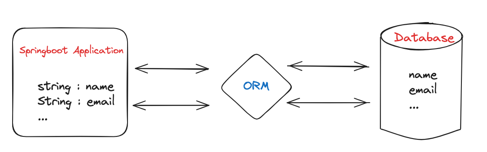
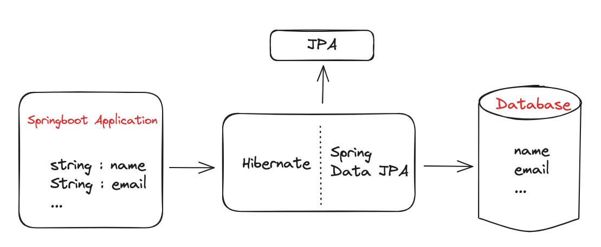

> [스프링부트 핵심가이드](https://ridibooks.com/books/1160000073?_s=search&_q=%EC%8A%A4%ED%94%84%EB%A7%81%EB%B6%80%ED%8A%B8+%ED%95%B5%EC%8B%AC&_rdt_sid=search&_rdt_idx=0)을 읽고 정리한 내용입니다.
>
> 위 책의 Part 6를 읽고 정리한 내용을 다루고 있습니다.

# Part 6. 데이터 베이스 연동

## ORM

ORM(Object Relational Mapping)은 객체 관계 매핑을 의미합니다.

> 자바와 같은 객체지향 언어에서 의미하는 객체(클래스)와 RDB(Relational Database)의 테이블을
> 자동으로 매핑하는 방법입니다. 클래스는 데이터베이스의 테이블과 매핑하기 위해 만들어진 것이
> 아니기 때문에 RDB 테이블과 어쩔 수 없는 불일치가 존재합니다.
> 
> ORM은 이 둘의 **불일치와 제약사항을 해결하는 역할**입니다.
> 

### ORM 장점

1. ORM을 사용하면서 데이터베이트 쿼리를 객체지향적으로 조작할 수 있습니다.
  - 쿼리문을 작성하는 양이 현저히 줄어 개발 비용이 줄어듭니다.
  - 객체지향적으로 데이터베이스에 접근할 수 있어 코드의 가독성을 높입니다.
2. 재사용 및 유지보수가 편리합니다.
  - ORM을 통해 매핑된 객체는 모두 독립적으로 작성되어 있어 재사용이 용이합니다.
  - 객체들은 각 클래스로 나뉘어 있어 유지보수가 수월합니다.
3. 데이터베이스에 대한 종속성이 줄어듭니다.
  - ORM을 통해 자동 생성된 SQL문은 객체를 기반으로 데이터베이스 테이블을 관리하기 떄문에 데이터베이스에 종속적이지 않습니다.
  - 데이터베이스를 교체하는 상황에서도 비교적 적은 리스크를 부담합니다.

### ORM 단점

1. ORM만으로 온전한 서비스를 구현하기에는 한계가 있습니다.
  - 복잡한 서비스의 경우 직접 쿼리를 구현하지 않고 코드로 구현하기 어렵습니다.
  - 복잡한 쿼리를 정확한 설계 없이 ORM만으로 구성하게 되면 속도 저하 등의 성능 문제가 발생할 수 있습니다.
2. 애플리케이션의 객체 관점과 데이터베이스의 관계 관점의 불일치가 발생합니다.
  - 세분성(Granularity) : ORM의 자동 설계 방법에 따라 데이터베이스에 있는 테이블의 수와 애플리케이션의 엔티티 클래스의 수가 일치하지 않을 수 있습니다.
  - 상속성(Inheritance) : 객체지향 프로그래밍 언어에서는 상속이라는 개념이 존재하지만, 데이터베이스에서는 상속이라는 개념이 존재하지 않습니다.
  - 식별성(Identity) : 객체는 참조를 통해 식별되지만, 데이터베이스는 주로 기본키를 통해 식별됩니다.
  - 연관성(Association) : 객체는 참조를 통해 연관되지만, 데이터베이스는 주로 외래키를 통해 연관됩니다.
  - 탐색(Navigation) : 객체는 참조를 통해 탐색하지만, 데이터베이스는 주로 쿼리를 통해 탐색합니다.

## JPA

JPA(Java Persistence API)는 자바 진영의 ORM 기술 표준으로 채택된 인터페이스 모음입니다.

:::tip ORM
ORM이 큰 개념이라면 JPA는 더 구체화된 스펙을 포함합니다.
 
JPA의 매커니즘을 보면 내부적으로 JDBC를 사용합니다. 개발자가 직접 JDBC를 구현하면 SQL에 의존하게 되는
문제 등이 있어 개발의 효율성이 떨어지는데, JPA는 이 같은 문제점을 보완해서 개발자 대신 적절한 SQL문을
생성하고 데이터베이스를 조작해서 객체를 자동 매핑하는 역할을 수행합니다.
:::

## Hibernate

Hibernate는 자바의 ORM 프레임워크로, JPA의 구현체 중 하나입니다.

### Spring Data JPA

Spring Data JPA는 스프링에서 JPA를 쉽게 사용할 수 있도록 도와주는 프레임워크입니다.

> Spring Data JPA는 JPA를 사용하기 위한 인터페이스를 제공하고, Hibernate의 EntityManager를 직접 사용하지 않고
> Repository를 정의해 사용함으로써 개발자가 JPA를 쉽게 사용할 수 있도록 도와줍니다.
> 

## 영속성 컨텍스트

영속성 컨텍스트(Persistence Context)는 애플리케이션과 데이터베이스 사이에서 객체를 보관하는 가상의 데이터베이스라고 생각하면 됩니다.

엔티티 객체가 영속성 컨텍스트에 들어오면 JPA는 엔티티 객체의 매핑 정보를 데이터베이스에 반영합니다.

이처럼 엔티티 객체가 영속성 컨텍스트에 들어와 JPA의 관리 대상이 되는 시점부터 해당 객체를 `영속 객체(Persistent Object)`라고 합니다.

### EntityManager

EntityManager는 이름 그대로 엔티티를 관리하는 객체입니다.

> EntityManager는 데이터베이스에 접근해서 CRUD 작업을 수행하는데, Spring Data JPA를 사용하면
> Repository를 통해 데이터베이스에 접근합니다.

### 엔티티의 생명주기

엔티티의 생명주기는 크게 비영속, 영속, 준영속, 삭제의 4가지 상태로 나뉩니다.

- 비영속(New) : 영속성 컨텍스트에 추가되지 않은 엔티티 객체의 상태를 의미합니다.
- 영속(Managed) : 영속성 컨텍스트에 의해 엔티티 객체가 관리되는 상태를 의미합니다.
- 준영속(Detached) : 영속성 컨텍스트에 저장되었다가 분리된 상태를 의미합니다.
- 삭제(Removed) : 데이터베이스에서 레코드를 삭제하기 위해 영속성 컨텍스트에 삭제 요청을 보낸 상태를 의미합니다.

## 데이터베이스 연동

```groovy 
/// title: build.gradle
  dependencies {
      implementation 'org.springframework.boot:spring-boot-starter-data-jpa'
  }
```

Spring Data JPA 의존성을 추가한 후, 별도의 설정이 필요합니다.

```properties 
/// showLineNumber 
/// title: application.properties
# 연동하려는 데이터베이스의 드라이버
spring.datasource.driverClassName=com.mariadb.cj.jdbc.Driver
# 연동하려는 데이터베이스의 URL
spring.datasource.url=jdbc:mariadb://localhost:3306/springboot
# 연동하려는 데이터베이스의 계정
spring.datasource.username=root
# 연동하려는 데이터베이스의 비밀번호
spring.datasource.password=password

# JPA 설정

# 애플리케이션 실행 시점에 데이터베이스 테이블을 생성하는 방법
spring.jpa.hibernate.ddl-auto=create
# 로그에 하이버네이트가 생성한 SQL문을 출력하는 옵션
spring.jpa.show-sql=true
# 로그에 하이버네이트가 생성한 SQL문을 포맷팅하는 옵션
spring.jpa.properties.hibernate.format_sql=true
```

<details>

<summary>ddl-auto 옵션</summary>

<div markdown="1">

- `create` : 애플리케이션 실행 시점에 기존 테이블을 삭제하고 새로 생성합니다.
- `create-drop` : create와 동일한 기능을 수행하나, 애플리케이션 종료 시점에 테이블을 삭제합니다.
- `update` : 애플리케이션 실행 시점에 객체를 검사하여 변경된 스키마를 갱신합니다. 기존에 저장된 데이터는 유지됩니다.
- `validate` : update처럼 객체를 검사하지만 변경된 스키마를 갱신하지 않습니다. 검사 과정에서 테이블과 엔티티의 스키마가 일치하지 않으면 에러가 발생합니다.
- `none` : ddl-auto 기능을 사용하지 않습니다.

</div>
</details>
