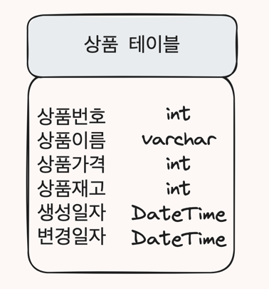

> [스프링부트 핵심가이드](https://ridibooks.com/books/1160000073?_s=search&_q=%EC%8A%A4%ED%94%84%EB%A7%81%EB%B6%80%ED%8A%B8+%ED%95%B5%EC%8B%AC&_rdt_sid=search&_rdt_idx=0)을 읽고 정리한 내용입니다.
>
> 위 책의 Part 6를 읽고 정리한 내용을 다루고 있습니다.

## 엔티티 설계

> 엔티티(Entity)는 데이터베이스 테이블에 대응하는 클래스입니다. 엔티티에는 데이터베이스에 쓰일 테이블과 컬럼을 정의합니다.



```java 
/// showLineNumber 
/// title: Product.java
package com.springboot.jpa.data.entity;

import java.persistence.*;
import java.time.LocalDateTime;

@Entity
@Table(name = "product")
public class Product {
    
    @Id
    @GeneratedValue(strategy = GenerationType.IDENTITY)
    private Long id;
    
    @Column(nullable = false)
    private String name;

    @Column(nullable = false)
    private Integer price;


    @Column(nullable = false)
    private Integer stock;
  
    private LocalDateTime createdAt;
    private LocalDateTime updatedAt;
    
    // ... getter/setter 생략
}
```

ddl-auto 값을 create 같은 테이블 생성하는 옵션으로 설정하면 쿼리문을 작성하지 않아도
데이터베이스에 테이블이 자동으로 만들어집니다.

### 엔티티 관련 기본 어노테이션

#### @Entity

해당 클래스가 엔티티임을 명시하기 위한 어노테이션. 클래스 자체는 테이블과 일대일로 매칭되며,
해당 클래스의 인스턴스는 매핑되는 테이블에서 하나의 레코드를 의미합니다.

#### @Table

엔티티 클래스는 테이블과 매핑되므로 특별한 경우가 아니면 @Table 어노테이션이 필요하지 않습니다.
클래스의 이름과 테이블의 이름이 다른 경우에는 @Table 어노테이션을 사용해서 매핑할 테이블을 지정할 수 있습니다.

#### @Id

엔티티 클래스의 필드는 테이블의 칼럼과 매핑됩니다.

@Id 어노테이션이 선언된 필드는 테이블의 기본값 역할로 사용됩니다. 모든 엔티티는 @Id 어노테이션이 필요합니다.

#### @GeneratedValue

일반적으로 @Id 어노테이션과 함께 사용됩니다. @GeneratedValue 어노테이션은 기본키의 생성 방법을 지정합니다.

- `AUTO` (default) : 특정 데이터베이스에 맞게 기본키를 자동으로 생성합니다.
- `IDENTITY` : 기본키 생성을 데이터베이스에 위임합니다. (데이터베이스의 AUTO_INCREMENT를 사용해 기본키를 생성합니다.)
- `SEQUENCE` : 데이터베이스의 시퀀스를 사용해 기본키를 생성합니다.
  - @SequenceGenerator 어노테이션으로 식별자 생성기를 설정하고 이를 통해 값을 자동 주입받습니다.
  - SequenceGenerator를 정의할 때는 name, sequenceName, allocationSize를 지정해야 합니다.
  ```java 
  /// showLineNumber
  /// title: Product.java
  @Entity
  @SequenceGenerator(name = "product_seq", sequenceName = "product_seq", allocationSize = 1)
  public class Product { 
      @Id
      @GeneratedValue(strategy = GenerationType.SEQUENCE, generator = "product_seq")
      private Long id;
  }
  ``` 
- `TABLE` 
  - 어떤 DBMS를 사용하더라도 동일하게 동작하길 원할 경우 사용합니다.
  - 식별자로 사용할 숫자의 보관 테이블을 별도로 생성하여 엔티티를 생성할 때마다 값을 갱신하며 사용합니다.
  - @TableGenerator 어노테이션으로 테이블 정보를 설정합니다.
  ```java 
  /// showLineNumber
  /// title: Product.java
  @Entity
  @TableGenerator(name = "product_seq", table = "product_seq", pkColumnName = "seq_name", valueColumnName = "next_val", allocationSize = 1)
  public class Product { 
      @Id
      @GeneratedValue(strategy = GenerationType.TABLE, generator = "product_seq")
      private Long id;
  }
  ```

#### @Column

엔티티 클래스의 필드는 자동으로 테이블 칼럼으로 매핑됩니다.

그래서 별다른 설정을 하지 않을 예정이라면 이 어노테이션을 명시하지 않아도 괜찮습니다.

- `name` : 매핑할 테이블의 칼럼명을 지정합니다. 명시하지 않으면 필드명과 동일한 칼럼명으로 매핑됩니다.
- `nullable` : null 값을 허용할지 여부를 지정합니다. 기본값은 true입니다.
- `unique` : 칼럼에 고유 제약 조건을 설정합니다. 기본값은 false입니다.
- `length` : 문자열 칼럼의 길이를 지정합니다. 기본값은 255입니다.

#### @Transient

엔티티 클래스에는 선언돼 있는 필드지만 데이터베이스에서는 필요 없을 경우 이 어노테이션을 사용합니다.

## 레포지토리 인터페이스 설계

> 레포지토리 인터페이스는 JpaRepositoy 인터페이스를 상속받아 기존의 다양한 메서드를 사용할 수 있습니다.
>
> JpaRepository를 상속받을 때는 제네릭 타입으로 엔티티 클래스(Product)와 기본키의 타입(@Id)을 지정해야 합니다.

```java
/// title: ProductRepository.java
public interface ProductRepository extends JpaRepository<Product, Long> {
}
```

> 레포지토리 인터페이스에는 메서드를 선언만 하고 구현하지 않습니다.
>
> JpaRepository 인터페이스를 상속받으면 기본적인 CRUD 메서드를 사용할 수 있습니다.
>
> 또한 메서드의 이름을 통해 쿼리문을 자동으로 생성할 수 있습니다.

### 레포지토리 메서드의 생성 규칙

커스텀 메서드를 생성할 때는 메서드의 이름을 통해 쿼리문을 자동으로 생성할 수 있습니다.

메서드에 이름을 붙일 때는 첫 단어를 제외한 이후 단어들의 첫 글자를 대문자로 설정해야합니다.

조회 메서드(find)에 조건으로 붙일 수 있는 키워드는 다음과 같습니다.
- `FindBy` : SQL의 WHERE 조건에 해당하는 메서드를 생성합니다.
  - 예) findByName(String name) : name이라는 필드의 값이 name인 엔티티를 조회합니다.
- `AND`, `OR` : SQL의 AND, OR 조건에 해당하는 메서드를 생성합니다.
  - 예) findByNameAndPrice(String name, Integer price) : name이라는 필드의 값이 name이고 price라는 필드의 값이 price인 엔티티를 조회합니다.
- `Like/NotLike` : SQL의 LIKE, NOT LIKE 조건에 해당하는 메서드를 생성합니다.
  - 예) findByNameLike(String name) : name이라는 필드의 값이 name을 포함하는 엔티티를 조회합니다.
- `StartWith/StartingWith` : 특정 문자열로 시작하는 엔티티를 조회합니다.
  - 예) findByNameStartWith(String name) : name이라는 필드의 값이 name으로 시작하는 엔티티를 조회합니다. (대소문자 구분 없음)
  - 예) findByNameStartingWith(String name) : name이라는 필드의 값이 name으로 시작하는 엔티티를 조회합니다. (대소문자 구분 있음)
- `EndWith/EndingWith` : 특정 문자열로 끝나는 엔티티를 조회합니다.
  - 예) findByNameEndWith(String name) : name이라는 필드의 값이 name으로 끝나는 엔티티를 조회합니다. (대소문자 구분 없음)
  - 예) findByNameEndingWith(String name) : name이라는 필드의 값이 name으로 끝나는 엔티티를 조회합니다. (대소문자 구분 있음)
- 그외에 `GreaterThan`, `LessThan`, `Between`, `IsNull`, `IsNotNull`, `OrderBy` 등의 키워드를 사용할 수 있습니다.

## DAO 설계

`DAO(Data Access Object)`는 데이터베이스에 접근하기 위한 로직을 관리하는 객체입니다.

> 비즈니스 로직의 동작 과정에서 데이터를 조작하는 기능을 담당합니다.
>
> 다만, 스프링 데이터 JPA에서 DAO의 개념은 레포지토리가 대체하고 있습니다.

규모가 작은 서비에는 DAO를 별도로 설계하지 않고 바로 서비스 레이어에서 데이터베이스에 접근해서 구현하기도 하지만,
이번 장에서는 DAO를 서비스 레이어와 레포지토리의 중간 계층을 구성하는 역할로 사용할 예정입니다.

### DAO 클래스 생성

DAO 클래스는 일반적으로 `인터페이스-구현체` 구성으로 생성합니다. DAO 클래스는 의존성 결합을 낮추기 위한
디자인 패턴이며, 서비스 레이어에 DAO 객체를 주입받을 때 인터페이스를 선언하는 방식으로 구성할 수 있습니다.

```
src
└── main
    └── java
        └── com
            └── springboot
                └── jpa
                    └── data
                        ├── dao
                        |   └── impl
                        |       └── ProductDaoImpl.java
                        │   └── ProductDao.java
                        └── entity
                            └── Product.java
                        └── repository
                            └── ProductRepository.java
```

<details>
<summary>ProductDao.java</summary>
<div markdown="1">

```java 
/// showLineNumber
/// title: ProductDao.java
package com.springboot.jpa.data.dao;

import com.springboot.jpa.data.entity.Product;

public interface ProductDAO {
    
    Product insertProduct(Product product);
    Product selectProduct(Long number);
    Product updateProductName(Long number, String name) throws Exception;
    void deleteProduct(Long number) throws Exception;
}
```
</div>
</details>

<details>
<summary>ProductDaoImpl.java</summary>
<div markdown="1">

```java 
/// showLineNumber
/// title: ProductDaoImpl.java
package com.springboot.jpa.data.dao.impl;

//import ...

@Component
public class ProductDAOImpl implements ProductDAO {
    
    private final ProductRepository productRepository;
    
    @Autowired
    public ProductDAOImpl(ProductRepository productRepository) {
        this.productRepository = productRepository;
    }
  
    @Override
    public Product insertProduct(Product product) {
        return productRepository.save(product);
    }
    
    @Override
    public Product selectProduct(Long number) {
        return productRepository.getById(number);
    }
    
    @Override
    Product updateProductName(Long number, String name) throws Exception {
        Optional<Product> selectedProduct = productRepository.findById(number);
        
        Product updatedProduct;
        if (selectedProduct.isPresent()) {
            Product product = selectedProduct.get();
            
            product.setName(name);
            product.setUpdatedAt(LocalDateTime.now());
            
            updatedProduct = productRepository.save(product);
        } else {
            throw new Exception();
        }
        return updatedProduct;
    }
    
    @Override
    void deleteProduct(Long number) throws Exception {
        Optional<Product> selectedProduct = productRepository.findById(number);
        
        if (selectedProduct.isPresent()) {
          Product product = selectedProduct.get();
          
          productRepository.delete(product);
        } else {
            throw new Exception();
        }
    }
}
```
</div>
</details>

`getById()` vs `findById()`
 
> `getById()`는 내부적으로 EntityManager의 `getReference()` 메서드를 호출합니다. 
> 이 메서드를 호출하면 프록시 객체를 리턴합니다. 실제 쿼리는 프록시 객체를 통해 최초로 데이터에 접근하는 시점에 실행됩니다.
> 이때 데이터가 존재하지 않으면 `EntityNotFoundException` 예외가 발생합니다.
> 
> `findById()`는 내부적으로 EntityManager의 `find()` 메서드를 호출합니다.
> 이 메서드는 영속성 컨텍스트의 캐시에서 값을 찾고, 캐시에 없으면 데이터베이스에서 값을 조회합니다.
> 리턴 값으로 Optional 객체를 리턴합니다.
