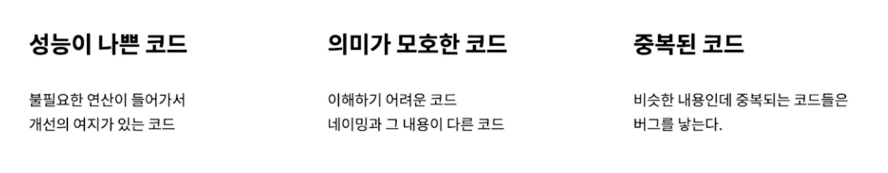
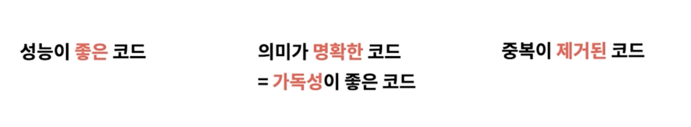
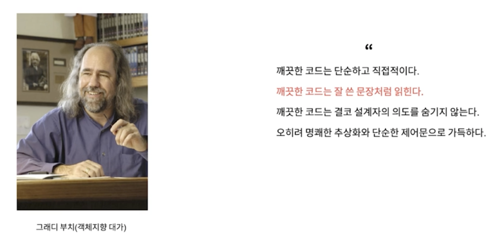
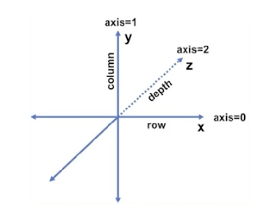

# 01. 나쁜 코드



## 나쁜 코드가 나쁜 이유

1. `깨진 유리창 법칙` : 나쁜 코드는 깨진 유리창처럼 계속 나쁜 코드가 만들어지도록 한다
2. `생산성 저하` : 나쁜 코드는 팀 생산성을 저하시킨다. (기술부채를 만들어 더 수정을 더 어렵게 한다)
3. `새로운 시스템을 만들어야 한다` : 현 시스템을 유지보수하며 대체할 새로운 시스템 개발은 현실적으로 매우 어렵다.

## 나쁜 코드를 짜는 이유

1. `일정이 촉박해서` : 일정 안에 기능을 구현하는 것이 최우선이라 코드 품질을 고려하지 않는다.
   - 하지만.. 나쁜 코드는 생산성을 저하하기 때문에 오히려 일정을 못맞춘다.
2. `영향 범위가 넓어서` : 생각보다 영향 범위가 넓어서 건드렸다가 다른 부분에 버그가 발생할까봐
   - 하지만.. 기술부채는 부메랑처럼 돌아와 더 큰 영향을 미친다.
  
# 02. 클린 코드






## 의미 있는 이름 짓기

```java 
/// title: 의미 없는 이름
int a;
String b;

System.out.printf("User Requested $s. count = %d", b, a);

// Console Output
// User Requested book. count = 10
```

위 코드처럼 의미가 불분명한 변수명을 사용하면 코드를 읽는 사람이 이해하기 어렵다.

```java 
/// title: 의미 있는 이름
int itemCount;
String itemName;

System.out.printf("User Requested $s. count = %d", itemName, itemCount);

// Console Output
// User Requested book. count = 10
```

위 코드처럼 변수명을 의미있게 지으면 코드를 읽는 사람이 이해하기 쉽다.

나아가, 클래스를 활용해서 더 의미있는 이름을 지을 수 있다.

```java 
/// title: 의미 있는 이름
class SalesItem {
    ItemCode code;
    String name;
    int count;
    int count;
}

// ...

SalesItem selectedItem = salesItemRepository.getItemByCode(purchaseRequest.getItemCode());
System.out.printf("User Requested $s. count = %d", selectedItem.getName(), selectedItem.getCount());

// Console Output
// User Requested book. count = 10
```

### 루프 속 i,j,k 사용하지 않기

```java 
/// title: 다른 방법들
for (int i = 0; i < messages.size(); i++) {
    // ...
}

// advanced for loop
for (Message message : messages) {
    // ...
}

// lambda
messages.stream().forEach(
    message -> // ...
)
```

굳이 의미 없는 i,j,k를 사용하지 않고, 향상된 for문이나 람다를 사용하면 더 의미있는 코드를 작성할 수 있다.

기존의 for문을 사용한다면, 최대한 의미를 부여하도록 하자.



- i, j -> row,col / width,height / x,y / start,end 등등
- i, j, k -> row,col,depth / x,y,z / start,end,step 등등
  
### 통일성 있는 단어 사용하기

- Member / Customer / User
- Service / Manager
- Repository / DAO
- ...

위 항목들처럼 동일한 의미를 가지는 단어들이 존재한다. 이런 단어들을 통일성 있게 사용하도록 하자.

### 변수명에 타입 넣지 않기

```java 
/// title: 변수명에 타입 넣지 않기
// 👎
String nameString; // -> name
int itemPriceAmount; // -> itemPrice
Account[] accountArray; // -> accounts
public interface IShapeFactory {} // -> ShapeFactory

// 👌 (허용)
List<Account> accountList; // -> accounts도 가능
Map<Account> accountMap
```

변수명에 타입을 넣는 것은 코드를 읽는 사람이 불필요한 정보를 더 읽어야 하기 때문에 좋지 않다.
