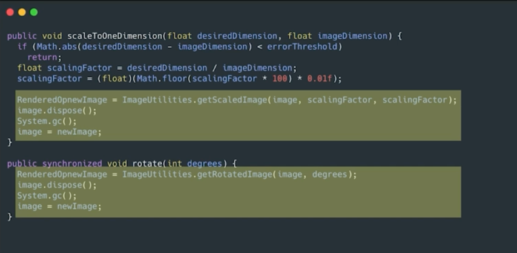
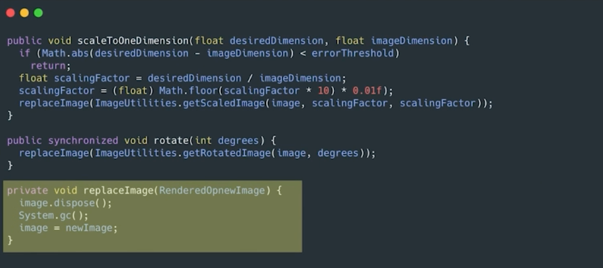
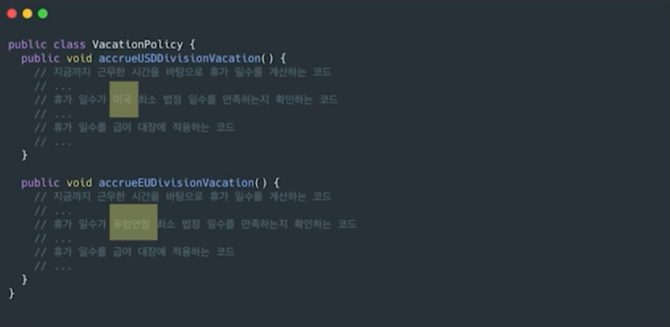
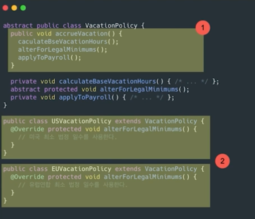

# Part 12. 창발성

## 창발적 설계란?

> 창발성(Emergence) : 단순한 형태와 규칙으로부터 복잡한 형태와 동작이 자연스럽게 도출되는 것
> 
> 각각의 개미는 집을 지을 능력이 없지만, 작은 개미들의 상호작용을 통해 집이라는 결과물이 나오는 것처럼 **작은 요소들의 상호작용의 반복이 전체구조에 영향을 미치는 것.**

창발적 설계는 단순한 4가지를 반복하다보면 전체적으로 깨끗한 코드가 만들어 진다는 것이다.

:::info 창발적 설계의 4가지 규칙
1. 모든 테스트를 실행한다.
2. 중복을 없앤다.
3. 프로그래머 의도를 표현한다.
4. 클래스와 메서드 수를 최소로 줄인다. (이건 실용적 관점에서 타협이 필요할 듯?)
:::

### (1) 모든 테스트를 실행한다.

- 모든 테스트 케이스를 항상 통과하는 시스템은 설계가 잘 되어있다는 증거이다.
- 테스트가 가능한 시스템을 만들려고 애쓰면 설계 품질이 높아진다. 크기가 작고 목적 하나만 수행하는 클래스가 나온다.
- 결합도가 높으면 테스트 케이스를 작성하기 어렵기 때문에 결합도를 낮추는 설계를 하게 된다.
- `모든 테스트를 실행한다`는 규칙을 따르는 시스템은 낮은 결합도와 높은 응집력이라는 목표를 저절로 달성할 수 있다.

### (2) 중복을 없앤다.

기존의 코드를 최대한 재활용한다. 중복을 제거하면 **변경이 용이한 시스템**이 된다.

위 코드에서 하이라이트 부분이 중복이 되고 있다. 

따로 메서드로 빼서 중복을 제거해주자.

#### Template Method 패턴

> `Template Method Pattern` : 알고리즘의 구조를 상위 클래스의 메서드에서 정의하고, 하위 클래스에서 자신에 맞게 구현하도록 하는 패턴
>
> 

예시 코드를 봐보자.

위 코드는 최소 법정 일수를 계산하는 코드를 제외하면 두 메서드는 거의 동일하다.

중복을 줄이기 위해 템플릿 메서드 패턴을 적용해보자.

1. 공통된 알고리즘을 accurueVacation 템플릿 메서드에 담고, 동일한 내용에 대해서는 메서드를 구현하고 다른 내용(미국/유럽연합)은 하위 클래스가 구현하도록 abstract 메서드로 만들어준다.
2. 하위 클래스는 각자의 알고리즘을 구현한다.

### (3) 프로그래머 의도를 표현한다.

1. 좋은 이름을 선택한다.
2. 함수와 클래스 크기를 가능한 줄인다. (작은 클래스와 작은 함수는 이름 짓기도 쉽고, 구현하기도 쉽다.)
3. 표준 명칭을 사용한다. 다른 개발자가 보고 바로 이해할 수 있도록.
4. 단위 테스트 케이스를 꼼꼼히 작성한다.

### (4) 클래스와 메서드 수를 최소로 줄인다.

여기서 중요한 것은 너무 과도한 설계는 지양해야 한다는 것이다.

- 여러가지 규칙에 극단적으로 심취해 클래스와 메서드를 무수하게 만들지 말기
- 결국 좋은 코드를 만드는 이유는 생산성을 올리기 위한 것이다.
- 실용적인 관점에서 타협해야 한다.

