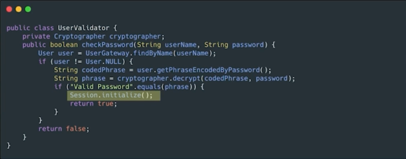
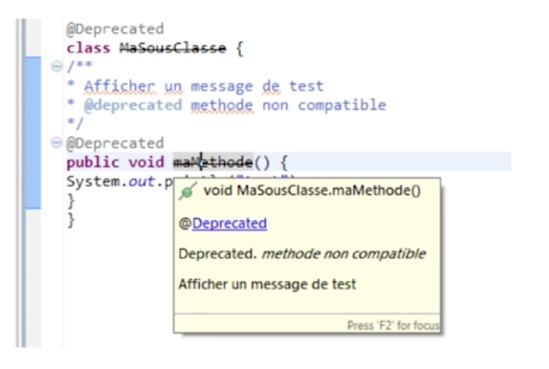
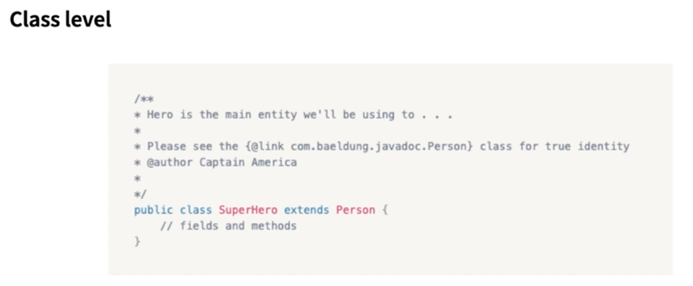
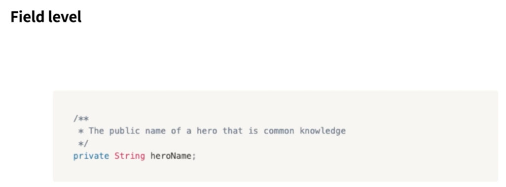
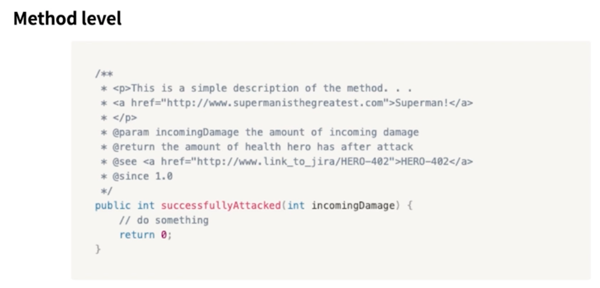

# 함수

## 01. SOLID

[SOLID 포스팅 참조](https://k-devlog.vercel.app/solid)

## 02. 간결한 함수 작성하기

### 간결한 함수 작성하기

```java 
/// title: 많은 기능을 하는 함수
public static String renderPageWithSetupsAndTeardowns(PageData pageData, boolean isSuite) throws Exception {
  boolean isTestPage = pageData.hasAttribute("Test");
  if (isTestPage) {
     WikiPage testPage = pageData.getWikiPage();
      StringBuffer newPageContent = new StringBuffer();
      includeSetupPages(testPage, newPageContent, isSuite);
      newPageContent.append(pageData.getContent());
      includeTeardownPages(testPage, newPageContent, isSuite);
      pageData.setContent(newPageContent.toString());
  }
  return pageData.getHtml();
}
```

함수가 길고, 여러가지 기능이 섞여있는 것을 볼 수 있다.

이를 아래와 같이 리팩토링 할 수 있다.

```java 
/// title: 한 가지 일만 하는 함수
public static String renderPageWithSetupsAndTeardowns(PageData pageData, boolean isSuite) throws Exception {
  if (isTestPage(pageData)) {
    includeSetupAndTeardownPages(pageData, isSuite);
  }
  return pageData.getHtml();
}
```

함수 내 추상화 수준을 동일하게 맞춰주고, 함수가 한 가지 일만 하도록 만들어야 한다.

### 한 가지만 하기(SRP), 변경에 닫게 만들기(OCP)

```java 
/// title: 두 가지 일을 하는 함수
public Money calculatePay(Employee e) throws InvalidEmployeeType {
    switch (e.type) {
        case COMMISIONED:
            return calculateCommisionedPay(e);
        case HOURLY:
            return calculateHourlyPay(e);
        case SALARIED:
            return calculateSalariedPay(e);
        default:
            throw new InvalidEmployeeType(e.type);
  }
}
```

위 코드를 보면 계산도 하고, Money 객체를 생성도 한다. 즉, 두 가지 일을 하고 있다.

여기에 새로운 직원 타입이 추가된다면 어떻게 될까?

```java
public abstract class Employee {
    public abstract boolean isPayday();
    public abstract Money calculatePay();
    public abstract void deliverPay(Money pay);
}
```

```java
public interface EmployeeFactory {
    public Employee makeEmployee(EmployeeRecord r) throws InvalidEmployeeType;
}
```

```java 
/// title: 리팩토링
public class EmployeeFactoryImpl implements EmployeeFactory {
    
    @Override
    public Employee makeEmployee(EmployeeRecord r) throws InvalidEmployeeType {
      switch (r.type) {
        case COMMISIONED:
          return calculateCommisionedPay(r);
        case HOURLY:
          return calculateHourlyPay(r);
        case SALARIED:
          return calculateSalariedPay(r);
        default:
          throw new InvalidEmployeeType(r.type);
      }
    }
}
```

리팩토링된 코드를 보면, 계산과 타입관리를 분리하여 변경에 닫혀있게 만들었다.
타입에 대한 처리는 최대한 Factory에서만 하고 계산은 Employee에서만 하도록 하였다. 즉, 한 가지 일만 하도록 만들었다.

### 함수 인수

함수에서 인수의 갯수는 0~2개가 적당하다. 3개 이상은 피하는 것이 좋다.

```java
// 객체를 인자로 넘기기
Circle makeCircle(double x, double y, double radius); // 👎
Circle makeCircle(Point center, double radius); // 👍

// 가변 인자 넘기기 -> 특별한 경우가 아니면 피하는 것이 좋다.
String.format(String format, Object... args); // 👎
```

## 03. 안전한 함수 작성하기

### 부수 효과(Side Effect) 없는 함수

> `부수 효과` : 값을 반환하는 함수가 외부 상태를 변경하는 경우



위 코드는 함수와 관계없는 외부 상태를 변경한다. 이를 부수 효과라고 한다.

### 함수 리팩터링


# 주석

## 주석은 최대한 쓰지 말자

> 주석은 나쁜 코드를 보완하지 못한다.

코드에 주석을 추가하는 일반적인 이유는 코드 품질이 나쁘기 때문이다. 자신이 저지른 난장판을 주석으로 설명하지 말고
개선하는데 시간을 보내야 한다.

**코드로도 의도를 표현할 수 있으므로** 주석을 최대한 줄이도록 노력해야 한다.

```java
// 직원에게 복지 혜택을 받을 자격이 있는지 검사한다
if ((employee.flags & HOURLY_FLAG) && (employee.age > 65))

// 의미있는 이름을 지으면 해결된다.
if (employee.isEligibleForFullBenefits())
```

> 주석은 방치된다

코드의 변화에 따라가지 못하고, 주석은 방치된다.

코드는 컴파일되어 호출되지만, 주석은 그저 주석이기 때문에 그 자리에 방치되고 결국 의미없는 텍스트가 되어버린다.

## 좋은 주석

> 구현에 대한 정보를 제공한다.

```java
// kk:mm:ss EEE,MMM dd, yyyy 형식
Pattern timeFormat = Pattern.compile("\\d*:\\d*:\\d* \\w*,\\w* \\d*, \\d*");
```

> 의도와 중요성을 설명한다.

```java
// 스레드를 많이 생성하여 시스템에 영향을 끼쳐 테스트를 만들도록 함
for (int i = 0; i < 25000; i++) {
    SomeThread someThread = ThreadBuilder.builder().build();
  }

// 유저로부터 입력받을 값을 저장할 때 trim으로 공백제거 필요
String userName = userNameInput.trim();
```

## 주석보다 annotation



> java.lang.annotation

`annotation` : 코드에 대한 메타데이터
- 코드의 실행 흐름에 간섭을 주기도 하고, 주석처럼 코드에 대한 정보를 줄 수 있다.

```java
@Deprecated // 컴파일러가 warning 발생시킴.
@NotThreadSafe // 스레드에 안전하지 않음
```

## JavaDoc

> Java 코드에서 API 문서를 HTML 형식으로 생성해주는 도구




