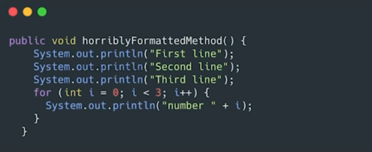

# 형식 맞추기

## 01. 포맷팅이 중요한 이유




위 코드에서 보이듯, 포맷팅은 `가독성에 필수적이다.`

## 02. 클린코드 포맷팅

### 적절한 길이 유지

`200 lines`

- 코드 길이를 200줄 정도로 제한하는 것은 반드시 지킬 엄격한 규칙은 아니지만, 일반적으로 큰 파일보다는 작은 파일이 이해하기 쉽ㄴ다.
  - 현업에서의 대부분의 코드들도 200라인 정도를 유지한다.
- 코드 길이가 200라인을 넘어간다면, 클래스가 여러 개의 일을 하고 있을 수 있다. (`SRP 위배`)

### 밀접한 개념은 가까이

```java
package fitnesse.wikitext.widgets;

import java.util.regex.*;

public class BoldWidget extends ParentWidget {
  public static final String REGEXP = "'''.+?'''";
  private static final Pattern pattern = Pattern.compile("'''(.+?)'''",
    Pattern.MULTILINE + Pattern.DOTALL
  );

  public BoldWidget(ParentWidget parent, String text) throws Exception {
    super(parent);
    Matcher match = pattern.matcher(text);
    match.find();
    addChildWidgets(match.group(1));
  }

  public String render() throws Exception {
    StringBuffer html = new StringBuffer("<b>");
    html.append(childHtml()).append("</b>");
    return html.toString();
  }
}
```

- 행 묶음은 완결된 생각 하나를 표현하기 때문에 빈 행으로 분리한다.
- 변수는 사용되는 위치에서 최대한 가까이 선언한다.

## 03. Java Class Declarations

> Class 내부 코드 순서

1. `static 변수`
   - public -> protected -> private 순으로
2. `instance 변수`
   - public -> protected -> private 순으로
3. `생성자`
4. `메서드`
   - public 메서드에서 호출되는 private 메서드는 그 아래에 둔다. 가독성 위주로 그룹핑

```java
// 예시 코드
public class CodeAnalyzer implements JavaFileAnalysis { 
    private int lineCount; 
    private int maxLineWidth;
    private int widestLineNumber;
    private LineWidthHistogram lineWidthHistogram; 
    private int totalChars;

    public CodeAnalyzer() {
        lineWidthHistogram = new LineWidthHistogram();
    }

    public static List<File> findJavaFiles(File parentDirectory) { 
        List<File> files = new ArrayList<File>(); 
        findJavaFiles(parentDirectory, files);
        return files;
    }

    private static void findJavaFiles(File parentDirectory, List<File> files) {
        for (File file : parentDirectory.listFiles()) {
            if (file.getName().endsWith(".java")) 
                files.add(file);
            else if (file.isDirectory()) 
                findJavaFiles(file, files);
        } 
    }

    public void analyzeFile(File javaFile) throws Exception { 
        BufferedReader br = new BufferedReader(new FileReader(javaFile)); 
        String line;
        while ((line = br.readLine()) != null)
            measureLine(line); 
    }

    private void measureLine(String line) { 
        lineCount++;
        int lineSize = line.length();
        totalChars += lineSize; 
        lineWidthHistogram.addLine(lineSize, lineCount);
        recordWidestLine(lineSize);
    }

    private void recordWidestLine(int lineSize) { 
        if (lineSize > maxLineWidth) {
            maxLineWidth = lineSize;
            widestLineNumber = lineCount; 
        }
    }

    public int getLineCount() { 
        return lineCount;
    }

    public int getMaxLineWidth() { 
        return maxLineWidth;
    }

    public int getWidestLineNumber() { 
        return widestLineNumber;
    }

    public LineWidthHistogram getLineWidthHistogram() {
        return lineWidthHistogram;
    }

    public double getMeanLineWidth() { 
        return (double)totalChars/lineCount;
    }

    public int getMedianLineWidth() {
        Integer[] sortedWidths = getSortedWidths(); 
        int cumulativeLineCount = 0;
        for (int width : sortedWidths) {
            cumulativeLineCount += lineCountForWidth(width); 
            if (cumulativeLineCount > lineCount/2)
                return width;
        }
        throw new Error("Cannot get here"); 
    }

    private int lineCountForWidth(int width) {
        return lineWidthHistogram.getLinesforWidth(width).size();
    }

    private Integer[] getSortedWidths() {
        Set<Integer> widths = lineWidthHistogram.getWidths(); 
        Integer[] sortedWidths = (widths.toArray(new Integer[0])); 
        Arrays.sort(sortedWidths);
        return sortedWidths;
    } 
}
```
