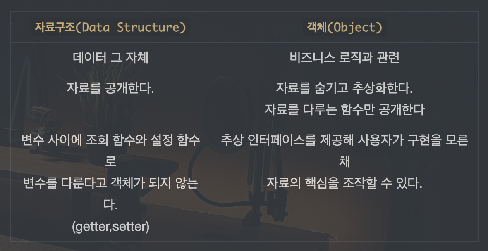
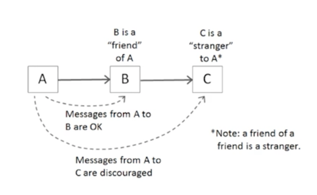
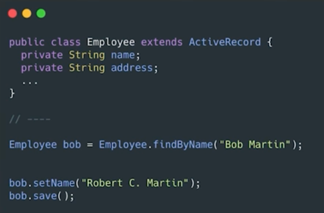
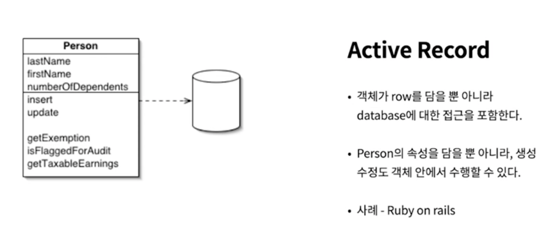
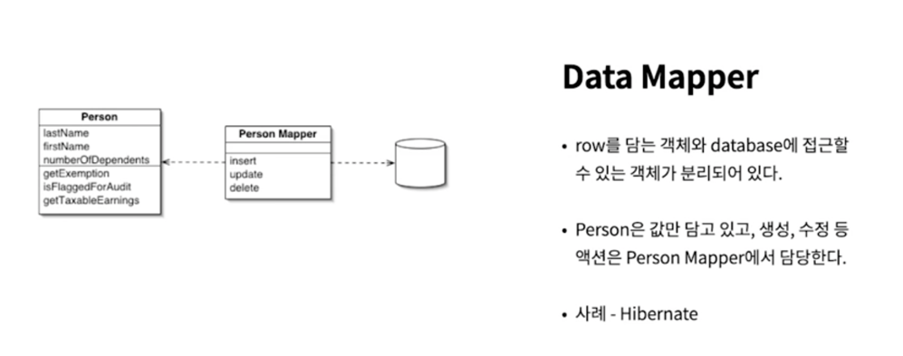

# 객체와 자료구조

## 01. 자료구조 vs 객체



### 예제1 - Vehicle

```java
// 자료구조
public interface Vehicle {
    double getFuelTankCapacityInGallons();
    double getGallonsOfGasoline();
}

public class Car implements Vehicle {
    double fuelTankCapacityInGallons;
    double gallonsOfGasoline;
    
    // Getter
    public double getFuelTankCapacityInGallons() {
        return fuelTankCapacityInGallons;
    }
    
    public double getGallonsOfGasoline() {
        return gallonsOfGasoline;
    }
}
```

```java
// 객체
public interface Vehicle {
    double getPercentFuelRemaining();
}

public class Car implements Vehicle {
    double fuelTankCapacityInGallons;
    double gallonsOfGasoline;
    
    // 생성자
    public Car(double fuelTankCapacityInGallons, double gallonsOfGasoline) {
        if (fuelTankCapacityInGallons <= 0) {
            throw new IllegalArgumentException("fuelTankCapacityInGallons must be greater than zero");
        }
        this.fuelTankCapacityInGallons = fuelTankCapacityInGallons;
        this.gallonsOfGasoline = gallonsOfGasoline;
    }
    
    // 비즈니스 로직
    public double getPercentFuelRemaining() {
        return this.gallonsOfGasoline / this.fuelTankCapacityInGallons;
    }
}
```

### 예제2 - Shape

```java
// 자료구조
public class Square {
    public Point topLeft;
    public double side;
}

public class Rectangle {
    public Point topLeft;
    public double height;
    public double width;
}

public class Circle {
    public Point center;
    public double radius;
}

public class Geometry {
    public final double PI = 3.141592653589793;
    
    public double area(Object shape) throws NoSuchShapeException {
        if (shape instanceof Square) {
            Square s = (Square) shape;
            return s.side * s.side;
        } else if (shape instanceof Rectangle) {
            Rectangle r= (Rectangle) shape;
            return r.height * r.width;
        } else if (shape instanceof Circle) {
            Circle c = (Circle) shape;
            return PI * c.radius * c.radius;
        }
        throw new NoSuchShapeException();
    }
}
```

위와 같은 절차적인 코드는 새로운 자료 구조를 추가하기 어렵다. `area()` 함수를 수정해야 하기 때문이다.

```java
// 객체
public interface Shape {
    double area();
}

public class Square implements Shape {
    private Point topLeft;
    private double side;
    
    @Override
    public double area() {
        return side * side;
    }
}

public class Rectangle implements Shape {
    private Point topLeft;
    private double height;
    private double width;
    
    @Override
    public double area() {
        return height * width;
    }
}

public class Circle implements Shape {
  private Point center;
  private double radius;
  private final double PI = 3.141592653589793;

  @Override
  public double area() {
    return PI * radius * radius;
  }
}
```

위와 같이 객체로 변경하면 새로운 자료 구조를 추가하기 쉬워진다. `area()` 함수를 수정할 필요가 없기 때문이다.

따라서 `상황에 맞는 선택을 하면 된다`

- 자료구조를 사용하는 절차적인 코드는 기본 자료구조를 변경하지 않으면서 새 함수를 추가하기 쉽다.
- 절차적인 코드는 새로운 자료 구조를 추가하기 어렵다. 그러려면 모든 함수를 고쳐야 한다.

___

- 객체지향 코드는 기존 함수를 변경하지 않으면서 새 클래스를 추가하기 쉽다.
- 객체지향 코드는 새로운 함수를 추가하기 어렵다. 그러려면 모든 클래스를 고쳐야 한다.

## 02. 객체 - 디미터 법칙

디미터 법칙은 잘 알려진 휴리스틱으로, 모듈은 자신이 조작하는 객체의 속사정을 몰라야 한다는 법칙이다.

* `휴리스틱(heuristic)` : 경험에 기반하여 문제를 해결하기 위해 발견한 방법




> `클래스 C의 메서드 f는 다음과 같은 객체의 메서드만 호출해야 한다.`
> 
> - 클래스 C
> - 자신이 생성한 객체
> - 자신의 인수로 넘어온 객체
> - C의 인스턴스 변수에 저장된 객체

### 기차 충돌

> `기차 충돌(train wreck)` : 객체의 메서드를 호출하고 그 결과로 반환된 객체에 또 다시 메서드를 호출하는 코드

```java
// 객체 - 기차 충돌(디미터의 법칙 위배)
final String outputDir = ctxt.getOptions().getScratchDir().getAbsolutePath();
```

여러 객체가 한 줄로 이어진 기차처럼 보여서 기차 충돌이라고 부른다.

일반적으로 조잡하다 여겨지는 방식이므로 피하는 편이 좋다.

```java
// 자료구조 - OK
String outputDir = ctxt.options.scratchDir.absolutePath;
```

만일 객체가 아닌 자료구조라면 디미터의 법칙을 위배하지 않는다. 객체라면 내부 구조를 숨겨야 하고, 자료구조라면 그렇게 할 필요가 없기 때문이다.

그러면 디미터의 법칙을 지키는 객체 구조는 어떻게 만들어야 할까?

### 기차 충돌 해결

해결하기 위해 왜 절대경로(Absolute Path)를 얻어야 하는지 알아야 하는데, 이는 파일을 생성해야 하기 때문인 것을 알 수있다.
그래서 `ctxt` 객체에 `createScratchFileStream()` 메서드를 추가하고, `ctxt` 객체가 `ScratchFileStream` 객체를 반환하도록 한다.

```java
// 객체 - 기차 충돌 해결
BufferedOutputStream bos = ctxt.createScratchFileStream(classFileName);
```

## 03. DTO

> `DTO(Data Transfer Object)` : 다른 계층 간 데이터를 교환할 때 사용
> 
> - 로직 없이 필드만 갖는다.
> - 일반적으로 클래스명이 Dto(DTO)로 끝난다.
> - getter/setter를 갖기도 한다.

```java
// DTO
public class Address { 
  public String street; 
  public String streetExtra; 
  public String city; 
  public String state; 
  public String zip;
  
  // getter/setter...
}
```

## 04. Active Record

> `Active Record` : Database row를 객체에 맵핑하는 패턴
> 
> - 비즈니스 로직 메서드를 추가해 개겣로 취급하는 건 바람직하지 않다.
> - 비즈니스 로직을 담으면서 내부 자료를 숨기는 객체는 따로 생성한다.
> - 하지만 객체가 많아지면 복잡하고, 가까운 곳에 관련 로직이 있는 것이 좋으므로 **현업에서는 Entity에 간단한 메서드를 추가해 사용**한다.



### Active Record vs Data Mapper




___

[출처](https://www.martinfowler.com/eaaCatalog/activeRecord.html)
