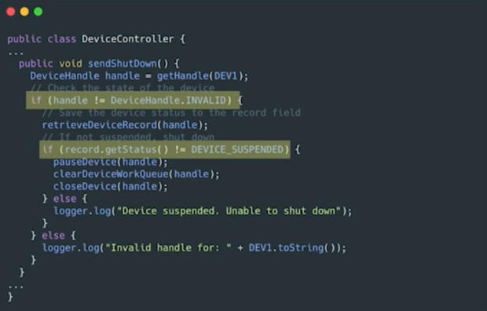
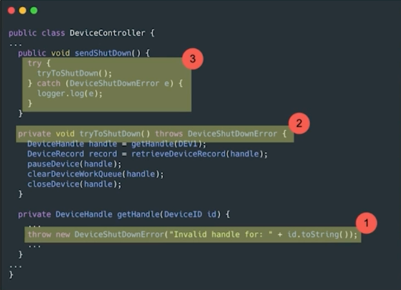
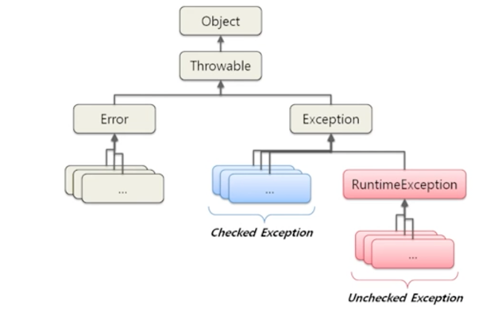
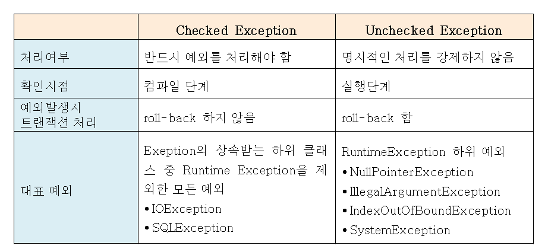
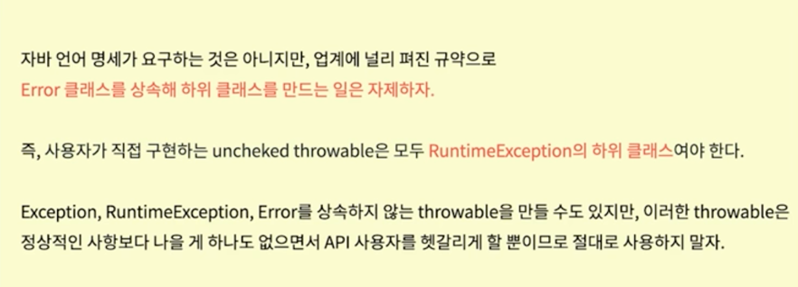
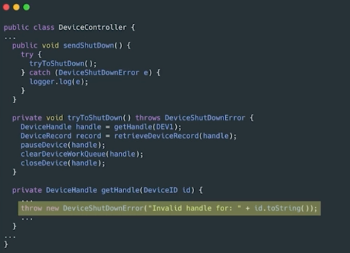
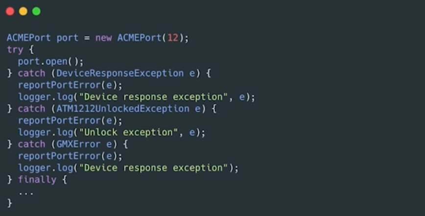
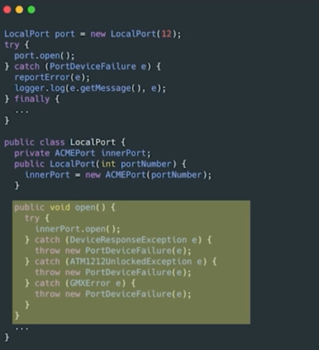
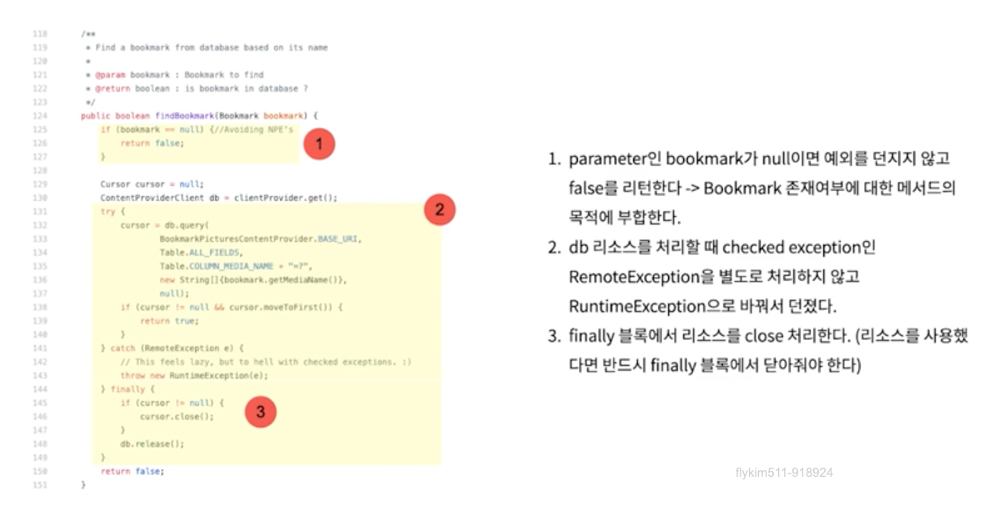
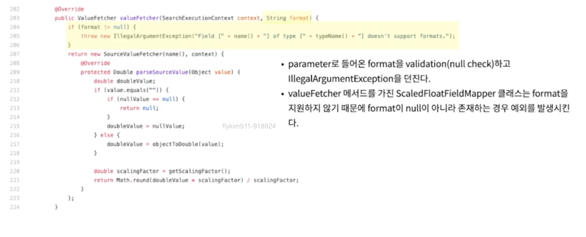

# 에러 핸들링

## 01. 예외 처리 방식

### 오류 코드를 리턴하지 말고, 예외를 던져라



옛날에는 오류를 나타낼 때 에러코드를 던졌다.

하지만 예외를 던지는 것이 명확하고, 처리 흐름이 깔끔해진다. 

___



1. 오류가 발생한 부분에서 예외를 던진다. (별도의 처리가 필요한 예외라면 checked exception을 던진다.)
2. checked exception에 대한 예외처리를 하지 않는다면 메서드 선언부에 throws를 명시해야 한다.
3. 예외를 처리할 수 있는 곳에서 catch 하여 처리한다.

## 02. Unchecked Exception을 사용하라





<https://www.nextree.co.kr/p3239/> 참고

> **Exception에 관한 규약 in Effective Java**
> 
> 

### Checked Exception이 나쁜 이유


위 코드를 다시보면 다음과 같은 문제점이 있다.

1. 특정 메소드에서 checked expcetion을 throw하고 상위 메소드에서 그 exception을 catch한다면 모든 중간단계 메소드에 exception을 throw 해야 한다.
2. OCP 위배 : 상위 레벨 메소드에서 하위 레벨 메소드의 디테일에 대해 알아야 하기 때문에 OCP 원칙에 위배된다.
3. 필요한 경우 checked exception을 사용해야 되지만 일반적인 경우 득보다 실이 많다.

## 03. Exception 잘 쓰기

### 예외에 메시지를 담아라

> 예외에 의미 있는 정보 담기



- 오류가 발생한 원인과 위치를 찾기 쉽도록, 예외를 던질 때는 전후 상황을 충분히 덧붙인다.
- 실패한 연산 이름과 유형 등 정보를 담아 예외를 던진다.

### exception wrapper



위 코드를 보면 로그만 찍을 뿐, 할 수 있는 일이 없다.

이런 경우에는 exception wrapper를 사용한다. (**예외를 감싸는 클래스를 만드는 것**)



- port.open() 시 발생하는 checked exception들을 감싸도록 port를 가지는 LocalPort 클래스를 만든다.
- port.open()이 던지는 checked exception들은 하나의 PortDeviceFailure exception으로 감싸서 던진다.

## 04. 실무 예외 처리 패턴

### getOrElse

> 예외 대신 기본 값을 리턴합니다.

1. null이 아닌 기본 값
2. 도메인에 맞는 기본 값

#### null이 아닌 기본 값

```java
// Bad
List<Employee> employees = getEmployees();
if (employees != null){
  for(Employee e : employees){
    totalPay += e.getPay();
  }
}
```

위 코드를 보면, getEmployees를 설계할 때, 데이터가 없는 경우를 null로 표현했는데, 다른 방법이 없을까?

null을 리턴한다면 이후 코드에서 모두 null 체크를 해야하는 번거로움이 있다.

```java
// Good
List<Employee> employees = getEmployees();
for(Employee e : employees){
  totalPay += e.getPay();
}

public List<Employee> getEmployees() {
    if ( /* 데이터가 없는 경우 */ ) {
      return Collections.emptyList();
    }
}
```

위 코드처럼, 복수형의 데이터를 가져올 때는 데이터의 없음을 의미하는 컬렉션을 리턴하면 된다.

**null 보다 size가 0인 컬렉션이 훨씬 안전하다.**

하지만 빈 컬렉션, 빈 문자열을 적용할 수 없는 경우라면 어떻게 해야할까?

#### 도메인에 맞는 기본 값

```java
// Bad
UserLevel userLevel = null;
try {
    User user = userRepository.findByUserId(userId);
    userLevel = user.getUserLevel();
} catch (UserNotFoundException e) {
    userLevel = UserLevel.BASIC;
}

// UserLevel을 이용한 처리
```

위 코드는, 호출부에서 예외 처리를 통해 userLevel 값을 처리한다.

코드를 계속 읽어나가다보면 논리적인 흐름이 끊긴다는 것을 알 수 있다.

```java
// Good
public class UserService {
    private static final UserLevel USER_BASIC_LEVEL = UserLevel.BASIC;
    
    public UserLevel getUserLevelOrDefault(String userId) {
        try {
            User user = userRepository.findByUserId(userId);
            return user.getUserLevel();
        } catch (UserNotFoundException e) {
            return USER_BASIC_LEVEL;
        }
    }
}
```

예외 처리를 데이터를 제공하는 쪽에서 처리해서 호출부 코드를 깔끔하게 만들 수 있다. (도메인에 맞는 기본값을 도메인 서비스에서 관리)

```java
// 호출부
UserLevel userLevel = userService.getUserLevelOrDefault(userId);
```

이렇게 논리적인 흐름도 끊기지 않으면서, 도메인에 맞는 기본값을 제공할 수 있다.

하지만 또 도메인에 맞는 기본값을 제공할 수 없는 경우가 있다.

### getOrElseThrow

> null 대신 예외를 던진다. (기본값이 없다면)

#### null 대신 예외를 던진다.

```java
// Bad
User user = userRepository.findByUserId(userId);
if (user == null) {
    // user를 이용한 처리
}
```

user를 사용하는 쪽에서 매번 null 체크를 해야한다.

가독성 뿐 아니라 안정성도 떨어진다.

```java
// Good
public class UserService {
    private static final UserLevel USER_BASIC_LEVEL = UserLevel.BASIC;
    
    public User getUserOrElseThrow(String userId) {
        User user = userRepository.findByUserId(userId);
        if (user == null) {
            throw new IllegalArgumentException("사용자가 존재하지 않습니다. userId=" + userId);
        }
        return user;
    }
}
```

```java
// 호출부
User user = userService.getUserOrElseThrow(userId);
// user를 이용한 처리
```

이렇게 null 대신 예외를 던지면, 호출부에서는 매번 null 체크를 할 필요 없이 안전하게 사용할 수 있다.

### 파라미터의 null을 점검하라

```java
// Bad
public class MetricsCalculator {
    public double xProjection(Point p1, Point p2) {
        return (p2.x - p1.x) * 1.5;
    }
}
```

```java
// 호출부
calculator.xProjection(null, new Point(12, 12)); // NullPointerException 발생
```

파라미터로 null을 리턴하는 것도 나쁘지만 null을 메서드로 넘기는 것은 더 나쁘다.

(null을 메서드의 파라미터로 넣어야 하는 API를 사용하는 경우가 아니면 null을 넘기지 말자)

```java
// Good
public class MetricsCalculator {
    public double xProjection(Point p1, Point p2) {
        if (p1 == null || p2 == null) {
            throw new IllegalArgumentException("p1, p2는 null이 될 수 없습니다.");
        }
        return (p2.x - p1.x) * 1.5;
    }
}
```

```java
// 호출부
calculator.xProjection(null, new Point(12, 12)); // IllegalArgumentException 발생
```

## 05. 오픈소스 속 Exception 살펴보기

### apps-android-commons



[Code](https://github.com/commons-app/apps-android-commons/blob/f8a8f9207028a6fb5a35483c040821f22daf755e/app/src/main/java/fr/free/nrw/commons/bookmarks/pictures/BookmarkPicturesDao.java)

### Elasticsearch



[Code](https://github.com/elastic/elasticsearch/blob/main/modules/mapper-extras/src/main/java/org/elasticsearch/index/mapper/extras/ScaledFloatFieldMapper.java#L364)
