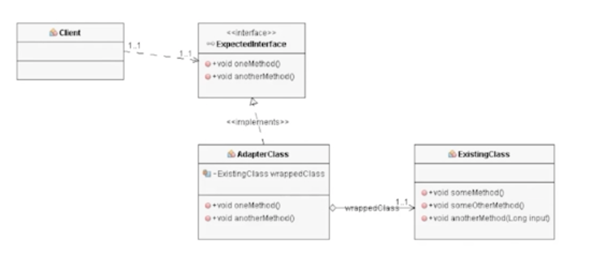

# 경계


## 경계 짓기(1) - 우리 코드를 보호하기

### 캡슐화


외부에서 사용되는 Sensor라는게 있다고 가정해보자.

```java
/// title: Bad
Map<Sensor> sensors = new HashMap<Sensor>();
Sensor s = sensors.get(sensorId);
```

위와 같이 사용하면, 외부에서 Sensor를 직접 사용할 수 있게 된다.

- Map 인터페이스가 제공하는 clear 등 불필요한 기능이 노출된다.
- 외부 코드가 함부로 호출하면 sensor 데이터가 손상될 수 있고, 이는 의도와 벗어나게 된다.

```java 
/// title: Good
public class Sensors {
    private Map<Sensor> sensors = new HashMap<Sensor>();
    public Sensor getById(String id) {
        return sensors.get(id);
    }
}
```

위와 같이 캡슐화를 통해 외부에서 사용할 수 없도록 하자. 캡슐화를 통해 원하는 기능만 제공할 수 있고, 적절한 경계로 우리 코드를 보호할 수 있다.

## 경계 짓기(2) - 외부 코드와 호환하기

외부 코드와 호환하는 방법으로 `Adapter Pattern`을 사용할 수 있다.

`Adapter Pattern`은 외부 코드를 호출할 때, 우리가 정의한 인터페이스 대로 호출하기 위해 사용하는 패턴이다.




> 어댑터 패턴은 나중에 공부해서 따로 정리해야겠다.