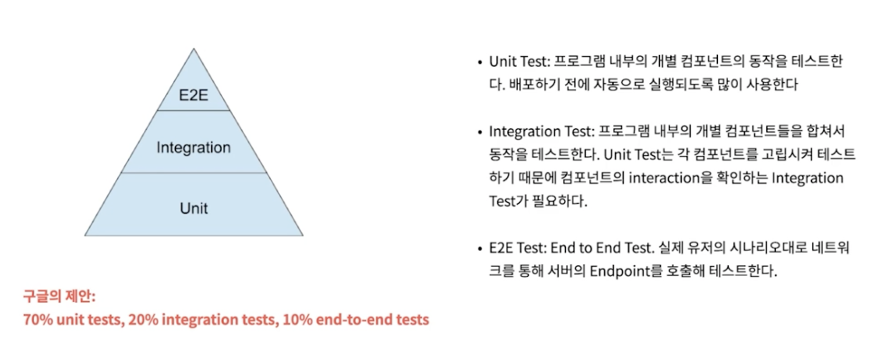
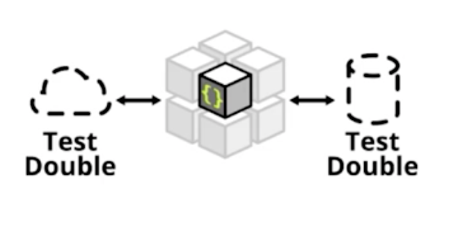

# 단위 테스트

## 테스트 코드의 중요성

- 테스트 코드는 실수를 바로 잡아준다.
- 테스트 코드는 반드시 존재해야하며, 실제 코드 못지 않게 중요하다.
- **테스크 케이스는 변경이 쉽도록 한다.** 코드에 유연성, 유지보수성, 재사용성을 제공하는 버팀목이 바로 단위테스트다. 테스트 케이스가 있으면 변경이 두렵지 않다. 테스트 케이스가 없다면 모든 변경이 잠정적인 버그다. 테스트 커버리지가 높을수록 버그에 대한 공포가 줄어든다
- 지저분한 테스트 코드는 테스르를 안하니만 못하다.


## 테스트의 종류



## Unit Test 작성

### 테스트 라이브러리를 사용하자

- `JUnit` : 유닛 테스트를 위한 테스트 프레임워크
- `Mockito` : Mock 객체를 생성하고 관리하는 라이브러리
- `Wiremock` : HTTP 기반 서비스를 위한 Mock 서버를 생성하는 라이브러리
- `Pact` : Consumer-Driven Contract Testing을 위한 라이브러리
- `Selenuim` : 브라우저 기반의 테스트를 위한 라이브러리
- `Rest-Assured` : REST API 테스트를 위한 라이브러리

### Test Double



Test Double은 테스트에서 원본 객체를 대신하는 객체를 말한다. 테스트 대상 코드가 의존하는 객체를 테스트 코드에서 대신하여 의존성을 제거하고 테스트를 수행할 수 있도록 도와준다.

- `Stub`
  - 원래의 구현을 최대한 단순한 것으로 대체한다.
  - 테스트를 위해 프로그래밍된 항목에만 응답한다.

- `Spy`
  - Stub의 역할을 하면서 호출에 대한 정보를 기록한다.
  - 이메일 서비스에서 메시지가 몇 번 전송되었는지 확인하고 싶을 때 사용한다.

- `Mock`
  - 행위를 검증하기 위해 가짜 객체를 만들어 테스트하는 방법
  - 호출에 대한 동작을 프로그램밍할 수 있다.
  - Stub은 상태를 검증하고 Mock은 행위를 검증한다.

### given-when-then 패턴을 사용하자

```java
public void testGetPageHierarchyAsXml() throws Exception {
    // given
    givenPages("PageOne", "PageOne.ChildOne", "PageTwo");
    givenPages("PageOne.ChildTwo", "PageOne.ChildThree");

    // when
    submitRequest("root", "type:pages");

    // then
    assertResponseIsXML();
    assertResponseContains(
        "<name>PageOne</name>", "<name>PageTwo</name>", "<name>ChildOne</name>",
        "<name>ChildTwo</name>", "<name>ChildThree</name>"
    );
}
```

- `given` : 테스트에 대한 pre-condition
- `when` : 테스트하고 싶은 동작 호출
- `then` : 테스트 결과 확인

## F.I.R.S.T 원칙

깨끗한 테스트는 다음 다섯 가지 규칙을 따르는데, 각 규칙에서 첫 글자를 따오면 FIRST가 된다.

- `Fast` : 빠르게
테스트는 빨라야 한다. 테스트는 빨리 돌아야 한다는 말이다. 테스트가 느리면 자주 돌릴 엄두를 못 낸다. 자주 돌리지 않으면 초반에 문제를 찾아내 고치지 못한다. 코드를 마음껏 정리하지도 못한다. 결국 코드 품질이 망가지기 시작한다.
- `Independent` : 독립적으로
각 테스트를 서로 의존하면 안 된다. 한 테스트가 다음 테스트가 실행될 환경을 준비해서는 안 된다. 각 테스트는 독립적으로 그리고 어떤 순서로 실행해도 괜찮아야 한다. 테스트가 서로에게 의존하면 하나가 실패할 때 나머지도 잇달아 실패하므로 원인을 진단하기 어려워지며 후반 테스트가 찾아내야 할 결함이 숨겨진다.
- `Repeatable` : 반복가능하게
테스트는 어떤 환경에서도 반복 가능해야 한다. 실제 환경, QA 환경, 버스를 타고 집으로 가는 길에 사용하는 노트북 환경(네트워크가 연결되지 않은)에서도 실행할 수 있어야 한다. 테스트가 돌아가지 않는 환경이 하나라도 있다면 테스트가 실패한 이유를 둘러댈 변명이 생긴다. 게다가 환경이 지원되지 않기에 테스트를 수행하지 못하는 상황에 직면한다.
- `Self-Validating` : 자가검증하는
테스트는 bool값으로 결과를 내야 한다. 성공 아니면 실패다. 통과 여부를 알리고 로그 파일을 읽게 만들어서는 안 된다. 통과 여부를 보려고 텍스트 파일 두 개를 수작업으로 비교하게 만들어서도 안 된다. 테스트가 스스로 성공과 실패를 가늠하지 않는다면 판단은 주관적이 되며 지루한 수작업 평가가 필요하게 된다.
- `Timely` : 적시에
테스트는 적시에 작성해야 한다. 단위 테스트는 테스트하려는 실제 코드를 구현하기 직전에 구현한다. 실제 코드를 구현한 다음에 테스트 코드를 만들면 실제 코드가 테스트하기 어렵다는 사실을 발견할지도 모른다. 어떤 실제 코드는 테스트하기 너무 어렵다고 판명날지 모른다. 테스트가 불가능하도록 실제 코드를 설계할지도 모른다.