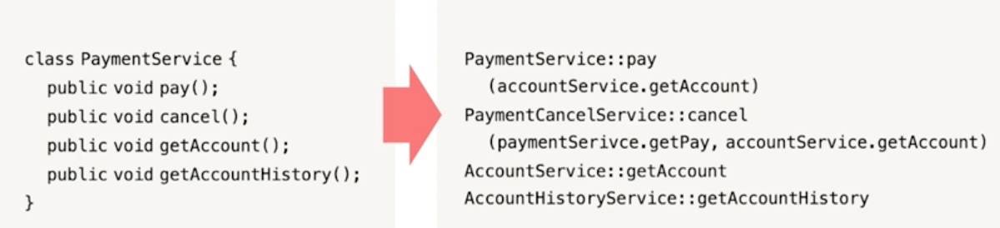
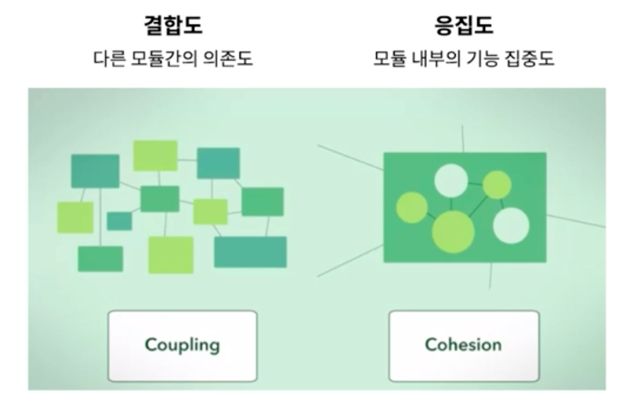
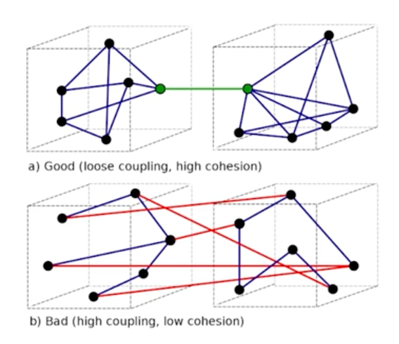

# Part 10. 클래스

## 캡슐화 (Encapsulation)

> 캡슐화 : 객체의 실제 구현을 외부로부터 감추는 방식

- 클래스를 개발할 대 기본적으로 구현을 감추고, 외부 객체와 상호작용하는 부분만 노출한다.
- 외부의 잘못된 사용을 방지한다.

```java
/// showLineNumber
/// title: stack 예제
public class Stack {
    private int topOfStack = 0;
    List<Integer> elements = new LinkedList<>();
    
    public List<Integer> getElements() {
        return elements;
    }
    
    public int size() {
        return topOfStack;
    }
    
    public void push(int element) {
        topOfStack++;
        elements.add(element);
    }
    
    public int pop() throws PoppedWhenEmpty {
        if (topOfStack == 0) {
            throw new PoppedWhenEmpty();
        }
        int element = elements.get(--topOfStack);
        elements.remove(topOfStack);
        return element;
    }
}
```

위 코드를 보면, 필드를 private으로 제한하고, getter/setter를 통해 외부에서 접근할 수 있도록 했다. 이렇게 하면 외부에서 잘못된 사용을 할 수 없다.

## 클래스는 작아야 한다!

> 클래스가 맡은 책임이 한 개인가?

- 함수와 마찬가지로 클래스도 작아야 한다.
- 함수는 라인 수로 크기를 측정했는데, 클래스는 맡은 **책임**의 수로 크기를 측정한다.
- 클래스 설명은 if, and, or, but을 사용하지 않고 **25단어 내외**로 가능해야 한다. -> 책임이 한 가지여야 한다.

```java
/// title: 책임이 두 개인 클래스
public class SuperDashboard extends JFrame implements MetaDataUser {
    public Component getLastFocusedComponent();
    public void setLastFocused(Component lastFocused);
    public int getMajorVersionNumber();
    public int getMinorVersionNumber();
    public int getBuildNumber();
}
```

위 코드를 보면 크게 focus와 version을 관리하는 두 가지 책임을 가지고 있다.

```java
/// title: Version 분리
public class Version {
    public int getMajorVersionNumber();
    public int getMinorVersionNumber();
    public int getBuildNumber();
}
```

- 위 코드처럼 Version 클래스를 분리하면 책임이 한 가지인 클래스가 된다. (SRP)
- 자잘한 단일 클래스가 많아지면 큰 그림을 이해하기 어렵다고 우려한다. 하지만 작은 클래스가 많은 시스템이든 큰 클래스가 몇 개뿐인 시스템이든 돌아가는 부품은 그 수가 비슷하다.
- "_도구상자를 어떻게 관리하고 싶은가? 작은 서랍을 많이 두고 기능과 이름이 명확한 컴포넌트를 나눠 넣고 싶은가? 아니면 큰 서랍  몇개를 두고 모두를 던져 넣고 싶은가?_" 
- 큼직한 다목적 클래스 몇 개로 이뤄진 시스템은 (변경을 가할 때) 당장 알 필요가 없는 사람까지 들이밀어 독자를 방해한다.
- 작은 클래스는 각자 맡은 책임이 하나며, 변경할 이유가 하나며, 다른 작은 클래스와 협력해 시스템에 필요한 동작을 수행한다.



## 결합도와 응집도



> 결합도는 낮을수록, 응집도는 높은수록 유지보수성이 좋다.



:::caution 문제점
**결합도가 높은 클래스의 문제점**
- 연관된 클래스가 변경되면 수정이 필요하다.
- 결합도가 높으면 연관된 클래스들을 모두 이해해야 한다.

**응집도가 낮은 클래스의 문제점**
- 여러 기능이 있으므로 이해하기 어렵다.
- 재사용하기 어렵다
:::

### 낮은 결합도

> 결합도는 낮아야 한다.

- 시스템의 결합도를 낮추면 유연성과 재사용성도 더욱 높아진다.
- `DIP` - 클래스가 상세한 구현이 아니라 추상화에 의존해야 한다.
- **추상화를 이용하면 테스트 코드 짜기에 용이하다.**

```java
/// title: 높은 결합도를 가진 코드
public class TokyoStockExchange {
    public Money currentPrice(String symbol);
}

private Portfolio {
    private TokyoStockExchange exchange;
    public Portfolio(TokyoStockExchange exchange) {
        this.exchange = exchange;
    }
}
```

위 코드를 보면, Portfolio 클래스는 TokyoStockExchange 클래스에 의존하고 있다.

이 상황에서 Portfolio 클래스의 테스트 코드를 짜야하는데 TokyoStockExchange 함수가 5분마다 업데이트 되는 함수라고 가정해보면 테스트 코드를 짜기가 어렵다.

```java
/// title: 낮은 결합도를 가진 코드
public class StockExchange {
    public Money currentPrice(String symbol);
}

public class TokyoStockExchange extends StockExchange {
    public Money currentPrice(String symbol) {
        // ...
    }
}

public Portfolio {
    private StockExchange exchange;
    public Portfolio(StockExchange exchange) {
        this.exchange = exchange;
    }
}
```

StockExchange 인터페이스를 통해 추상화를 하여, Portfolio와 TokyoStockExchange의 결합도를 낮춰주면 테스트 코드를 짜기가 용이해진다.

```java
/// title: Portfolio 테스트 코드
public class PortfolioTest {
    private FixedStockExchangeStub exchange;
    private Portfolio portfolio;

    @Before
    protected void setUp() {
        exchange = new FixedStockExchangeStub(); // 테스트용 객체
        exchange.fix("FB", 10); // 10달러 
        portfolio = new Portfolio(exchange); // 포트폴리오 객체
    }
    
    @Test
    public void GivenFiveFBTotalShouldBe50() {
        portfolio.add(5, "FB"); // 5주 
        assertEquals(50, portfolio.value()); // 50달러
    }
}
```

이처럼 테스트결과가 일정하게 나오므로 테스트 코드를 짜기가 용이해진다.

**그러나 확장될 가능성이 적다면 일단은 결합하고, 나중에 추상화해도 괜찮다.**
(객체를 Mocking 하면 변경되는 클래스도 테스트할 수 있다.)

### 높은 응집도

> 응집도는 높아야 한다.

- 클래스는 인스턴스 변수 수가 적어야 한다. 메서드는 인스턴스 변수를 하나 이상 사용해야 한다. 메서드가 인스턴스 변수를 많이 사용할수록 응집도가 높다.
- 응집도가 높다 = 클래스에 속한 메서드와 변수가 서로 의존적이다 = 서로 관계있는 애들만 모여있다.
- 클래스가 응집도를 잃어간다면 함수를 쪼개야 한다.

```java
/// title: Stack을 구현한 코드, 응집도가 높은 편이다.
public class Stack {
    private int topOfStack = 0;
    List<Integer> elements = new LinkedList<Integer>();

    public int size() { 
        return topOfStack;
    }

    public void push(int element) { 
        topOfStack++; 
        elements.add(element);
    }

    public int pop() throws PoppedWhenEmpty { 
        if (topOfStack == 0)
            throw new PoppedWhenEmpty();
        int element = elements.get(--topOfStack); 
        elements.remove(topOfStack);
        return element;
    }
}
```

## 클래스는 변경하기 쉬워야 한다.

```java
/// title: 변경하기 어려운 코드
public class Sql {
    public Sql(String table, Column[] columns)
    public String create()
    public String insert(Object[] fields)
    public String selectAll()
    public String findByKey(String keyColumn, String keyValue)
    public String select(Column column, String pattern)
    public String select(Criteria criteria)
    public String preparedInsert()
    private String columnList(Column[] columns)
    private String valuesList(Object[] fields, final Column[] columns) private String selectWithCriteria(String criteria)
    private String placeholderList(Column[] columns)
}
```

위 함수에 Update를 추가해야 한다면?

새로운 SQL을 추가할 때도 수정이 발생하고, 기존 SQL문을 수정할 때도 수정이 발생하므로 OCP를 위반한다.

```java
/// title: 변경하기 쉬운 코드
    abstract public class Sql {
        public Sql(String table, Column[] columns) 
        abstract public String generate();
    }
    public class CreateSql extends Sql {
        public CreateSql(String table, Column[] columns) 
        @Override public String generate()
    }

    public class SelectSql extends Sql {
        public SelectSql(String table, Column[] columns) 
        @Override public String generate()
    }

    public class InsertSql extends Sql {
        public InsertSql(String table, Column[] columns, Object[] fields) 
        @Override public String generate()
        private String valuesList(Object[] fields, final Column[] columns)
    }

    public class SelectWithCriteriaSql extends Sql { 
        public SelectWithCriteriaSql(
        String table, Column[] columns, Criteria criteria) 
        @Override public String generate()
    }

    public class SelectWithMatchSql extends Sql { 
        public SelectWithMatchSql(String table, Column[] columns, Column column, String pattern) 
        @Override public String generate()
    }

    public class FindByKeySql extends Sql public FindByKeySql(
        String table, Column[] columns, String keyColumn, String keyValue) 
        @Override public String generate()
    }

    public class PreparedInsertSql extends Sql {
        public PreparedInsertSql(String table, Column[] columns) 
        @Override public String generate() {
        private String placeholderList(Column[] columns)
    }

    public class Where {
        public Where(String criteria) public String generate()
    }

    public class ColumnList {
        public ColumnList(Column[] columns) public String generate()
    }
```

- 공개 인터페이스를 전부 SQL 클래스에서 파생하는 클래스로 만들고
- 비공개 메서드는 해당 클래스로 옮기고
- 공통된 인터페이스는 따로 클래스로 뺐다.

이렇게 하면 update문 추가 시에 기존의 클래스를 건드릴 이유가 없어진다.