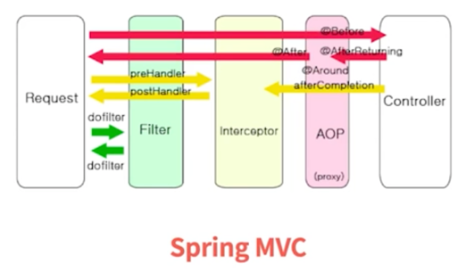
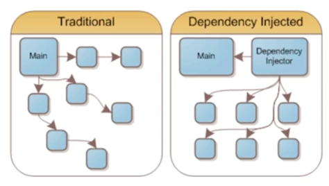
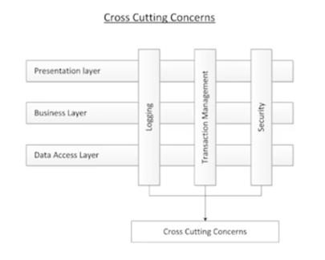

# Part 11. 시스템

## 관심사 분리

construction(생성)과 use(사용)은 아주 다르다.

- 소프트웨어 시스템은 (어플리케이션 객체를 제작하고 의존성을 서로 '연결'하는) **준비 과정**과 (준비 과정 이후에 이어지는) **런타임 로직**을 분리해야 한다.
- 객체의 생성과 객체를 사용하는 부분을 분리한다.

### 시작에 대한 관심사 분리

> 객체의 생성은 시작 단계에서, 비즈니스 로직은 객체를 사용하는데 집중한다.

- 시작 단계는 모든 어플리케이션이 풀어야할 관심사이다.
- main 함수에서 시스템에 필요한 객체를 생성한 후 어플리케이션에 넘긴다.
- 어플리케이션은 그저 만들어진 객체를 사용한다.
- 모든 객체가 잘 생성되었다고 가정하고, 객체를 이용한 개발에 집중한다.

### 요청에 대한 관심사 분리



Spring Framework를 예로 들어보자면

Filter, Interceptor, AOP 등을 통해 요청에 대한 관심사를 분리할 수 있다.

## Dependency Injection (의존성 주입)

> 객체 의존성을 DI 컨테이너에 맡긴다.



- Setter 주입 or 생성자 주입을 통해 의존성을 주입한다.
- DI 컨테이너는 요청이 들어올 때 필요한 객체의 인스턴스를 만든 후 의존성을 설정한다.
- 예시 : `Spring IoC Container`

## Cross Cutting Concerns (횡단 관심 분리)

> 어플리케이션 전반에서 가지는 공통적인 관심사를 분리한다.



- 비즈니스 로직 외에 Logging, Transaction, Security 등의 관심사를 분리한다.
- 관심사들은 많은 어플리케이션 레이어에 퍼져있는데, 이 관심사들을 분리해서 처리하는 것이 효율적이다.

### 횡단 관심 분리의 필요성

```java
public Response executeBusinessLogic(Request request) {
    // 공통 기능
    checkAuth(request);
    
    // 비즈니스 로직
    Response response = businessLogic(request);
    
    // 공통 기능
    logging(request, response);
}
```

위 코드는 하나의 메서드에 공통 기능과 비즈니스 로직이 섞여있다. 이를 분리해보자.

```java
public Response executeBusinessLogic(Request request) {
    // 비즈니스 로직
    Response response = businessLogic(request);
}

// 공통 기능은 별도의 코드에서 관리한다.
```

이렇게 분리하면 비즈니스 로직에 집중할 수 있고, 공통 기능을 변경할 때도 편리하다.


