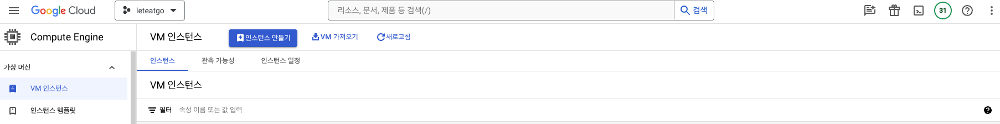
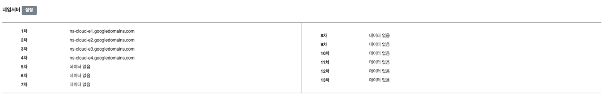

## GCP 인스턴스 생성

- GCP 콘솔에서 **Compute Engine**에 들어오면 새로운 인스턴스를 만들 수 있습니다. (EC2 인스턴스와 동일)
    - 기본 설정들은 임의로 설정해주면 되고 저희 프로젝트는 `e2-medium` 을 사용했습니다.
    - GCP 콘솔에서 **VPC 네트워크 → 방화벽**에 들어가 허용할 포트를 설정해줘야합니다. (80, 443 등)
- 그리고 EC2든 GCP 인스턴스든 `고정 IP`를 할당해줘야합니다. (할당해주지 않으면 인스턴스 재시작시 IP가 바뀌어서 DNS 설정이 까다로워집니다.)
    
    
    
    VPC 네트워크 → IP주소로 들어와 `외부 고정 IP 주소 예약`을 클릭해주고
    
    
    
    유형에 `전역`을 선택해줍니다.
    고정 주소를 만들고 고정 주소를 VM인스턴스에 할당시켜주면 됩니다.
    
    
    
:::info
하지만 GCP 부하분산(로드밸런서)를 이용할거기 때문에 VM인스턴스에 고정 IP를 할당시켜주지 않아도되고 로드밸런서에 고정 IP를 할당시켜줘도 됩니다. 
(그런데 로드밸런서를 통하면 STOMP 연결이 안되는 문제가 있어서 따로 고정 IP를 할당시켜줬습니다.)
:::

## DNS 설정

> 저는 [가비아](https://www.gabia.com/)에서 구입해줬습니다.

- GCP 콘솔에서 `Cloud DNS` 에 들어가 영역을 만들어 줍니다.
    
    
    
    
    
    
    
    DNS 영역이 만들어졌다면 처음엔 SOA, NS 레코드만 존재합니다.
    
    - `SOA` 레코드 : Start Of Authority의 약자로 DNS 영역을 만들 때 기본적으로 등록되는 레코드로써, 관리 권한이 시작되는 곳으로 도메인의 시작점입니다.
    - `NS` 레코드 : NameServer의 약자로 도메인의 네임서버를 지정하는 레코드입니다.
- 다음으로 도메인을 구입한 곳으로 가서 **네임서버를 변경**해 주어야합니다.
  
  가비아에 들어가서 **My 가비아 → 도메인 통합 관리 툴 → 본인의 도메인**으로 이동합니다.
    
    
    
    네임서버를 변경해주었는데 위 값들은 Cloud DNS의 NS 레코드를 열어보면 확인할 수 있습니다.
    
    
    
    (주의 : NS 레코드에 뒤에 온점(.)이 있는데 온점을 제외하고 가비아에 등록해주셔야 합니다!)
    
- 이렇게 네임서버 설정해주면 일정 시간 후에 터미널에서`dig` 명령어를 통해 확인 할 수 있습니다. (반영되는데 시간이 좀 걸립니다)
    
    
    
- NS 레코드 설정이 완료되면 A레코드를 설정해줘야합니다.
    - `A` 레코드 : 도메인을 IP주소로 연결해주는 레코드입니다.
    
    
    
    DNS 영역 세부정보에 들어와서 `표준 추가` 버튼을 클릭해줍니다.
    
    
    
    - DNS 이름엔 서브도메인을 추가할 수 있습니다. (따로 적어주지않으면 `leteatgo.site` 가 기본 도메인이 됩니다)
    - IPv4 주소에는 VM 인스턴스의 외부 IP 주소를 선택해주면 되는데, 저희는 이따 만들 로드밸런서에 할당된 IP 주소를 할당시켜줄겁니다. (로드밸런서를 사용하지 않으면 아까 만들어준 고정IP를 할당시켜주면 됩니다)
    
    이렇게 A 레코드까지 설정해주고 다시 `dig` 명령어를 통해 확인해보면
    
    
    
    ANSWER SECTION에 할당된 IP 주소가 설정된 것을 확인할 수 있습니다 
    
    (저는 서브도메인 backend-prod을 만들어서 A레코드 설정을 해준 상태입니다)

## 부하분산(Load Balancer) 생성

:::info 인스턴스 그룹
- 인스턴스 그룹은 GCP에서 동일한 설정을 가진 여러 가상 머신(VM) 인스턴스를 관리하는 데 사용되는 서비스입니다. 로드 밸런서를 사용할 때 인스턴스 그룹이 중요한 역할을 합니다.
- 로드 밸런서는 들어오는 트래픽을 여러 인스턴스에 분산시키는 역할을 하는데, 이 때 인스턴스 그룹을 통해 트래픽을 분산시킬 대상 인스턴스들을 지정하게 됩니다. 즉, 인스턴스 그룹은 로드 밸런서가 트래픽을 분산시킬 인스턴스들을 관리하는 역할을 합니다.
- 또한, 인스턴스 그룹을 사용하면 인스턴스의 수를 자동으로 확장하거나 축소하는 `오토스케일링` 기능을 사용할 수 있습니다. 이를 통해 트래픽이 많을 때는 인스턴스를 자동으로 추가하고, 트래픽이 적을 때는 인스턴스를 자동으로 제거하여 리소스를 효율적으로 관리할 수 있습니다.
:::

유저의 접속량이 늘어날수록 백엔드 서버 컴퓨터가 늘어날텐데 인스턴스 그룹이 백앤드 서버 컴퓨터를 하나로 묶어줍니다. 

이때 DNS를 통해 A레코드로 바뀐 채, 백엔드 서버 컴퓨터로 접속하게 되는데 백엔드 서버 컴퓨터 중 특정 컴퓨터에만 바뀐 A레코드가 적용될 수 있습니다.

그렇게 된다면 부하 관리를 위해 늘려준 백엔드 서버 컴퓨터를 추가로 만들어준 의미가 없게 됩니다.

따라서, DNS와 백엔드 서버 사이에 `로드밸런서`를 두고 DNS A레코드에는 로드밸런서의 IP주소를 연결시켜주고 로드밸런서를 백엔드 서버와 연결시켜서 부하를 분산시켜 주면 됩니다.

- 우선 인스턴스 그룹을 만들어 주겠습니다.
    
    
    
    비관리형 인스턴스 그룹을 선택해줍니다.
    
    
    
    
    
    - 네트워크는 `default`, vm인스턴스는 만들어준 인스턴스를 선택해줍니다.
- 이제 로드밸런서를 만들어줍시다.
**네트워크 서비스 → 부하분산** 에서 부하 분산기 만들기를 클릭
    
    
    
    
    
    HTTP/S 부하분산기를 선택해주고
    
    
    
    위와 같이 선택
    
    
    
    백엔드 구성, 프런트엔드 구성이 나오는데
    로드밸런서 기준으로 
    - `외부 트래픽이 접속하는 곳을 프런트엔드`
    - `외부 트래픽을 넘겨주는 곳을 백엔드`
  
    라고 부릅니다. 
  
    (프런트엔드에서는 브라우저에서 어떻게 접속 요청을 받을 것인지, 백엔드에서는 인스턴스 그룹과 연결 설정) 
    
    평소 알고있던 프론트엔드, 백엔드와는 다른 개념입니다
    
    - 프런트엔드 구성
        
        우리 서비스는 https로 배포해야 하기때문에 https로 설정해줍니다.
        
        
        
        gcp에서 쉽게 ssl 인증서를 발급받을 수 있습니다. 위 항목에서 `인증서` 부분을 클릭하면 `새 인증서 발급하기` 항목이 나옵니다.
        
        
        
        이름을 정해주고, 생성모드에서 2번째 항목을 선택해줍니다.
        
        그리고 도메인에는 DNS A레코드에 설정해준 도메인을 작성해주면 됩니다. 
        
        (존재하지 않는 도메인이면 생성 승인이 되지않습니다!) → 인증서 발급받는데 시간이 소요됩니다.
        
        
        
        발급이 완료되면 위와 같이 나옵니다.
        
    - 백엔드 구성
        
        이제 백엔드 구성으로 들어가서 `백엔드 서비스 만들기`를 클릭해줍니다.
        
        
        
        백엔드 항목에서 추가를 누르면 인스턴스 그룹을 설정해줄 수 있는데 아까 만들어놓은 인스턴스 그룹을 할당해주면 됩니다. 또한 저희는 **nginx를 사용하여 80포트를 열어놓았기 때문에** 포트 번호에 80을 추가해줍니다.
        또한 밑으로 내리면 `상태 확인(Health Checker)`이 있는데 새로 생성해주고 할당시켜주면 됩니다.
        
:::info 상태 확인(Health checker)
로드밸런서가 백엔드 서버 컴퓨터로 부하 분산을 할 때, 

서버가 죽어있는 컴퓨터로 트래픽을 분산시키면 안되기에 

**비정상적인 인스턴스를 감지하고 정상적인 인스턴스에만 요청을 보낼 수 있도록 확인하는 역할**을 합니다.
:::
        
    - 라우팅 규칙은 알아서 생성됩니다.

- 로드밸런서가 만들어졌으면
    
    
    
    
    
    위 처럼 나오면 잘 생성이 된건데
    세부정보 페이지 밑 부분에 `1개중 1개` 이렇게 나온다면 우리가 만든 인스턴스 그룹에 백엔드 서버를 띄우고 있는 인스턴스 컴퓨터 1개가 있고 그 1개가 잘 연결된다는 뜻입니다.
    
    이제 `https:my-domain`으로 접속하면 로드밸런서를 통해 접근이 가능해집니다.