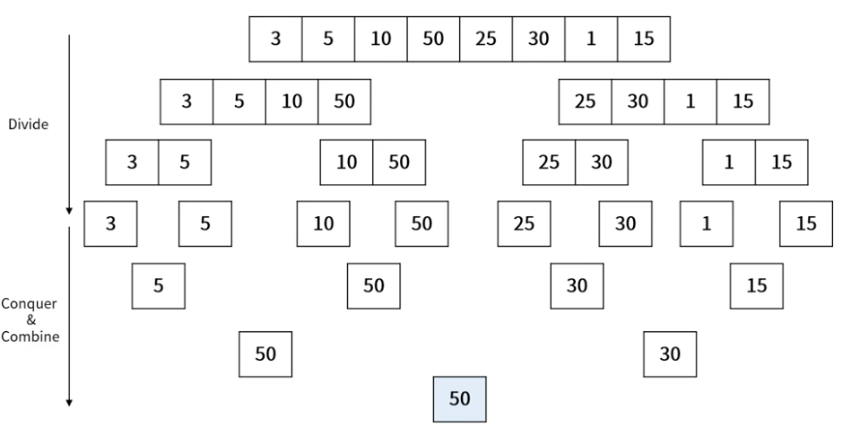
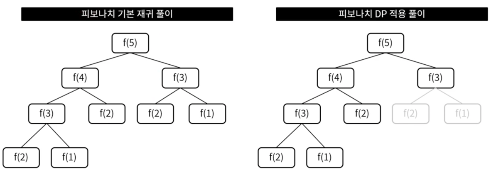
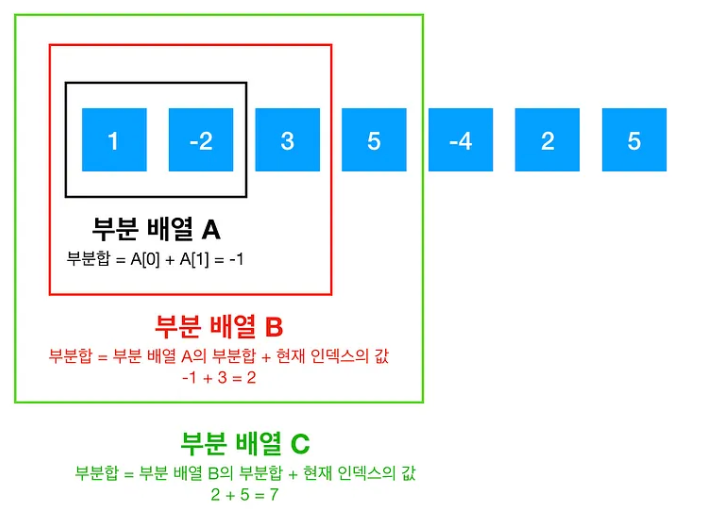

## 분할 정복 (Divide and Conquer)
분할 정복이란?
> - 문제를 나눌 수 없을 때까지 나누어서 각각을 풀면서 다시 합병하여 문제의 답을 얻는 알고리즘
> - <span style="color: red">하향식 접근법</span>으로, 상위의 해답을 구하기 위해 아래로 내려가면서 하위의 해답을 구하는 방식
>   - 일반적으로 `재귀함수`로 구현
> - 문제를 잘게 쪼갤 때, 부분 문제는 서로 중복되지 않음
>   - 예시 : 병합 정렬, 퀵 정렬 등

- <span style="color:blue">장점</span>
  - 문제를 나누어 처리하며 어려운 문제 해결 가능
  - 병렬처리에 이점이 있음
- <span style="color:red">단점</span>
  - 메모리를 많이 사용 (재귀 호출 구조)

### 분할 정복 예시

> 최대 값 찾기



<details>
<summary>최대 값 찾기 코드</summary>
<div markdown="1">

```java 
/// showLineNumber 
/// title: code.java
public static int getMax(int[] arr, int left, int right) {
    int m = (left + right) / 2; // 중간 지점
    if (left == right) {
        return arr[left];
    }
    
    // 분할
    left = getMax(arr,left,m);
    right = getMax(arr,m+1,right);
    
    // 병합
    return (left > right) ? left : right;
  }
```
</div>
</details>

## 동적 계획법 (Dynamic Programming, DP)
동적 계획법이란?
 
> - 입력 크기가 작은 부분 문제들을 해결한 후, 해당 부분 문제의 해를 활용해서 보다 큰 크기의 부분 문제를 해결, 최종적으로 전체 문제를 해결하는 알고리즘
> - `Tabulation` 기법
>   - <span style="color: blue">상향식</span> 접근 방법
>   - 작은 문제부터 차근차근 답을 도출
>   - 모두 계산하면서 차례대로 진행
>   - `Bottom-Up` 방식
> - `Memoization` 기법
>   - <span style="color: red">하향식</span> 접근 방법
>   - 큰 문제를 해결하기 위해 작은 문제를 호출
>   - 계산이 필요한 순간 계산하며 진행
>   - `Top-Down` 방식
> - 문제를 잘게 쪼갤 때, 부분 문제는 중복되어 재활용됨
>   - 예시 : 피보나치 수열
>
> 


<details>
<summary>피보나치 수열 코드</summary>
<div markdown="1">

```java 
/// showLineNumber 
/// title: code.java
public class Main {

    // 일반 풀이 (O(n^2))
    public static int fib(int n) {
        if (n <= 1) {
            return n;
        } else {
            return fib(n - 1) + fib(n - 2);
        }
    }

    // DP 풀이 - 타뷸레이션 (O(n))
    public static int fibDP(int n) {
        int[] dp = new int[n < 2 ? 2 : n + 1]; // dp용 메모리
        dp[0] = 0; // n = 0 일 때
        dp[1] = 1; // n = 1 일 때

        for (int i = 2; i <= n; i++) {
            dp[i] = dp[i - 1] + dp[i - 2];
        }
        return dp[n];
    }

    // DP 풀이 - 메모이제이션 (O(n))
    static int[] dp = new int[8];
    public static int fibDP2(int n) {
        if (n <= 2) {
            return 1;
        }

        // dp[n] 이 0이 아니라면 이미 계산한 값이므로 그대로 반환
        if (dp[n] != 0) {
            return dp[n];
        }

        dp[n] = fibDP2(n - 1) + fibDP2(n - 2);
        
        return dp[n];
    }

    public static void main(String[] args) {
        // Test code
        System.out.println(fib(7));
        System.out.println(fibDP(7));
        System.out.println(fibDP2(7));
    }
}

```
</div>
</details>

### Kadane's Algorithm (카데인 알고리즘)
> DP의 대표적인 예시 문제로 `최대 부분합 배열 문제`가 있음


[사진출처](https://medium.com/@vdongbin/kadanes-algorithm-%EC%B9%B4%EB%8D%B0%EC%9D%B8-%EC%95%8C%EA%B3%A0%EB%A6%AC%EC%A6%98-acbc8c279f29)

- `최대 부분합 배열 문제`란?
  - 배열에서 연속된 부분 배열의 합이 최대가 되는 값을 찾는 문제
  - 예시 : `[-2, 1, -3, 4, -1, 2, 1, -5, 4]` 에서 최대 부분합 배열은 `[4, -1, 2, 1]` 이며, 합은 `6` 이다.

<details>
<summary><span style="color: #b96a38">Kadane's algorithm 코드</span></summary>
<div markdown="1">

```java 
/// showLineNumber 
/// title: code.java
public class KadaneAlgorithm {

    public static void main(String[] args) {
        int[] fruits = {-2, 1, -3, 4, -1, 2, 1, -5, 4};
        System.out.println(solution(fruits)); // 6
    }

    public static int solution(int[] fruits) {
        int currentMax = fruits[0];
        int globalMax = fruits[0];

        for (int i = 1; i < fruits.length; i++) {
            currentMax = Math.max(fruits[i], currentMax + fruits[i]);
            if (currentMax > globalMax) {
                globalMax = currentMax;
            }
        }
        return globalMax;
    }
}
```

- `currentMax` : 현재까지의 최대 부분합
- `globalMax` : 전체의 최대 부분합

</div>
</details>

### Dynamic Programming과 다른 알고리즘들의 차이

1. **분할 정복**과의 차이
   - 분할 정복은 부분 문제가 서로 중복되지 않음
   - 동적 계획법은 부분 문제가 서로 중복되어 재활용에 적합함
2. **그리디 알고리즘**과의 차이
   - 그리디 알고리즘은 순간의 최선을 구하는 방식 (근사치)
   - 동적 계획법은 모든 경우의 수를 다 계산해서 최선의 답을 구함
