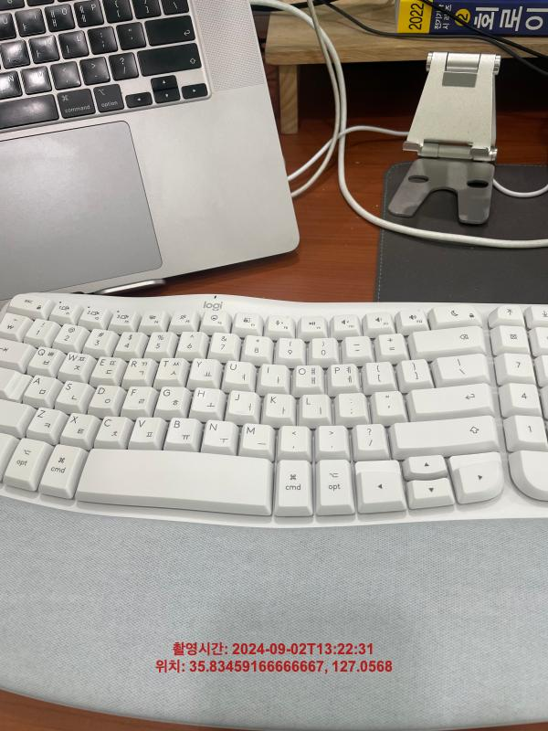
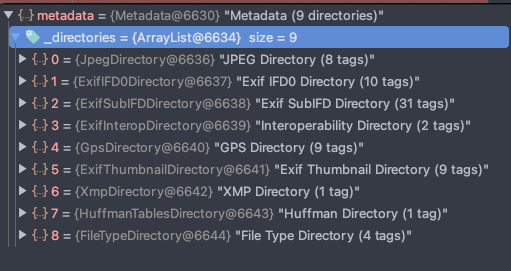

# 0. 개요

프로젝트 요구 사항 중 사용자가 사진을 업로드할 때 워터마크를 그려주는 요구가 있었습니다.

워터마크에 들어갈 데이터는 `촬영일시` / `위치정보`가 있었는데, 이 데이터를 이미지의 메타데이터를 통해 얻고자 했습니다.



# 1. 사용된 기술 및 라이브러리

- Java 8
- SpringBoot 2.5.6
- maven
- metadata-extractor
- Thumbnailator

## 이미지 메타데이터 추출

메타데이터 추출 라이브러리 중 2개의 라이브러리 중 고민했습니다.

| 비교 항목       | `metadata-extractor`                       | `commons-imaging`                                       |
| --------------- | ------------------------------------------ | ------------------------------------------------------- |
| 주요 목적       | 이미지 파일에서 메타데이터 추출에 특화     | 이미지 처리와 메타데이터 추출 모두 지원 (범용적)        |
| 지원 포맷       | 다양한 이미지 포맷 지원 (더 많은 포맷)     | 다양한 이미지 포맷 지원                                 |
| 메타데이터 지원 | EXIF, IPTC, XMP 등 다양한 형식 광범위 지원 | 기본적인 메타데이터 지원                                |
| 이미지 처리     | 제공하지 않음                              | 제공함                                                  |
| 사용 편의성     | 간단한 API, 사용하기 쉬움                  | 복잡한 API, 학습 곡선이 더 가파름                       |
| 성능            | 메타데이터 추출에 최적화, 빠른 성능        | 이미지 처리와 메타데이터 추출 모두 수행, 균형 잡힌 성능 |
| 추천 상황       | 메타데이터 추출에만 집중할 때              | 이미지 처리 기능도 함께 필요할 때                       |

- _프로젝트의 요구사항에 따라 적절한 라이브러리를 선택하면 될 것 같습니다._

결론적으로 저는 `metadata-extractor` 라이브러리를 선택했습니다. 메타데이터 추출에 특화되어 있고, 사용이 간편하며 성능이 우수하기 때문입니다.

## 워터마크 생성

워터마크 생성 방법도 여러가지 있었는데 기본 Java API와 라이브러리를 이용하는 방법이 있었습니다.

| 비교 항목   | `Thumbnailator`                    | `Java 2D API`      | `ImageMagick (im4Java)`              |
| ----------- | ---------------------------------- | ------------------ | ------------------------------------ |
| 주요 기능   | 이미지 리사이징, 워터마크, 회전 등 | 저수준 그래픽 작업 | 광범위한 이미지 처리 기능            |
| 사용 편의성 | 간단한 API                         | 복잡한 API         | 중간 수준의 복잡성                   |
| 성능        | 좋음                               | 매우 좋음          | 매우 좋음 (네이티브 라이브러리 사용) |
| 의존성      | 가벼움                             | Java 기본 제공     | 외부 라이브러리 설치 필요            |

결론적으로 `Thumbnailator`를 선택했습니다. 그 이유는 다음과 같습니다:

1. ImageMagick은 단순한 워터마크 생성에는 과도하게 복잡하다고 판단했습니다.
2. Java 기본 API로도 구현 가능하지만, 코드가 길어지는 것을 피하고 싶었습니다.
3. Thumbnailator는 워터마크 생성뿐만 아니라 이미지 리사이징, 압축 기능도 제공하여 프로젝트 요구사항에 적합했습니다.

- Thumbnailator는 이미지에 워터마크를 적용하는 기능을 제공하는 것이고, 워터마크 자체를 생성하는 기능은 제공하지 않습니다. 워터마크를 생성하는 작업은 Java 2D API를 이용합니다.

# 2. 사용예시

## metadata-extractor

먼저 maven 의존성을 추가합니다.

```xml
<dependency>
  <groupId>com.drewnoakes</groupId>
  <artifactId>metadata-extractor</artifactId>
  <version>2.19.0</version>
</dependency>
```

### 메타데이터 읽기

```java
Metadata metadata = ImageMetadataReader.readMetadata(file.getInputStream());
```

ImageMetadataReader.readMetadata() 메소드를 사용하여 이미지 파일로부터 모든 메타데이터를 읽어옵니다.

### 디렉토리 구조

metadata-extractor는 메타데이터를 `디렉토리`로 구분합니다. 각 디렉토리는 특정 유형의 메타데이터를 담고 있습니다.



- ExifIFD0Directory: 기본적인 이미지 정보 (촬영 날짜, 카메라 모델 등)
- GpsDirectory: GPS 관련 정보
- ExifSubIFDDirectory: 추가적인 EXIF 정보
- 기타 여러 디렉토리들 (IPTC, XMP 등)

### 특정 디렉토리 접근

```java
ExifIFD0Directory exifIFD0Directory = metadata.getFirstDirectoryOfType(ExifIFD0Directory.class);
GpsDirectory gpsDirectory = metadata.getFirstDirectoryOfType(GpsDirectory.class);
```

getFirstDirectoryOfType() 메소드를 사용하여 원하는 디렉토리에 접근할 수 있습니다.

### 태그를 통한 데이터 접근

각 디렉토리 내의 특정 데이터는 `태그`를 통해 접근합니다.

```java
Date date = exifIFD0Directory.getDate(ExifIFD0Directory.TAG_DATETIME);
int orientation = exifIFD0Directory.getInt(ExifIFD0Directory.TAG_ORIENTATION);
```

### GPS 데이터 처리

이미지 메타데이터에 있는 GPS 좌표는 도(degrees), 분(minutes), 초(seconds) 형식으로 저장되어 있어 변환이 필요합니다.

```java
Metadata metadata = ImageMetadataReader.readMetadata(file.getInputStream());

GpsDirectory gpsDirectory = metadata.getFirstDirectoryOfType(GpsDirectory.class);
if (gpsDirectory != null) {
  Double latitude = getCoordinate(gpsDirectory, GpsDirectory.TAG_LATITUDE);
  Double longitude = getCoordinate(gpsDirectory, GpsDirectory.TAG_LONGITUDE);
  String latitudeRef = gpsDirectory.getString(GpsDirectory.TAG_LATITUDE_REF);
  String longitudeRef = gpsDirectory.getString(GpsDirectory.TAG_LONGITUDE_REF);

  if (latitude != null && longitude != null) {
  // 남위, 서경인 경우 좌표값을 음수로 변환
    if (latitudeRef != null && latitudeRef.equalsIgnoreCase("S")) {
        latitude = -latitude;
    }
    if (longitudeRef != null && longitudeRef.equalsIgnoreCase("W")) {
        longitude = -longitude;
    }

    imageMetadata.setLatitude(latitude);
    imageMetadata.setLongitude(longitude);
    }
}

private Double getCoordinate(GpsDirectory gpsDirectory, int tagType) {
        Rational[] components = gpsDirectory.getRationalArray(tagType);
        if (components != null && components.length > 0) {
            double degrees = components[0].doubleValue();
            double minutes = components[1].doubleValue();
            double seconds = components[2].doubleValue();
            return degrees + (minutes / 60) + (seconds / 3600);
        }
        return null;
    }
```

### 전체 코드

```java
import com.drew.imaging.ImageMetadataReader;
import com.drew.imaging.ImageProcessingException;
import com.drew.lang.Rational;
import com.drew.metadata.Metadata;
import com.drew.metadata.MetadataException;
import com.drew.metadata.exif.ExifIFD0Directory;
import com.drew.metadata.exif.GpsDirectory;
import java.io.IOException;
import java.time.LocalDateTime;
import java.time.ZoneOffset;
import java.util.Date;
import lombok.extern.slf4j.Slf4j;
import org.springframework.stereotype.Component;
import org.springframework.web.multipart.MultipartFile;

@Slf4j
@Component
public class ImageMetadataExtractor {

    /**
     * 이미지 파일에서 메타데이터를 추출하여 ImageMetadata 객체로 반환
     *
     * @param file 메타데이터를 추출할 이미지 파일
     * @return 추출된 메타데이터를 담고 있는 ImageMetadata 객체
     */
    public ImageMetadata extractMetadata(MultipartFile file) {
        ImageMetadata imageMetadata = new ImageMetadata();

        try {
            Metadata metadata = ImageMetadataReader.readMetadata(file.getInputStream());

            // 촬영 시간 추출
            ExifIFD0Directory exifIFD0Directory = metadata.getFirstDirectoryOfType(ExifIFD0Directory.class);
            if (exifIFD0Directory != null) {
                Date date = exifIFD0Directory.getDate(ExifIFD0Directory.TAG_DATETIME);
                if (date != null) {
                    LocalDateTime localDateTime = LocalDateTime.ofInstant(date.toInstant(), ZoneOffset.UTC);
                    imageMetadata.setCaptureTime(localDateTime);
                }
            } else {
                log.warn("촬영 시간 메타데이터가 존재하지 않습니다.");
            }

            // GPS 정보 추출
            GpsDirectory gpsDirectory = metadata.getFirstDirectoryOfType(GpsDirectory.class);
            if (gpsDirectory != null) {
                Double latitude = getCoordinate(gpsDirectory, GpsDirectory.TAG_LATITUDE);
                Double longitude = getCoordinate(gpsDirectory, GpsDirectory.TAG_LONGITUDE);
                String latitudeRef = gpsDirectory.getString(GpsDirectory.TAG_LATITUDE_REF);
                String longitudeRef = gpsDirectory.getString(GpsDirectory.TAG_LONGITUDE_REF);

                if (latitude != null && longitude != null) {
                    // 남위, 서경인 경우 좌표값을 음수로 변환
                    if (latitudeRef != null && latitudeRef.equalsIgnoreCase("S")) {
                        latitude = -latitude;
                    }
                    if (longitudeRef != null && longitudeRef.equalsIgnoreCase("W")) {
                        longitude = -longitude;
                    }

                    imageMetadata.setLatitude(latitude);
                    imageMetadata.setLongitude(longitude);
                }
            } else {
                log.warn("GPS 메타데이터가 존재하지 않습니다.");
            }
        } catch (ImageProcessingException e) {
            log.error("ImageProcessingException: ", e);
        } catch (IOException e) {
            log.error("IOException: ", e);
        }

        return imageMetadata;
    }

    /**
     * 이미지 파일의 EXIF 방향 정보 추출
     *
     * @param file 이미지 파일
     * @return EXIF 방향 정보 (정수값), 방향 정보가 없으면 1(회전 없음)을 반환
     */
    public int extractExifOrientation(MultipartFile file) {
        try {
            Metadata metadata = ImageMetadataReader.readMetadata(file.getInputStream());
            ExifIFD0Directory ifd0Directory = metadata.getFirstDirectoryOfType(ExifIFD0Directory.class);
            if (ifd0Directory != null && ifd0Directory.containsTag(ExifIFD0Directory.TAG_ORIENTATION)) {
                return ifd0Directory.getInt(ExifIFD0Directory.TAG_ORIENTATION);
            } else {
                log.warn("방향 정보 메타데이터가 존재하지 않습니다.");
            }
        } catch (ImageProcessingException e) {
            log.error("ImageProcessingException: ", e);
        } catch (IOException e) {
            log.error("IOException: ", e);
        } catch (MetadataException e) {
            log.error("MetadataException: ", e);
        }
        return 1; // 기본값 (회전 없음)
    }

    /**
     * GPS 좌표를 도(degree) 단위로 변환
     *
     * @param gpsDirectory GPS 메타데이터를 포함하는 디렉토리
     * @param tagType      위도 또는 경도 태그 타입
     * @return 도 단위로 변환된 GPS 좌표. 변환 실패 시 null 반환
     */
    private Double getCoordinate(GpsDirectory gpsDirectory, int tagType) {
        Rational[] components = gpsDirectory.getRationalArray(tagType);
        if (components != null && components.length > 0) {
            double degrees = components[0].doubleValue();
            double minutes = components[1].doubleValue();
            double seconds = components[2].doubleValue();
            return degrees + (minutes / 60) + (seconds / 3600);
        }
        return null;
    }
}

```

## Thumbnailator

먼저 의존성을 추가해봅니다.

```xml
<dependency>
  <groupId>net.coobird</groupId>
  <artifactId>thumbnailator</artifactId>
  <version>0.4.20</version>
</dependency>
```

해당 라이브러리의 사용법은 간단합니다.

코드를 보면서 살펴보면 금방 알 수 있습니다.

### 기본 사용법

#### 이미지 리사이징

```java
Thumbnails.of("original.jpg")
    .size(200, 200)
    .keepAspectRatio(true)
    .toFile("resized.jpg");
```

keepAspectRatio(true) 옵션을 사용하여 이미지의 원본 비율을 유지하면서 리사이징할 수 있습니다.

#### 워터마크 추가

```java
BufferedImage watermark = ImageIO.read(new File("watermark.png"));
Thumbnails.of("original.jpg")
    .size(400, 300)
    .watermark(Positions.BOTTOM_RIGHT, watermark, 0.5f)
    .toFile("watermarked.jpg");
```

.watermark(방향, 워터마크이미지, 불투명도) 옵션을 통해 워터마크 이미지를 추가할 수 있습니다.

#### 이미지 포맷 변환

```java
Thumbnails.of("original.png")
    .size(300, 300)
    .outputFormat("jpg")
    .toFile("converted.jpg");
```

이미지 포맷 또한 변경할 수 있습니다.

#### 비율로 리사이징

```java
Thumbnails.of("original.jpg")
    .scale(0.5)
    .toFile("half-size.jpg");
```

원본 이미지의 50% 크기로 리사이징합니다.

#### 이미지 압축

```java
Thumbnails.of("original.jpg")
    .scale(1.0)
    .outputQuality(0.5)
    .toFile("compressed.jpg");
```

이미지 크기는 유지하면서 품질을 50%로 낮춰서 압축합니다.

### 실제 사용 예시

다음은 제가 실제 구현하면서 사용한 코드예시입니다.

```java
import java.awt.Color;
import java.awt.Font;
import java.awt.FontMetrics;
import java.awt.Graphics2D;
import java.awt.RenderingHints;
import java.awt.image.BufferedImage;
import java.io.File;
import java.time.LocalDateTime;
import java.time.format.DateTimeFormatter;
import java.util.ArrayList;
import java.util.List;
import java.util.Objects;
import javax.annotation.Resource;
import javax.imageio.ImageIO;
import lombok.extern.slf4j.Slf4j;
import net.coobird.thumbnailator.Thumbnails;
import net.coobird.thumbnailator.geometry.Positions;
import org.apache.commons.io.FilenameUtils;
import org.springframework.stereotype.Service;
import org.springframework.web.multipart.MultipartFile;

@Slf4j
@Service
public class WatermarkService {

    private static final String IMG_PATH = "img/"; // 저장될 이미지 경로
    private static final String DATE_FORMAT = "yyyyMMddHHmmss"; // 날짜 형식
    private static final int MAX_DIMENSION = 800; // 이미지 리사이징 시 최대 너비 또는 높이 (픽셀)
    private static final double WATERMARK_WIDTH_RATIO = 0.9; // 워터마크 너비가 원본 이미지 너비의 몇 %를 차지할지 비율
    private static final double WATERMARK_HEIGHT_RATIO = 0.2; // 워터마크 높이가 원본 이미지 높이의 몇 %를 차지할지 비율
    private static final float WATERMARK_OPACITY = 0.8f; // 워터마크 불투명도 (0.0 ~ 1.0 , 1.0이 완전 불투명)
    private static final double IMAGE_QUALITY = 0.5; // 이미지 압축 품질 (0.0 ~ 1.0, 1.0이 최고 품질)
    private static final int MIN_WATERMARK_WIDTH = 100; // 워터마크 최소 너비 (픽셀)
    private static final int MIN_WATERMARK_HEIGHT = 50; // 워터마크 최소 높이 (픽셀)
    private static final int MIN_FONT_SIZE = 10; // 워터마크 텍스트의 최소 폰트 크기
    private static final int MAX_FONT_SIZE = 16; // 워터마크 텍스트의 최대 폰트 크키

    @Resource
    private ImageMetadataExtractor imageMetadataExtractor;

    /**
     * 여러 이미지 파일에 워터마크를 추가하는 메인 메소드
     *
     * @param files 워터마크를 추가할 이미지 파일 리스트
     */
    public ResponseVO addWaterMark(List<MultipartFile> files) {
        ResponseVO responseVO = new ResponseVO();

        for (MultipartFile file : files) {
            try {
                // 원본 이미지 읽기
                BufferedImage originalImage = ImageIO.read(file.getInputStream());
                // 이미지 메타데이터 추출
                ImageMetadata imageMetadata = imageMetadataExtractor.extractMetadata(file);
                // 메타데이터 없을 때 처리. (어떤식으로 처리할진 아직 확정 X, 우선 여기로에서 사용하는 방식으로 구현)
                if (imageMetadata.isEmpty()) {
                    throw new IllegalArgumentException("메타데이터가 존재하지 않습니다.");
                }
                // EXIF 방향 정보 추출
                int exifOrientation = imageMetadataExtractor.extractExifOrientation(file);

                // 원본 이미지 비율 유지하면서 리사이징 (scale이 1보다 작으면 이미지 축소, 1보다 크면 확대)
                int maxDimension = MAX_DIMENSION;
                /*
                (double) maxDimension / originalImage.getWidth(): 너비 기준 축소 비율
                (double) maxDimension / originalImage.getHeight(): 높이 기준 축소 비율
                 */
                double scale = Math.min((double) maxDimension / originalImage.getWidth(), (double) maxDimension / originalImage.getHeight());

                // 워터마크 텍스트 생성
                List<String> metadataInfoList = createMetadataInfoList(imageMetadata);

                // Thumbnailator를 사용한 이미지 처리
                BufferedImage watermarkedImage = Thumbnails.of(originalImage)
                        .scale(scale) // 이미지 리사이징
                        .rotate(getRotationAngle(exifOrientation)) // EXIF 방향 정보를 읽어와 이미지 회전 (이 작업 해주지 않으면 이미지 리사이징할 때 사진이 맘대로 돌아감)
                        .watermark(
                                Positions.BOTTOM_CENTER, // 워터마크 위치
                                createWatermark(metadataInfoList, originalImage.getWidth(), originalImage.getHeight()), // 워터마크 이미지 생성
                                WATERMARK_OPACITY // 불투명도 설정
                        )
                        .outputQuality(IMAGE_QUALITY) // 압축률 설정
                        .asBufferedImage();

                // 파일 저장 (TODO: 적절한 이름, 경로로 수정 필요)
                String extension = FilenameUtils.getExtension(file.getOriginalFilename());
                String fileName = FilenameUtils.getBaseName(file.getOriginalFilename()) + "_" + LocalDateTime.now()
                        .format(DateTimeFormatter.ofPattern(DATE_FORMAT)) + "." + extension;
                File output = new File(IMG_PATH, fileName);
                ImageIO.write(watermarkedImage, Objects.requireNonNull(extension), output);

                responseVO.setMessage("이미지 처리 성공");
                responseVO.setResult(true);
            } catch (Exception e) {
                log.error("IOException", e);
                responseVO.setResult(false);
                responseVO.setMessage(e.getMessage());
                return responseVO;
            }
        }
        return responseVO;
    }

    /**
     * EXIF 방향 정보에 따른 회전 각도 반환
     *
     * @param orientation EXIF 방향 정보
     * @return 회전 각도 (도)
     */
    private double getRotationAngle(int orientation) {
        switch (orientation) {
            case 3:
                return 180;
            case 6:
                return 90;
            case 8:
                return 270;
            default:
                return 0;
        }
    }

    /**
     * ImageMetadata 객체로부터 워터마크에 표시할 메타데이터 정보 리스트 생성
     *
     * @param imageMetadata 이미지 메타데이터 객체
     * @return 메타데이터 정보 리스트
     */
    private List<String> createMetadataInfoList(ImageMetadata imageMetadata) {
        List<String> metadataInfo = new ArrayList<>();
        if (imageMetadata.getCaptureTime() != null) {
            metadataInfo.add("촬영시간: " + imageMetadata.getCaptureTime());
        }
        if (imageMetadata.getLatitude() != null && imageMetadata.getLongitude() != null) {
            // TODO: 역지오코딩으로 위경도 -> 주소로 변경필요 (현재는 워터마크에 위,경도 값 그려주는중)
            metadataInfo.add("위치: " + imageMetadata.getLatitude() + ", " + imageMetadata.getLongitude());
        }
        return metadataInfo;
    }

    /**
     * 워터마크 이미지 생성
     *
     * @param metadataInfo   메타데이터 정보 리스트
     * @param originalWidth  원본 이미지 너비
     * @param originalHeight 원본 이미지 높이
     * @return 생성된 워터마크 이미지
     */
    private BufferedImage createWatermark(List<String> metadataInfo, int originalWidth, int originalHeight) {
        // 워터마크 크기 계산
        int watermarkWidth = Math.max(MIN_WATERMARK_WIDTH, (int) (originalWidth * WATERMARK_WIDTH_RATIO));
        int watermarkHeight = Math.max(MIN_WATERMARK_HEIGHT, (int) (originalHeight * WATERMARK_HEIGHT_RATIO));

        BufferedImage watermark = new BufferedImage(watermarkWidth, watermarkHeight, BufferedImage.TYPE_INT_ARGB);
        Graphics2D g2d = watermark.createGraphics();
        g2d.setRenderingHint(RenderingHints.KEY_TEXT_ANTIALIASING, RenderingHints.VALUE_TEXT_ANTIALIAS_ON); // 텍스트 렌더링 품질 향상

        // 텍스트 색상 및 폰트 설정
        g2d.setColor(Color.RED.darker());
        int fontSize = Math.max(MIN_FONT_SIZE, Math.min(watermarkHeight / 6, MAX_FONT_SIZE));
        g2d.setFont(new Font("Arial", Font.BOLD, fontSize));

        // 텍스트 그리기
        FontMetrics fm = g2d.getFontMetrics();
        int lineHeight = fm.getHeight();
        int totalTextHeight = lineHeight * metadataInfo.size();
        int startY = (int) (watermarkHeight * 0.9) - totalTextHeight + fm.getAscent();

        for (String info : metadataInfo) {
            int textWidth = fm.stringWidth(info);
            int x = (watermarkWidth - textWidth) / 2; // 중앙정렬
            g2d.drawString(info, x, startY);
            startY += lineHeight;
        }

        g2d.dispose();
        return watermark;
    }

}
```
