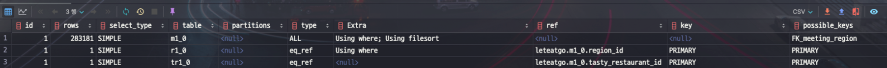
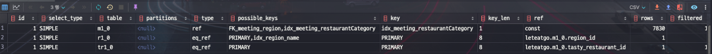
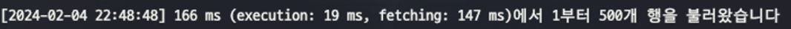
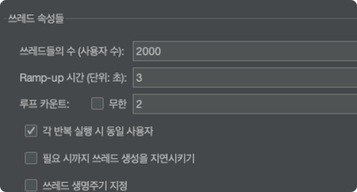
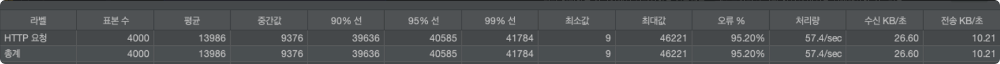
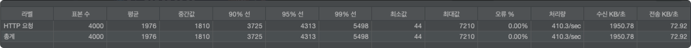

# 들어가기 앞서

:::info 개발환경
- Spring Boot 3.2.2
- MySQL 8.0.26
- QueryDSL 5.0.0
:::

[프로젝트](https://github.com/let-eat-go/backend)를 진행하면서 쿼리 성능을 향상시키기 위해 고민하고 적용한 방법에 대해 정리해보려고 합니다.

쿼리는 `QueryDSL`로 작성했고, RDBMS는 `MySQL`을 사용했습니다.

---

## 테스트를 위한 데이터 삽입

우선 테스트를 하기 위해 DB Procedure를 만들어 테스트 데이터를 삽입해보겠습니다.

```sql
/// title: Procedure 생성
# TastyRestaurant 데이터 생성하는 프로시저
create procedure tastyrestaurantdata()
begin
    declare i int default 1;
    while i <= 100000 do
        insert into tasty_restaurant ( created_at, updated_at, api_id, category, land_address, latitude, longitude, name, number_of_uses, phone_number, restaurant_url, road_address)
        VALUES ( NOW(), NOW(), FLOOR(RAND() * 1000000000000000000),
                ELT(CEIL(RAND() * 13), 'SNACK', 'STREET_FOOD', 'BUFFET', 'PUB', 'ASIAN_CUISINE', 'WESTERN_CUISINE', 'JAPANESE_CUISINE', 'CHINESE_CUISINE', 'FAST_FOOD', 'FAMILY_RESTAURANT', 'PIZZA', 'CHICKEN', 'KOREAN_CUISINE'),
                '서울시 강남구', 37.123456, 127.123456, CONCAT('테스트', FLOOR(RAND() * 10000)), 1, '010-1234-5678', 'http://www.naver.com', '서울시 강남구');
        set i = i + 1;
        end while;
end;

# Meeting 데이터 생성하는 프로시저
create procedure meetingdata()
begin
    declare i int default 1;
    while i <= 300000 do
        insert into meeting ( created_at, updated_at, current_participants, description, max_participants, age_preference, alcohol_preference, gender_preference, purpose, status, min_participants, name, restaurant_category, start_date_time, host_id, region_id, tasty_restaurant_id)
            values ( now(), now(), 1, 'test', 4, 'ANY' , 'ANY', 'ANY', 'SOCIAL', 'BEFORE', 1, '테스트',
                    ELT(CEIL(RAND() * 13), 'SNACK', 'STREET_FOOD', 'BUFFET', 'PUB', 'ASIAN_CUISINE', 'WESTERN_CUISINE', 'JAPANESE_CUISINE', 'CHINESE_CUISINE', 'FAST_FOOD', 'FAMILY_RESTAURANT', 'PIZZA', 'CHICKEN', 'KOREAN_CUISINE'),
                    now(), 1, 1, floor(1 + (rand() * 100000)));
        set i = i + 1;
        end while;
end;

# 프로시저 실행
call meetingdate();
call tastyrestaurantdata();
```

**10만개**의 `TastyRestaurant` 데이터와 **30만개**의 `Meeting` 데이터를 삽입했습니다.

(대략 데이터 10만개당 6~7분이 소요됐습니다)

## 테스트 할 쿼리1

프로젝트에서 모임목록을 조회하는 API가 있습니다. (`/api/meetings/list?page=1&region=강남구&category=피자`)

- **카테고리** 별로 조회 가능
- **모임 지역** 별로 조회 가능

```sql
/// title: 최적화 전 쿼리
select
    /* ... */
from
    meeting m1_0
        left join
    tasty_restaurant tr1_0
    on tr1_0.id=m1_0.tasty_restaurant_id
        join
    region r1_0
    on r1_0.id=m1_0.region_id
where
    m1_0.restaurant_category='PUB'
  and r1_0.name='강남구'
order by
    m1_0.created_at desc;
```

쿼리 최적화를 하기 전 조회 API의 쿼리는 위와 같이 실행되었습니다.

위 쿼리의 **실행계획**을 살펴봅시다. (실행계획은 `explain`을 통해 확인할 수 있습니다)

```sql
/// title: 실행계획 조회
explain
select
    /* ... */
from
    meeting m1_0
        left join
    tasty_restaurant tr1_0
    on tr1_0.id=m1_0.tasty_restaurant_id
        join
    region r1_0
    on r1_0.id=m1_0.region_id
where
    m1_0.restaurant_category='PUB'
  and r1_0.name='강남구'
order by
    m1_0.created_at desc;
```



조회된 실행계획을 살펴보면 `meeting` 테이블을 **type=ALL**로 조회하고 있습니다. (모든 레코드를 조회하는 것)

:::info type : 데이터를 찾을 방식
- `ALL`: 테이블의 모든 행을 스캔합니다. 이는 가장 비효율적인 방법이며, 가능하면 피해야 합니다.
- `index`: 인덱스의 모든 행을 스캔합니다. ALL보다는 좋지만, 여전히 비효율적입니다.
- `range`: 인덱스를 사용하여 특정 범위의 행을 검색합니다. 이는 효율적인 방법이 될 수 있습니다.
- `ref`: 인덱스를 사용하여 특정 행을 검색합니다. 이는 매우 효율적인 방법입니다.
- `eq_ref`: 유일한 인덱스를 사용하여 특정 행을 검색합니다. 이는 가장 효율적인 방법 중 하나입니다. (보통 fk를 사용해서 조인할 경우)
- `const, system`: 이 방법들은 테이블에 하나의 매칭 행만 있을 때 사용됩니다. 이는 매우 빠르며, 테이블의 행이 메모리에 저장될 수 있습니다.
:::

모든 레코드를 조회하는 것은 가장 비효율적인 방법이므로 이를 개선하기 위해 인덱스를 사용해보겠습니다.

### 인덱스 생성

먼저 `meeting` 테이블의 `restaurant_category` 컬럼에 인덱스를 생성해보겠습니다.

```sql
/// title: restaurant_category 인덱스 생성
create index idx_meeting_restaurant_category on meeting(restaurant_category);
```

또는 JPA Entity에서 설정해줄 수 있습니다.

```java
/// title: Meeting.java
@Entity
@Getter
@NoArgsConstructor(access = AccessLevel.PROTECTED)
@Table(indexes = {
        @Index(name = "idx_meeting_restaurant_category", columnList = "restaurant_category")
})
public class Meeting extends BaseEntity {
    // ...
}
```

인덱스를 설정해주고 다시 실행계획을 조회해보겠습니다.



type이 ref(=const)로 변경된 것을 확인할 수 있고 검색할 양(row)도 줄어든 것을 볼 수 있습니다.

where 조건에서 `category = PUB` 으로 조회 시 meeting 테이블에서 `PUB`이라는 카테고리를 가진 데이터가 **7830**개가 있고, 이를 인덱스를 통해 조회했습니다.

```sql
show index from meeting;
```

위 명령어를 통해 meeting 테이블의 인덱스를 조회해보면 방금 생성해준 `idx_meeting_restaurant_category` 인덱스가 생성된 것을 확인할 수 있습니다.
또한 fk 설정 시 해당 테이블들의 id값으로 자동으로 생성해준 인덱스들도 확인할 수 있습니다. (**이 인덱스들은 fk를 사용하여 조인할 경우 사용됩니다**)

하지만 `idx_meeting_restaurant_category` 인덱스의 `cardinality`가 **1**로 엄청 낮은 것을 확인할 수 있는데 이건 값들이 크게 다르지 않다는 뜻 입니다.
실제로 프로젝트에서는 카테고리가 12개밖에 없기 때문에 이렇게 낮은 값이 나온 것입니다.

이런 경우, 오히려 인덱스를 사용하지 않는 것이 더 효율적일 수 있습니다. (더 많은 I/O가 발생할 수 있음)

:::tip 인덱스 생성 시 고려할 점
빠른 검색을 위해 모든 컬럼에 인덱스를 적용하다보면 데이터를 등록,수정할 때마다 

정렬을 시도하기 때문에 속도가 느려질 수 있습니다. 따라서, 검색에 자주 사용되는 컬럼에만 인덱스를 적용하는 것이 좋습니다.
:::

인덱스를 생성한 후, 쿼리의 실행속도를 비교해보겠습니다.

- 인덱스 설정 전
    
- 인덱스 설정 후
    

약 **3배** 정도의 성능 향상이 있었습니다. (데이터가 많을수록 더 큰 차이가 날 수 있습니다)

추가로 **최신순 정렬**을 하기 위해 order by를 사용했는데, 이 부분도 `created_at` 컬럼에 인덱스를 생성해주면 더 효율적일 수 있습니다.

(저희 프로젝트에서는 created_at을 대부분 desc로 조회하기 때문에 인덱스 순서를 desc로 설정해주었습니다.)

```sql
/// title: created_at 인덱스 생성
create index idx_meeting_created_at on meeting(created_at desc);
```

또는 JPA Entity에서 설정해줄 수 있습니다.

```java
/// title: Meeting.java
@Entity
@Getter
@NoArgsConstructor(access = AccessLevel.PROTECTED)
@Table(indexes = {
        @Index(name = "idx_meeting_created_at", columnList = "created_at desc")
})
public class Meeting extends BaseEntity {
    // ...
}
```

이제 meeting 테이블에는 `restaurant_category`와 `created_at` 컬럼에 인덱스가 생성되었습니다.

다시 쿼리의 실행속도를 비교해보겠습니다.

- restaurant_category, created_at 인덱스 설정
    
- created_at에만 인덱스 설정
    

의아한 점은 `restaurant_category`와 `created_at` 컬럼에 인덱스를 생성한 것보다 `created_at`에만 인덱스를 생성한 것이 더 빠른 속도를 보였습니다.
이는 `restaurant_category` 컬럼의 `cardinality`가 낮아서 인덱스를 사용하지 않는 것이 더 효율적이었기 때문인지는 모르겠지만 `created_at` 컬럼에만 인덱스를
생성하는 게 더 빠른 속도를 보여주기 때문에 저는 `restaurant_category` 컬럼에는 인덱스를 생성하지 않기로 결정했습니다.

### 서브 쿼리 사용

현재 최적화 전 쿼리를 보면, `region` 테이블을 조인하여 `name` 컬럼을 조회하고 있습니다.

```sql
/// title: 최적화 전 쿼리
/// hlLines: 8,9,10,13
select
    /* ... */
from
    meeting m1_0
        left join
    tasty_restaurant tr1_0
    on tr1_0.id=m1_0.tasty_restaurant_id
        join
    region r1_0
    on r1_0.id=m1_0.region_id
where
    m1_0.restaurant_category='PUB'
  and r1_0.name='강남구'
order by
    m1_0.created_at desc;
```

where 조건에서 `region` 의 `name` 컬럼을 조회하는 것은 **서브쿼리**를 사용하여 최적화할 수 있습니다.

```java
/// title: 서브쿼리 사용 전 코드
/// hlLines: 13-15
    @Override
    public Slice<MeetingListResponse> findMeetingList(
            RestaurantCategory category, String regionName, Pageable pageable
    ) {

        BooleanBuilder condition = new BooleanBuilder();
        condition.and(meeting.meetingOptions.status.eq(MeetingStatus.BEFORE));

        if (category != null) {
            condition.and(meeting.restaurantCategory.eq(category));
        }

        if (regionName != null) {
            condition.and(meeting.region.name.eq(regionName));
        }

        List<MeetingListResponse> meetingList = queryFactory.select(meetingListProjection())
                .from(meeting)
                .join(meeting.host, member)
                .leftJoin(meeting.tastyRestaurant, tastyRestaurant)
                .where(condition)
                .orderBy(meeting.createdAt.desc())
                .offset(pageable.getOffset())
                .limit(pageable.getPageSize() + 1)
                .fetch();

        return new SliceUtil<>(meetingList, pageable).getSlice();
    }
```

현재 코드에서는 region 테이블의 name 필드를 기반으로 meeting 테이블을 조회하고 있습니다.

이러면 meeting 테이블의 `region_id` 인덱스를 활용하지 못하고 전체 레코드를 조회하게 됩니다.

이를 해결하기 위해, **서브쿼리**를 사용하여 최적화할 수 있습니다.

- 서브쿼리 내용 : 인자로 받은 regionName을 통해 region 테이블의 id를 먼저 조회하고, 이 id를 사용하여 meeting 테이블을 조회 (meeting 테이블의 region_id 인덱스를 활용)

```java
/// title: 서브쿼리 사용 후 코드
/// hlLines: 13-21
    @Override
    public Slice<MeetingListResponse> findMeetingList(
            RestaurantCategory category, String regionName, Pageable pageable
    ) {

        BooleanBuilder condition = new BooleanBuilder();
        condition.and(meeting.meetingOptions.status.eq(MeetingStatus.BEFORE));

        if (category != null) {
            condition.and(meeting.restaurantCategory.eq(category));
        }

        if (regionName != null) {
            condition.and(meeting.region.id.eq(
                    JPAExpressions
                            .select(region.id)
                            .from(region)
                            .where(region.name.eq(regionName)
                            )
            ));
        }

        List<MeetingListResponse> meetingList = queryFactory.select(meetingListProjection())
                .from(meeting)
                .join(meeting.host, member)
                .leftJoin(meeting.tastyRestaurant, tastyRestaurant)
                .where(condition)
                .orderBy(meeting.createdAt.desc())
                .offset(pageable.getOffset())
                .limit(pageable.getPageSize() + 1)
                .fetch();

        return new SliceUtil<>(meetingList, pageable).getSlice();
    }

    @Override
    public Slice<MeetingListResponse> searchMeetings(String term, Pageable pageable) {

        BooleanBuilder condition = new BooleanBuilder();
        condition.and(meeting.name.containsIgnoreCase(term) // LIKE %term%
                .or(tastyRestaurant.name.containsIgnoreCase(term))); // LIKE %term%

        List<MeetingListResponse> meetingSearchResponses = queryFactory
                .select(meetingListProjection())
                .from(meeting)
                .leftJoin(meeting.tastyRestaurant, tastyRestaurant)
                .where(condition)
                .orderBy(meeting.createdAt.desc())
                .offset(pageable.getOffset())
                .limit(pageable.getPageSize() + 1)
                .fetch();

        return new SliceUtil<>(meetingSearchResponses, pageable).getSlice();
    }
```

위 코드에서 `regionName`을 통해 `region` 테이블의 `id`를 조회하는 서브쿼리를 사용하여 최적화했습니다.

위 코드로 실행되는 쿼리는 아래와 같습니다.

```sql
/// hlLines: 13-19
    select
        /* ... */
    from
        meeting m1_0 
    left join
        tasty_restaurant tr1_0 
            on tr1_0.id=m1_0.tasty_restaurant_id 
    join
        region r1_0 
            on r1_0.id=m1_0.region_id 
    where
        m1_0.status=? 
        and m1_0.region_id=(
            select
                r2_0.id 
            from
                region r2_0 
            where
                r2_0.name=?
        ) 
    order by
        m1_0.created_at desc 
```

쿼리 실행속도는 큰 차이는 없었지만, 조~~금 속도가 향상된 것을 확인할 수 있었습니다.


### 결과

최종적으로 최적화를 통해 쿼리의 실행속도를 **4배** 정도 향상시킬 수 있었습니다.

- 처음
    
- 최종
    

또한 `Jmeter`로 부하테스르를 간략히 진행해봤습니다.

- 설정
    
- 처음 (인덱스 설정 전)
    
- 최종 (인덱스 설정 후)
    

인덱스 설정 전에는 모든 요청을 처리하지 못하고 nginx에서 502 Bad Gateway 에러가 발생했지만, 인덱스 설정 후에는 모든 요청을 처리할 수 있었습니다.

또한 `tps` (초당 처리량)에서도 엄청난 차이를 보였습니다. 

# 마무리

쿼리 성능을 향상시키기 위해 인덱스를 생성하고 서브쿼리를 사용하는 방법에 대해 알아보았습니다.

쿼리 성능을 향상시키기 위해 다양한 방법을 사용할 수 있지만, 가장 중요한 것은 **실행계획**을 확인하고
상황마다 쿼리 성능을 향상시키기 위한 방법이 다르기 때문에, 상황에 맞게 적용해보는 것이 중요하다는 것을 알 수 있었습니다.

긴 글 읽어주셔서 감사합니다. 😊