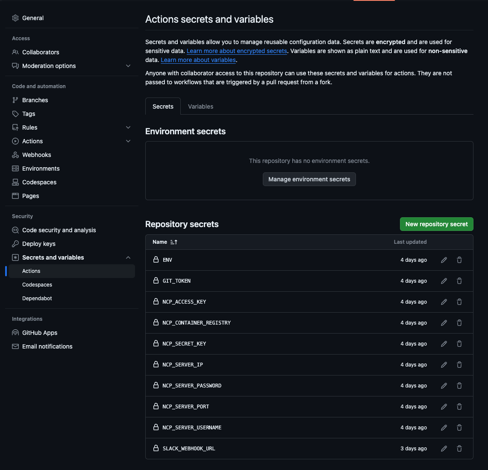

# 개요

[개인프로젝트](https://github.com/kingseungil/matgo)를 진행하면서 Blue Green Deploy를 구현해보았습니다.

전엔 `docker-compose`를 이용하여 수동으로 ec2 서버에 들어가서 `docker-compose up`을 통해 배포를 진행하였습니다.

이번엔 꼭 CI/CD를 적용해보고자 `github actions`를 이용하여 배포를 진행해보았습니다.

# CI/CD

CI/CD를 구축하는 방법은 여러가지가 있습니다.

대표적으로 `Jenkins`, `Travis CI`, `Github Actions` 등이 있습니다.

또는 각 클라우드 서비스에 존재하는 CI/CD 서비스를 이용할 수도 있습니다. (e.g. AWS CodePipeline, NCP CodePipeline 등)

취준생은 가난하고, 클라우드 서비스는 울렁증이 있어서.. 그나마 무료인 `Github Actions`를 이용하여 배포를 진행해보았습니다.

## Github Actions

:::info Github Actions란?
GitHub Actions는 GitHub에서 제공하는 서비스로, 빌드, 테스트, 배포 파이프라인을 자동화할 수 있는 `CI(Continuous Integration, 지속 통합)`와 `CD(Continuous Deployment, 지속 배포)` 플랫폼입니다. 

GitHub Actions를 사용하면 GitHub 리포지토리에서 손쉽게 CI/CD 결과를 확인하고 관리할 수 있습니다. 

또한, YAML 포맷을 사용하여 가독성이 높고, 이미 구현되어 있는 수많은 액션을 활용하여 간단하게 CI/CD 플로우를 작성할 수 있습니다.

출처 : <https://tech.kakaoenterprise.com/180>
:::

Github Actions는 `.github/workflows` 디렉토리에 `yml` 파일을 생성하여 workflow를 정의합니다.

<details>
<summary>deploy.yml</summary>

```yaml
/// title: deploy.yml
name: auto deploy

on:
  push:
    branches:
      - master

jobs:
  push_to_ncp_registry:
    name: Push to ncp container registry
    runs-on: ubuntu-latest
    services:
      redis:
        image: redis
        ports:
          - 6379:6379
      elasticsearch:
        image: elasticsearch:8.6.2
        ports:
          - 9200:9200
        options: -e="discovery.type=single-node"
    steps:
      - name: Checkout
        uses: actions/checkout@v3

      - name: Set up JDK 17
        uses: actions/setup-java@v2
        with:
          distribution: 'adopt'
          java-version: '17'

      - name: Set environment values
        run: |
          cd ./src/main/resources
          mkdir properties
          cd properties
          touch ./env.properties
          echo "${{ secrets.ENV }}" > ./env.properties

      - name: Build with Gradle
        uses: gradle/gradle-build-action@bd5760595778326ba7f1441bcf7e88b49de61a25 # v2.6.0
        with:
          arguments: build generateSwaggerUI

      - name: Set up Docker Buildx
        uses: docker/setup-buildx-action@v2

      - name: Login to NCP Container Registry
        uses: docker/login-action@v2
        with:
          registry: ${{ secrets.NCP_CONTAINER_REGISTRY }}
          username: ${{ secrets.NCP_ACCESS_KEY }}
          password: ${{ secrets.NCP_SECRET_KEY }}

      - name: build and push
        uses: docker/build-push-action@v3
        with:
          context: .
          file: ./docker/api/Dockerfile
          push: true
          tags: |
            ${{ secrets.NCP_CONTAINER_REGISTRY }}/matgo:${{ github.sha }}
            ${{ secrets.NCP_CONTAINER_REGISTRY }}/matgo:latest
          cache-from: type=registry,ref=${{ secrets.NCP_CONTAINER_REGISTRY }}/matgo:latest
          cache-to: type=inline
          secrets: |
            GIT_AUTH_TOKEN=${{ secrets.GIT_TOKEN }}

  pull_from_ncp_registry:
    name: Connect server ssh and pull from ncp container registry
    needs: push_to_ncp_registry
    runs-on: ubuntu-latest
    steps:
      - name: connect ssh
        uses: appleboy/ssh-action@master
        with:
          host: ${{ secrets.NCP_SERVER_IP }}
          username: ${{ secrets.NCP_SERVER_USERNAME }}
          password: ${{ secrets.NCP_SERVER_PASSWORD }}
          port: ${{ secrets.NCP_SERVER_PORT }}
          script: |
            cd matgo
            git pull
            echo "${{ secrets.NCP_SECRET_KEY }}" | docker login ${{ secrets.NCP_CONTAINER_REGISTRY }} --username ${{ secrets.NCP_ACCESS_KEY }} --password-stdin
            docker pull ${{ secrets.NCP_CONTAINER_REGISTRY }}/matgo:latest
            cd script
            chmod +x deploy.sh
            ./deploy.sh
            docker image prune -f --filter "until=24h"

      - name: Notify to slack
        uses: 8398a7/action-slack@v3
        with:
          status: ${{ job.status }}
          author_name: Matgo
          fields: repo,message,commit,action,eventName,ref,workflow,job,took
        env:
          SLACK_WEBHOOK_URL: ${{ secrets.SLACK_WEBHOOK_URL }}
        if: always()
```
</details>

위 코드를 살펴보기 전에 Github Actions의 구조를 살펴보겠습니다.

### Github Actions 구조

#### workflow

Github Actions는 `workflow`를 기반으로 동작합니다.

workflow는 쉽게 말해 '작업의 흐름'으로, 특정한 목적을 위한 일련의 실행 트리거, 환경, 기능들을 모두 포함합니다.

workflow 파일에서 `on` 속성을 통해 해당 workflow가 어떤 이벤트에 반응하여 동작할지 정의합니다.

```yaml
on:
  push:
    branches:
      - master
```

위 코드는 `master` 브랜치에 push가 발생하면 workflow가 동작하도록 정의한 것입니다.

#### job

workflow는 하나 이상의 `job`으로 구성됩니다.

job은 github actions에서 **독립된 환경에서 돌아가는 하나의 처리 단위**를 의미합니다.

job에서 필수적으로 정의해야 하는 속성은 **runs-on**과 **steps**입니다.

:::info runs-on
runs-on에는 Job을 실행할 러너(환경)을 정의합니다.

위 코드같은 경우 `ubuntu-latest`를 사용하였습니다.

OS마다 비용이 다르기 때문에, 자신의 프로젝트에 맞는 러너를 선택하여 사용하면 됩니다.
[러너 비용](https://docs.github.com/en/billing/managing-billing-for-github-actions/about-billing-for-github-actions#about-billing-for-github-actions)
:::

:::info steps
steps에는 job에서 실행할 작업들을 정의합니다.

`name` 속성은 해당 작업의 이름을 정의하고, `uses` 속성은 해당 작업을 실행할 액션을 정의합니다.
:::

이 외에 속성들은 검색하면 쉽게 찾을 수 있으니 생략하겠습니다.

### Secret 설정하기

deploy.yml 파일을 보면 `{{ secrets.ENV }}` 같은 부분이 보입니다. 이는 Github Actions에서 사용하는 환경변수를 의미합니다.


Github Actions에서 사용하는 환경변수는 `Settings > Secrets`에서 설정할 수 있습니다.

Secrets and variables의 Actions 부분을 클릭하고 사용할 환경변수를 추가합니다.



이제 master 브랜치에 push가 발생하면 위 코드대로 workflow가 동작하게 됩니다.

## deploy.yml 코드 살펴보기

전체적인 흐름은 다음과 같습니다.

1. master 브랜치에 push가 발생하면 `push_to_ncp_registry` job이 동작합니다.
   - 스프링부트가 빌드될 때, 테스트가 실행되기 때문에 필요한 redis, elasticsearch를 서비스로 실행합니다.
   - 그리고 gradle을 이용하여 빌드를 진행합니다.
   - 빌드가 완료되면 해당 이미지를 NCP Container Registry에 push합니다.
2. `push_to_ncp_registry` job이 완료되면 `pull_from_ncp_registry` job이 동작합니다.
   - ssh를 이용하여 NCP 서버에 접속합니다.
   - 해당 서버에서 `docker pull`을 통해 이미지를 받아옵니다.
   - `docker-compose`를 이용하여 컨테이너를 실행합니다.
3. `pull_from_ncp_registry` job이 완료되면 `Notify to slack` job이 동작합니다.
   - 해당 job이 성공했는지 실패했는지에 따라 slack에 알림을 보냅니다.

여기서 살펴봐야 할 부분은 `pull_from_ncp_registry` 입니다.

blue-green deploy를 구현하기 위해 `deploy.sh`를 실행하는데 이 파일은 다음과 같습니다.

<details>
<summary>deploy.sh</summary>

```bash
#! /bin/bash

cd ../docker

# nginx container가 없으면 실행
if [ $(docker ps | grep -c "matgo-proxy") -eq 0 ]; then
  echo "### Starting Nginx ###"
  docker-compose up -d matgo-proxy
else
  echo "### Nginx already running ###"
fi

# db container가 없으면 실행
if [ $(docker ps | grep -c "matgo-db") -eq 0 ]; then
  echo "### Starting database ###"
  docker-compose up -d matgo-db
else
  echo "### Database already running ###"
fi
# redis container가 없으면 실행
if [ $(docker ps | grep -c "matgo-redis") -eq 0 ]; then
  echo "### Starting redis ###"
  docker-compose up -d matgo-redis
else
  echo "### Redis already running ###"
fi

# es container가 없으면 실행
if [ $(docker ps | grep -c "matgo-es") -eq 0 ]; then
  echo "### Starting elasticsearch ###"
  docker-compose up -d matgo-es
else
  echo "### Elasticsearch already running ###"
fi

echo

IS_BLUE=$(docker ps | grep -c "blue")

if [ "$IS_BLUE" -eq 1 ]; then
  echo "### BLUE => GREEN ###"

  echo "1. green container up"
  docker-compose up -d matgo-server-green

  echo "Waiting for the green application to fully start..."
  sleep 45

  echo "2. reload nginx"
  cd /root/matgo/docker/nginx || exit # 각자 경로에 맞게 수정
  docker-compose exec matgo-proxy /bin/bash -c "cp /etc/nginx/nginx.green.conf /etc/nginx/nginx.conf && nginx -s reload"

  MAX_ATTEMPTS=10
  ATTEMPTS=0

  while [ $ATTEMPTS -lt $MAX_ATTEMPTS ]; do
    echo "3. green container health check"
    sleep 3

    REQUEST=$(curl http://{url}/)
#    REQUEST=$(curl http://127.0.0.1/)
    if [ -n "$REQUEST" ]; then
      echo "4. green container health check success"
      break
    fi

    ATTEMPTS=$((ATTEMPTS+1))

    if [ $ATTEMPTS -eq $MAX_ATTEMPTS ]; then
      echo "Green health check failed after $MAX_ATTEMPTS attempts. Reverting Nginx configuration."
      docker-compose exec matgo-proxy /bin/bash -c "cp /etc/nginx/nginx.blue.conf /etc/nginx/nginx.conf && nginx -s reload"
      exit 1
    fi
  done

  echo "5. blue container down"
  docker-compose stop matgo-server-blue
else
  echo "### GREEN => BLUE ###"

  echo "1. blue container up"
  docker-compose up -d matgo-server-blue

  echo "Waiting for the blue application to fully start..."
  sleep 45

  echo "2. reload nginx"
  cd /root/matgo/docker/nginx || exit # 각자 경로에 맞게 수정
  docker-compose exec matgo-proxy /bin/bash -c "cp /etc/nginx/nginx.blue.conf /etc/nginx/nginx.conf && nginx -s reload"


  MAX_ATTEMPTS=10
  ATTEMPTS=0

  while [ $ATTEMPTS -lt $MAX_ATTEMPTS ]; do
    echo "3. blue container health check"
    sleep 3

    REQUEST=$(curl http://{url}/)
#    REQUEST=$(curl http://127.0.0.1/)
    if [ -n "$REQUEST" ]; then
      echo "4. blue container health check success"
      break
    fi

    ATTEMPTS=$((ATTEMPTS+1))

    if [ $ATTEMPTS -eq $MAX_ATTEMPTS ]; then
      echo "Blue health check failed after $MAX_ATTEMPTS attempts. Reverting Nginx configuration."
      docker-compose exec matgo-proxy /bin/bash -c "cp /etc/nginx/nginx.green.conf /etc/nginx/nginx.conf && nginx -s reload"
      exit 1
    fi
  done

  echo "5. green container down"
  docker-compose stop matgo-server-green
fi
```
</details>

`deploy.sh`는 다음과 같은 역할을 합니다.

1. nginx, db, redis, elasticsearch 컨테이너가 없으면 실행합니다.
2. 현재 실행중인 컨테이너가 blue 컨테이너인지 green 컨테이너인지 확인합니다.
3. 현재 실행중인 컨테이너가 blue 컨테이너라면 green 컨테이너를 실행합니다.
4. nginx 설정을 green 컨테이너로 변경합니다. (프록시 설정을 바꿔줘서 green 컨테이너로 요청이 들어가도록 합니다.)
5. green 컨테이너가 정상적으로 실행되었는지 확인합니다.
6. blue 컨테이너를 종료합니다.

이렇게되면 blue 컨테이너가 green 컨테이너로 교체되는 것이고, 이 과정에서 downtime이 발생하지 않습니다.

:::tip downtime이란?
downtime은 서비스가 중단되는 시간을 의미합니다.

blue-green deploy를 하지 않는다면, 배포 과정에서 downtime이 발생합니다.

docker-compose up을 통해 컨테이너를 실행하면, 컨테이너가 실행되는 동안 서비스가 중단됩니다.

하지만 blue-green deploy를 하게되면, 컨테이너를 실행하는 과정에서 downtime이 발생하지 않습니다.
:::

# 마치며

모든 코드를 해당 글에 담지 않았고, 전체적인 흐름만 담았습니다.

글에서는 설명하지 않았지만 `docker-compose.yml` 파일도 작성해야하고,

`nginx.green.conf`, `nginx.blue.conf` 파일도 작성해야합니다.

해당 코드는 [여기](https://github.com/kingseungil/matgo)에서 확인할 수 있습니다.