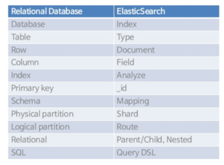

# 서론

> springboot 3.1.6, java 17, elasticsearch 8.6.2 버전을 사용하였습니다.

:::info 왜 도입하였나?
개인 프로젝트를 진행하면서 [전주시 음식점 공공데이터](https://www.data.go.kr/tcs/dss/selectFileDataDetailView.do?publicDataPk=15076735#tab-layer-openapi)를 사용하여
맛집 정보를 제공하는 서비스를 만들고 있습니다. 

맛집 조회 API에서 구현하고자 하는 기능은 다음과 같습니다. 

- 맛집 이름으로 검색
- 내 지역 기준으로 검색
- 전체 맛집 조회

RDB의 `Like 검색`을 사용해도 되지만, 데이터가 많아질수록 검색 속도가 느려지기 때문에 `Elasticsearch`를 도입하게 되었습니다.
:::

# Elasticsearch란?

우선 엘라스틱서치에 대해 간단히 알아보겠습니다.

:::info Elasticsearch
Elasticsearch는 Apache Lucene 기반의 Java 오픈소스 분산 검색 엔진입니다.

역색인 기반의 검색 엔진으로, 데이터를 저장할 때 역색인을 생성하여 검색 속도를 높입니다.

> `역색인(Inverted Index)` : 보통 책의 뒷 페이지에 있는 색인처럼, 특정 단어가 어느 문서에 있는지를 기록한 색인
> 
> 역색인은 특정 단어가 어느 문서에 있는지를 기록하기 때문에, 특정 단어를 검색할 때 모든 문서를 훑어보지 않고 역색인을 통해 검색할 문서를 빠르게 찾을 수 있습니다.
> 
> 

Elasticsearch는 검색을 위해 단독으로 사용되기도 하며

ELK 스택(Elasticsearch, Logstash, Kibana)의 중요한 구성 요소로 사용되기도 합니다.
:::

## Elasticsearch vs RDB



RDB와 Elasticsearch의 차이점은 다음과 같습니다.

- `RDB`
  - 정형화된 데이터를 저장하기 위해 설계된 데이터베이스
  - 데이터를 테이블에 저장하고, 테이블 간의 관계를 정의
  - 테이블에 저장된 데이터를 검색하기 위해 SQL을 사용
  - 데이터의 일관성을 보장하기 위해 트랜잭션을 사용
  - 데이터의 무결성을 보장하기 위해 제약 조건을 사용
- `Elasticsearch`
  - 비정형화된 데이터를 저장하기 위해 설계된 데이터베이스
  - 데이터를 문서에 저장하고, 문서 간의 관계를 정의하지 않음
  - 문서에 저장된 데이터를 검색하기 위해 JSON기반의 DSL을 사용
  - 데이터의 일관성을 보장하지 않음
  - 데이터의 무결성을 보장하지 않음

## Elasticsearch의 특징

- `분산형 구조`
  - 여러 대의 서버에 데이터를 분산 저장하고, 검색 요청을 분산 처리
  - 서버가 추가되거나 삭제되어도 클러스터를 중단시키지 않고 계속 운영 가능
- `RESTful API`
  - HTTP 프로토콜을 사용하여 데이터를 색인하고, 검색 가능
    | **Data CRUD** | **Elasticsearch Resfful** |
    |-----------|-----------------------|
    | Create    | PUT                   |
    | Read      | GET                   |
    | Update    | POST                  |
    | Delete    | DELETE                |


# Elasticsearch 설치 (Docker)

간단히 설치하기 위해 `docker-compose`를 사용했습니다.

<details>
<summary>docker-compose.yml</summary>

```yaml
/// title: docker-compose.yml
version: '3.7'

services:
  elasticsearch:
    build:
      context: ./elastic
      dockerfile: Dockerfile
      args:
        VERSION: 8.6.2
    container_name: elasticsearch
    environment:
      - xpack.security.enabled=false # 보안 기능 비활성화
      - discovery.type=single-node # 단일 노드로 실행 
    ulimits:
      memlock:
        soft: -1
        hard: -1
      nofile:
        soft: 65536
        hard: 65536
    cap_add:
      - IPC_LOCK
    volumes:
      - elasticsearch-data:/usr/share/elasticsearch/data
    ports:
      - "9200:9200"
      - "9300:9300"
    restart: always

volumes:
  elasticsearch-data:
    driver: local
```
</details>


<details>
<summary>Dockerfile</summary>

```dockerfile
/// title: Dockerfile
ARG VERSION
FROM docker.elastic.co/elasticsearch/elasticsearch:${VERSION}
RUN elasticsearch-plugin install analysis-nori
```

</details>

`docker-compose.yml` 파일을 보면 `elasticsearch` 서비스를 실행하기 위해 `Dockerfile`을 사용하고 있습니다.

따로 `Dockerfile`을 만든 이유는 `elasticsearch`에 `nori` 플러그인을 설치하기 위해서입니다.

:::tip nori 플러그인
한글 형태소 분석기인 `nori` 플러그인을 설치하면 한글을 분석할 수 있습니다.
:::

## Springboot와 Elasticsearch 연동

`Springboot`와 `Elasticsearch`를 연동하기 위해 `spring-boot-starter-data-elasticsearch` 의존성을 추가합니다.

```groovy
/// title: build.gradle
dependencies {
    implementation 'org.springframework.boot:spring-boot-starter-data-elasticsearch'
}
```

그리고 `ElasticConfig` 클래스에 `Elasticsearch` 설정을 추가합니다.

```java
/// title: ElasticSearchConfig.java
@Configuration
@EnableElasticsearchRepositories
@EnableElasticsearchAuditing
public class ElasticSearchConfig extends ElasticsearchConfiguration {

    @Override
    public ClientConfiguration clientConfiguration() {
        return ClientConfiguration.builder()
                                  .connectedTo("localhost:9200")
                                  .build();
    }
}
```

이제 `Elasticsearch`와 `Springboot` 연동이 완료되었습니다.

# Elasticsearch 사용하기

우선 공공데이터에서 받아온 데이터는 RDB에 저장되어 있기 때문에 `Elasticsearch`에 데이터를 색인해야 합니다.

1. `Logstash`를 사용하여 RDB에서 데이터를 가져와 `Elasticsearch`에 색인
2. `Springboot` 애플리케이션에서 실시간으로 `Elasticsearch`에 색인

저는 두 가지 방법 중 고민하다가 2번 방법을 선택했습니다. 우선 `Logstash`는 별도의 서버가 필요해서 관리 비용이 높고 러닝커브가 있기 때문에
비교적 간단하고 직관적인 2번 방법을 선택했습니다.

## Springboot에서 Elasticsearch 색인하기

우선 색인 과정은, 공공데이터를 한달에 한번 스케쥴링으로 가져와서 RDB에 저장하는데 이때 같이 `Elasticsearch`에도 색인을 진행합니다.

<details>
<summary>RestaurantService.java</summary>

```java
@Transactional
// 한달에 한번씩 실행
@Scheduled(cron = "0 0 0 1 * *")
public void fetchAndSaveRestaurants() {
    int page = 1;
    int perPage = 100;

    RestaurantDataResponse response;
    do {
        response = fetchRestaurantsFromAPI(page, perPage);
        List<Restaurant> restaurants = convertToRestaurants(response.data());
        Map<String, Restaurant> existingRestaurantsMap = getExistingRestaurantsMap(restaurants);
        List<Restaurant> newRestaurants = getNewRestaurants(restaurants, existingRestaurantsMap);
        saveRestaurants(newRestaurants);
        page++;
    } while (response.page() * response.perPage() < response.totalCount());

    log.info("fetch and save restaurants success");
    indexingToES();
}

@Transactional
// 한시간에 한번씩 실행
@Scheduled(cron = "0 0 * * * *")
public void indexingToES() {
  // 1시간 이내에 수정된 식당만 elasticsearch에 저장
  LocalDateTime oneHourAgo = LocalDateTime.now().minusHours(1);
  List<Restaurant> restaurants = restaurantRepository.findByModifiedAtAfterAndApprovedAtIsNotNull(oneHourAgo);
  if (restaurants.isEmpty()) {
    log.info("No restaurants updated in the last hour");
  } else {
    List<RestaurantSearch> restaurantSearches = restaurants.stream()
                                                           .map(RestaurantSearch::from)
                                                           .toList();
    restaurantSearchRepositoryImpl.bulkInsertOrUpdate(restaurantSearches);
    log.info("elasticsearch indexing success");
  }

}
```
</details>

- `fetchAndSaveRestaurants()`
  - 공공데이터에서 맛집 정보를 가져와서 RDB에 저장
  - RDB에 저장된 맛집 정보를 Elasticsearch에 색인 (`indexingToES()` 호출)
- `indexingToES()`
  - RDB에 저장된 맛집 정보를 Elasticsearch에 색인
  - 이후에는 1시간에 한번씩 실행되어 RDB에 저장된 맛집 정보를 Elasticsearch에 색인

이렇게 RDB와 Elasticsearch의 데이터 동기화를 맞추면 Elasticsearch에 색인된 데이터를 사용하여 검색 API를 구현할 수 있습니다.

## Elasticsearch 검색 API 구현준비

API를 구현하기 전에 사전작업을 진행해야 합니다.

1. Elasticsearch용 Document 클래스 생성
2. Document 클래스를 사용하기 위한 Repository 생성

마치 JPA를 사용할 때 엔티티 클래스를 생성하고, 엔티티 클래스를 사용하기 위한 Repository를 생성하는 것과 비슷합니다.

### Elasticsearch용 Document 클래스 생성

<details>
<summary>RestaurantSearch.java</summary>

```java
/// title: RestaurantSearch.java
@Document(indexName = "restaurant")
@Mapping(mappingPath = "elastic/restaurant-search-mapping.json")
@Setting(settingPath = "elastic/restaurant-search-setting.json")
@Getter
@AllArgsConstructor
public class RestaurantSearch {

    @Id
    private String id;
    @Field(type = FieldType.Text, name = "name")
    private String name;
    @Field(type = FieldType.Text, name = "roadAddress")
    private String roadAddress;
    @Field(type = FieldType.Text, name = "address")
    private String address;
    @Field(type = FieldType.Text, name = "phoneNumber")
    private String phoneNumber;
    @Field(type = FieldType.Double, name = "lat")
    private Double lat;
    @Field(type = FieldType.Double, name = "lon")
    private Double lon;
    @Field(type = FieldType.Text, name = "description")
    private String description;
    @Field(type = FieldType.Double, name = "rating")
    private Double rating;
    @Field(type = FieldType.Integer, name = "reviewCount")
    private Integer reviewCount;
}
```
</details>

위 코드를 살펴보겠습니다.

- `@Document`
  - `indexName` : Elasticsearch에 색인될 때 사용될 인덱스 이름 (= Table 이름)
- `@Mapping`
  - `mappingPath` : Elasticsearch에 색인될 때 사용될 매핑 파일 경로
  - 매핑 파일은 Elasticsearch에 색인될 때 사용될 데이터의 타입을 정의합니다.
  - 따로 매핑 파일을 작성하지 않고, `@Field` 어노테이션을 사용해도 됩니다.
- `@Setting`
  - `settingPath` : Elasticsearch에 색인될 때 사용될 세팅 파일 경로
  - 세팅 파일은 Elasticsearch에 색인될 때 사용될 인덱스의 세팅을 정의합니다.
  - 저 같은 경우엔, `nori` 플러그인을 사용하기 위해 `analysis` , `tokenizer` 세팅을 추가했습니다.
- `@Id`
  - Elasticsearch에 색인될 때 사용될 데이터의 식별자
  - `@Id` 어노테이션을 사용하지 않으면 Elasticsearch에 색인될 때 자동으로 식별자가 생성됩니다.
- `@Field`
  - Elasticsearch에 색인될 때 사용될 데이터의 필드
  - `type` : 데이터의 타입
  - `name` : 필드 이름 (= Column 이름)
  - `analyzer` : 데이터의 분석기
  - 등등 다양한 옵션을 사용할 수 있습니다.

<details>
<summary>restaurant-search-mapping.json</summary>

```json
{
  "properties": {
    "id": {
      "type": "keyword"
    },
    "name": {
      "type": "text",
      "analyzer": "nori"
    },
    "roadAddress": {
      "type": "text",
      "analyzer": "nori"
    },
    "address": {
      "type": "text",
      "analyzer": "nori"
    },
    "phoneNumber": {
      "type": "text"
    },
    "lat": {
      "type": "double"
    },
    "lon": {
      "type": "double"
    },
    "description": {
      "type": "text",
      "analyzer": "nori"
    },
    "rating": {
      "type": "double"
    },
    "reviewCount": {
      "type": "integer"
    }
  }
}
```

</details>

<details>
<summary>restaurant-search-setting.json</summary>

```json
{
  "analysis": {
    "analyzer": {
      "nori": {
        "type": "custom",
        "tokenizer": "nori_mixed",
        "filter": [
          "lowercase",
          "stop"
        ]
      }
    },
    "tokenizer": {
      "nori_mixed": {
        "type": "nori_tokenizer",
        "decompound_mode": "mixed",
        "discard_punctuation": "false"
      }
    }
  }
}
```
</details>

### Document 클래스를 사용하기 위한 Repository 생성

```java
@Repository
public interface RestaurantSearchRepository extends ElasticsearchRepository<RestaurantSearch, String> {

  @Query("{\"match_phrase\": {\"address\": \"?0\"}}")
  Page<RestaurantSearch> findByAddressExactMatch(String addressKeyword, Pageable pageable);
}
```

마치 JPA를 사용할 때 Repository를 생성하는 것과 비슷합니다. 

`JpaRepository` 대신 `ElasticsearchRepository`를 상속받습니다.

이 인터페이스에 기본적인 CRUD 메서드가 정의되어있고, JPA의 JPQL처럼 메서드 이름을 통해 쿼리를 생성할 수 있습니다.

또는 `@Query` 어노테이션을 사용하여 직접 쿼리를 작성할 수도 있습니다.

## Elasticsearch 검색 API 구현

예시로 `address` 필드를 기준으로 검색하는 API를 구현해보겠습니다.

<details>
<summary>RestaurantSearchController.java</summary>

```java
/// title: RestaurantController.java
@RestController
@RequiredArgsConstructor
public class RestaurantController {
    
    private final RestaurantService restaurantService;

    @GetMapping("/address")
    public RestaurantsSliceResponse getRestaurantsByAddress(
            @RequestParam String keyword,
            @Valid CustomPageRequest customPageRequest
    ) {
      Pageable pageable = PageRequest.of(
              customPageRequest.page(),
              customPageRequest.size(),
              customPageRequest.getSort()
      );
      return restaurantService.getRestaurantsByAddress(keyword, pageable);
    }
}
```


</details>
<details>
<summary>RestaurantService.java</summary>

```java
/// title: RestaurantService.java
@Service
@RequiredArgsConstructor
public class RestaurantService {

    private final RestaurantSearchRepository restaurantSearchRepository;

    @Transactional(readOnly = true)
    public RestaurantsSliceResponse getRestaurantsByAddress(String addressKeyword, Pageable pageable) {
      Slice<RestaurantSearch> slice = restaurantSearchRepository.findByAddressExactMatch(addressKeyword, pageable);
      List<RestaurantSliceResponse> restaurants = slice.map(RestaurantSliceResponse::from).toList();
  
      return new RestaurantsSliceResponse(restaurants, slice.hasNext());
    }
}
```

</details>

이런식으로 Elasticsearch에 인덱싱만 해두면, 간편하게 검색 API를 구현할 수 있습니다.

전체 코드는 [여기](https://github.com/kingseungil/matgo)에서 확인할 수 있습니다.

---

# 참고

- <https://www.slideshare.net/deview/2d1elasticsearch>
