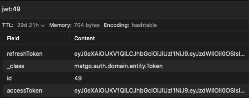

# 스프링부트 로그인 인증 구현하기

:::info
Springboot 3.1.6, Java 17 기준으로 작성되었습니다.
:::

로그인 구현을 처음해보는 것은 아니지만, 할 때마다 새롭고 어렵다..😭

전에 `NestJS`로 로그인 인증을 구현해본 적이 있는데, 그때는 `Passport`를 이용해서 구현했었다. 

방법이 정형화되어있어서 그런지 어렵지 않게 구현했던 기억이 있다.

하지만 스프링은 오히려 너무 방대한 자료들 덕분에(?) 어떻게 구현하는게 좋은건지 감이 잘 안잡혔다. 그래서 이번 기회에 정리해보려고 한다.

## 왜 Refresh Token을 도입했는가?

단순히 Access Token만 이용해도 로그인 인증을 구현할 순 있다.

하지만, 유효기간이 짧은 Access Token만 이용하면, Access Token이 만료되면 로그인 인증이 풀리게 된다. 그래서 사용자 입장에서 매번 로그인을 해야하는 불편함이 있다.
이를 해결하기 위해 **Refresh Token**을 도입했다. 유효기간이 긴 Refresh Token을 이용해서 Access Token을 갱신해주면, 로그인 인증이 풀리지 않는다.

또한 `Refresh Token`을 이용하면, `Access Token`의 유효기간을 짧게 설정할 수 있어서 보안에도 도움이 된다.

## Access Token, Refresh Token을 어디에 저장할 것인가?

`Access Token`, `Refresh Token`을 어디에 저장할 것인지에 대해서는 여러가지 방법이 있다.

- **Frontend** : `LocalStorage`, `Cookie`
  - stateless한 jwt토큰의 특성으로 서버의 부하를 줄일 수 있는 장점이 있다.
  - 하지만, `LocalStorage`는 XSS공격에 취약하고, `Cookie`는 CSRF 공격에 취약하다. 또한 토큰이 탈취된다면 아무런 조치를 취할 수 없는 단점이 있다.

- **Backend** : `RDB`, `Redis`
  - `RDB`는 트랜잭션을 지원하기 때문에 데이터의 일관성을 보장할 수 있다. 하지만, 속도가 느리다는 단점이 있다.
  - `Redis`는 In-memory DB이기 때문에 속도가 빠르고, 데이터의 일관성 또한 보장할 수 있다(**AOF, RDB 영속성 매커니즘 지원**). 하지만, 메모리를 많이 사용하고, 추가적인 서버를 두어야 한다는 단점이 있다.

이번 프로젝트에서는 `Redis`를 이용해서 `Access Token`, `Refresh Token`을 저장하는 방식을 선택했다.

## Process

1. 로그인을 하면 Access Token, Refresh Token을 발급한다.
   -  Access Token은 클라이언트로 전달하고 Access Token 과 Refresh Token으로 구성된 객체를 Redis에 저장한다.
2. 클라이언트는 Access Token을 이용해서 API를 요청한다.
3. Access Token이 만료되면, 서버 측에서 캐치하여 Refresh Token을 이용해서 Access Token을 갱신한다.
   - Refresh Token도 만료되었다면, 로그인을 다시 해야한다.
4. 로그아웃을 하면, Redis에 저장된 Access Token, Refresh Token을 삭제한다.

## 구현

### Redis

```groovy
/// title: build.gradle
dependencies {
    // security
    implementation 'org.springframework.boot:spring-boot-starter-security'

    // redis
    implementation 'org.springframework.boot:spring-boot-starter-data-redis'

    // jwt
    implementation 'io.jsonwebtoken:jjwt-api:0.11.5'
    runtimeOnly 'io.jsonwebtoken:jjwt-impl:0.11.5'
    runtimeOnly 'io.jsonwebtoken:jjwt-jackson:0.11.5'
}
```

위와 같이 의존성을 추가해주고, `application.yml`에 Redis 설정을 추가해준다.

```yaml
/// title: application.yml
spring:
  data:
    redis:
      host: localhost
      port: 6379
```

그리고 `RedisConfig`와 redis와 매핑할 `Token` 클래스를 만들어준다.

```java
/// title: RedisConfig.java
import org.springframework.beans.factory.annotation.Value;
import org.springframework.context.annotation.Bean;
import org.springframework.context.annotation.Configuration;
import org.springframework.data.redis.connection.RedisConnectionFactory;
import org.springframework.data.redis.connection.lettuce.LettuceConnectionFactory;

@Configuration
public class RedisConfig {

    @Value("${spring.data.redis.host}")
    private String host;
    @Value("${spring.data.redis.port}")
    private int port;

    @Bean
    public RedisConnectionFactory redisConnectionFactory() {
        return new LettuceConnectionFactory(host, port);
    }
}
```

```java
/// title: Token.java
import jakarta.persistence.Id;
import lombok.AllArgsConstructor;
import lombok.Getter;
import org.springframework.data.redis.core.RedisHash;
import org.springframework.data.redis.core.index.Indexed;

@Getter
@RedisHash(value = "jwt", timeToLive = 60 * 60 * 24 * 30) // 30일
@AllArgsConstructor
public class Token {

    @Id
    private String id;

    @Indexed
    private String accessToken;

    private String refreshToken;

    public void updateAccessToken(String accessToken) {
        this.accessToken = accessToken;
    }
}
```

Token 클래스는 `RedisHash` 어노테이션을 이용해서 Redis에 저장할 객체임을 명시해준다. 기간은 30일로 설정해줬다.

그리고 accessToken에 `@Indexed` 어노테이션을 달아줬는데, 이는 Redis에 저장된 객체를 조회할 때 사용할 수 있게 해준다. 또한 Redis Set 자료구조를 이용해서 저장되기 때문에 중복된 객체는 저장되지 않는다.

이제 Redis 데이터를 쉽게 다룰 수 있도록 `TokenRepository`를 만들어준다.

```java
/// title: TokenRepository.java
import java.util.Optional;
import matgo.auth.domain.entity.Token;
import org.springframework.data.repository.CrudRepository;
import org.springframework.stereotype.Repository;

@Repository
public interface TokenRepository extends CrudRepository<Token, Long> {

    Optional<Token> findByAccessToken(String accessToken);
}
```

`CrudRepository`를 상속받으면 JPA처럼 쉽게 Redis 데이터를 다룰 수 있다.

다음으로 이 Repository를 사용하는 `TokenService`를 만들어준다.

```java
/// title: TokenService.java
import static matgo.global.exception.ErrorCode.EXPIRED_REFRESH_TOKEN;

import lombok.RequiredArgsConstructor;
import matgo.auth.domain.entity.Token;
import matgo.auth.domain.repository.TokenRepository;
import matgo.auth.exception.TokenException;
import org.springframework.stereotype.Service;

@Service
@RequiredArgsConstructor
public class TokenService {

    private final TokenRepository tokenRepository;

    public void deleteToken(Long id) {
        tokenRepository.deleteById(id);
    }

    public Token findByAccessToken(String accessToken) {
        return tokenRepository.findByAccessToken(accessToken)
                              .orElseThrow(() -> new TokenException(EXPIRED_REFRESH_TOKEN));
    }
}
```

> `findByAccessToken` 메서드에서 값이 존재하지 않으면 `EXPIRED_REFRESH_TOKEN` 에러를 발생시키는데 이는 `Refresh Token`이 만료되었을 때 발생하는 에러이다. 이 부분에 대해선 이따 더 자세히 다루겠다.

### JWT

이제 Token 발급과 갱신을 위한 JWT를 구현해보자.

전체적인 흐름은 다음과 같다.

1. TokenProvider에서 Access Token, Refresh Token을 발급한다.
2. TokenProvider에서 발급한 Access Token, Refresh Token을 이용해서 Token 객체를 만들어준다.
3. Token 객체를 Redis에 저장한다.
4. 클라이언트에서 헤더에 담긴 Access Token은 JwtTokenFilter에서 검증한다.
5. Filter에서 토큰이 만료된 경우를 캐치하면, Access Token을 갱신시켜서 다시 클라이언트로 전달한다.
6. Refresh Token까지 만료된 경우, `EXPIRED_REFRESH_TOKEN` 에러가 발생하여 로그인을 다시 하도록 클라이언트에게 알려준다.

```java
/// title: TokenProvider.java
import static io.jsonwebtoken.SignatureAlgorithm.HS256;
import static java.nio.charset.StandardCharsets.UTF_8;
import static matgo.global.exception.ErrorCode.EMPTY_ACCESS_TOKEN;
import static matgo.global.exception.ErrorCode.EMPTY_REFRESH_TOKEN;
import static matgo.global.exception.ErrorCode.EXPIRED_ACCESS_TOKEN;
import static matgo.global.exception.ErrorCode.EXPIRED_REFRESH_TOKEN;
import static matgo.global.exception.ErrorCode.INVALID_ACCESS_TOKEN;
import static matgo.global.exception.ErrorCode.INVALID_REFRESH_TOKEN;

import io.jsonwebtoken.Claims;
import io.jsonwebtoken.ExpiredJwtException;
import io.jsonwebtoken.Header;
import io.jsonwebtoken.Jwts;
import io.jsonwebtoken.MalformedJwtException;
import io.jsonwebtoken.security.Keys;
import io.jsonwebtoken.security.SecurityException;
import java.time.Duration;
import java.util.Collections;
import java.util.Date;
import java.util.List;
import java.util.stream.Collectors;
import javax.crypto.SecretKey;
import lombok.extern.slf4j.Slf4j;
import matgo.auth.application.TokenService;
import matgo.auth.domain.entity.Token;
import matgo.auth.exception.TokenException;
import org.springframework.beans.factory.annotation.Value;
import org.springframework.security.authentication.UsernamePasswordAuthenticationToken;
import org.springframework.security.core.Authentication;
import org.springframework.security.core.GrantedAuthority;
import org.springframework.security.core.authority.SimpleGrantedAuthority;
import org.springframework.security.core.userdetails.User;
import org.springframework.stereotype.Component;
import org.springframework.transaction.annotation.Transactional;

@Component
@Slf4j
public class JwtTokenProvider {

    private static final long ACCESS_TOKEN_EXPIRE_TIME = Duration.ofMinutes(1).toMillis();
    private static final long REFRESH_TOKEN_EXPIRE_TIME = Duration.ofDays(30).toMillis();
    private static final String KEY_ROLE = "role";

    private final SecretKey key;
    private final TokenService tokenService;

    public JwtTokenProvider(
      @Value("${spring.security.jwt.secret}") String key,
      TokenService tokenService
    ) {
        this.key = Keys.hmacShaKeyFor(key.getBytes(UTF_8));
        this.tokenService = tokenService;
    }

    public String createAccessToken(Authentication authentication) {
        return createToken(authentication, ACCESS_TOKEN_EXPIRE_TIME, key);
    }

    public String createRefreshToken(Authentication authentication) {
        return createToken(authentication, REFRESH_TOKEN_EXPIRE_TIME, key);
    }

    private String createToken(Authentication authentication, long expireTime, SecretKey secret) {
        Claims claims = Jwts.claims().setSubject(authentication.getName());
        String authorities = authentication.getAuthorities().stream()
                                           .map(GrantedAuthority::getAuthority)
                                           .collect(Collectors.joining(","));
        claims.put(KEY_ROLE, authorities);
        Date now = new Date();

        return Jwts.builder()
                   .setHeaderParam(Header.TYPE, Header.JWT_TYPE)
                   .setClaims(claims)
                   .setIssuedAt(now)
                   .setIssuer("matgo")
                   .setExpiration(new Date(now.getTime() + expireTime))
                   .signWith(secret, HS256)
                   .compact();
    }

    @Transactional
    public String refreshAccessToken(String accessToken) {
        Token token = tokenService.findByAccessToken(accessToken);
        String refreshToken = token.getRefreshToken();
        validateRefreshToken(refreshToken);

        Authentication authentication = getAuthentication(refreshToken);
        return createAccessToken(authentication);
    }


    public Authentication getAuthentication(String token) {
        try {
            Claims claims = Jwts.parserBuilder()
                                .setSigningKey(key)
                                .build()
                                .parseClaimsJws(token)
                                .getBody();
            List<SimpleGrantedAuthority> authorities =
              Collections.singletonList(new SimpleGrantedAuthority(claims.get(KEY_ROLE).toString()));

            User principal = new User(claims.getSubject(), "", authorities);
            return new UsernamePasswordAuthenticationToken(principal, token, authorities);
        } catch (ExpiredJwtException e) {
            throw new TokenException(EXPIRED_ACCESS_TOKEN);
        }
    }


    public void validateAccessToken(String accessToken) {
        try {
            Jwts.parserBuilder().setSigningKey(key).build().parseClaimsJws(accessToken);
        } catch (SecurityException | MalformedJwtException e) {
            throw new TokenException(INVALID_ACCESS_TOKEN);
        } catch (ExpiredJwtException e) {
            throw new TokenException(EXPIRED_ACCESS_TOKEN);
        } catch (IllegalArgumentException e) {
            throw new TokenException(EMPTY_ACCESS_TOKEN);
        }
    }

    public void validateRefreshToken(String refreshToken) {
        try {
            Jwts.parserBuilder().setSigningKey(key).build().parseClaimsJws(refreshToken);
        } catch (SecurityException | MalformedJwtException e) {
            throw new TokenException(INVALID_REFRESH_TOKEN);
        } catch (ExpiredJwtException e) {
            throw new TokenException(EXPIRED_REFRESH_TOKEN);
        } catch (IllegalArgumentException e) {
            throw new TokenException(EMPTY_REFRESH_TOKEN);
        }
    }
}
```

```java
/// title: JwtTokenFilter.java
import static matgo.global.exception.ErrorCode.EXPIRED_ACCESS_TOKEN;
import static matgo.global.exception.ErrorCode.EXPIRED_REFRESH_TOKEN;

import jakarta.servlet.FilterChain;
import jakarta.servlet.ServletException;
import jakarta.servlet.http.HttpServletRequest;
import jakarta.servlet.http.HttpServletResponse;
import java.io.IOException;
import java.util.Arrays;
import lombok.RequiredArgsConstructor;
import lombok.extern.slf4j.Slf4j;
import matgo.auth.exception.TokenException;
import org.springframework.security.core.Authentication;
import org.springframework.security.core.context.SecurityContextHolder;
import org.springframework.stereotype.Component;
import org.springframework.util.AntPathMatcher;
import org.springframework.util.StringUtils;
import org.springframework.web.filter.OncePerRequestFilter;

@Slf4j
@Component
@RequiredArgsConstructor
public class JwtTokenFilter extends OncePerRequestFilter {

    // 토큰 검증이 필요 없는 url
    private static final String[] WHITELIST = {
      "/api/auth/login", // 로그인
      "/api/auth/verify-emailcode", // 이메일 인증
      "/api/member/signup"     // 회원가입
    };
    private static final String AUTHORIZATION = "Authorization";
    private static final String BEARER = "Bearer ";

    private final JwtTokenProvider jwtTokenProvider;
    private final AntPathMatcher antPathMatcher = new AntPathMatcher();


    @Override
    protected void doFilterInternal(HttpServletRequest request, HttpServletResponse response, FilterChain filterChain)
      throws ServletException, IOException {

        String path = request.getRequestURI();

        if (Arrays.stream(WHITELIST).anyMatch(pattern -> antPathMatcher.match(pattern, path))) {
            filterChain.doFilter(request, response);
            return;
        }

        String accessToken = resolveToken(request);
        try {
            // Access Token 유효성 검사
            jwtTokenProvider.validateAccessToken(accessToken);
            Authentication authentication = jwtTokenProvider.getAuthentication(accessToken);
            SecurityContextHolder.getContext().setAuthentication(authentication);
        } catch (TokenException e) {
            // Access Token 만료 시 Refresh Token 유효성 검사
            if (e.getErrorCode().equals(EXPIRED_ACCESS_TOKEN)) {
                try {
                    String newAccessToken = jwtTokenProvider.refreshAccessToken(accessToken);
                    Authentication authentication = jwtTokenProvider.getAuthentication(newAccessToken);
                    SecurityContextHolder.getContext().setAuthentication(authentication);
                    response.setHeader(AUTHORIZATION, BEARER + newAccessToken);
                } catch (TokenException ex) {
                    // Refresh Token 만료 시
                    if (ex.getErrorCode().equals(EXPIRED_REFRESH_TOKEN)) {
                        log.error("Refresh token has expired");
                        request.setAttribute("exception", ex);
                    } else {
                        log.error("TokenException: {}", ex.getMessage());
                        request.setAttribute("exception", ex);
                    }
                }
            } else {
                log.error("TokenException: {}", e.getMessage());
                request.setAttribute("exception", e);
            }
        }

        filterChain.doFilter(request, response);

    }

    private String resolveToken(HttpServletRequest request) {
        String bearerToken = request.getHeader(AUTHORIZATION);

        if (StringUtils.hasText(bearerToken) && bearerToken.startsWith(BEARER)) {
            return bearerToken.substring(BEARER.length());
        }

        return null;
    }
}
```

이 두개의 클래스를 이용해서 Access Token, Refresh Token을 발급하고, 검증하는 작업을 수행한다.

그리고 JwtTokenFilter는 Security Filter Chain에 등록해서 토큰 검증을 수행한다.

```java
/// title: SecurityConfig.java
import lombok.RequiredArgsConstructor;
import matgo.auth.jwt.JwtTokenFilter;
import matgo.auth.security.CustomAccessDeniedHandler;
import matgo.auth.security.CustomAuthenticationEntryPoint;
import org.springframework.context.annotation.Bean;
import org.springframework.context.annotation.Configuration;
import org.springframework.security.config.annotation.method.configuration.EnableMethodSecurity;
import org.springframework.security.config.annotation.web.builders.HttpSecurity;
import org.springframework.security.config.annotation.web.configuration.EnableWebSecurity;
import org.springframework.security.config.annotation.web.configuration.WebSecurityCustomizer;
import org.springframework.security.config.annotation.web.configurers.AbstractHttpConfigurer;
import org.springframework.security.config.http.SessionCreationPolicy;
import org.springframework.security.crypto.bcrypt.BCryptPasswordEncoder;
import org.springframework.security.crypto.password.PasswordEncoder;
import org.springframework.security.web.SecurityFilterChain;
import org.springframework.security.web.authentication.UsernamePasswordAuthenticationFilter;

@EnableWebSecurity(debug = true)
@EnableMethodSecurity
@Configuration
@RequiredArgsConstructor
public class SecurityConfig {

    private final JwtTokenFilter jwtTokenFilter;
    private final CustomAccessDeniedHandler customAccessDeniedHandler;
    private final CustomAuthenticationEntryPoint customAuthenticationEntryPoint;


    @Bean
    public PasswordEncoder passwordEncoder() {
        return new BCryptPasswordEncoder();
    }

    @Bean
    public WebSecurityCustomizer webSecurityCustomizer() {
        return webSecurity -> webSecurity.ignoring().requestMatchers("/docs/**", "/error", "/v3/api-docs/**");
    }

    @Bean
    protected SecurityFilterChain filterChain(HttpSecurity http) throws Exception {
        http
          .csrf(AbstractHttpConfigurer::disable)
          .exceptionHandling(exceptionHandling -> exceptionHandling
            .authenticationEntryPoint(customAuthenticationEntryPoint)
            .accessDeniedHandler(customAccessDeniedHandler)
          )
          .sessionManagement(session -> session.sessionCreationPolicy(SessionCreationPolicy.STATELESS))
          .authorizeHttpRequests(authorizeRequests -> authorizeRequests
            // 모두 허용
            .requestMatchers(
              "/api/member/signup", // 회원가입
              "/api/auth/verify-emailcode", // 이메일 인증 코드 확인
              "/api/auth/login" // 로그인
            ).permitAll()
            // 고객만 허용
            .requestMatchers(
              "/api/member/me" // 내 정보 조회
            ).hasRole("USER")
            // 관리자만 허용
            // 그 외는 인증 필요
            .anyRequest().authenticated())
          // jwt filter 추가
          .addFilterBefore(jwtTokenFilter, UsernamePasswordAuthenticationFilter.class);

        return http.build();
    }
}
```

### Login, Logout

이제 로그인을 하면 토큰을 발급하고 Redis에 저장할 준비가 끝났다.

```java
/// title: AuthController.java
@RestController
@RequestMapping("/api/auth")
@RequiredArgsConstructor
public class AuthController {

    private final AuthService authService;

    @PostMapping("/login")
    public ResponseEntity<LoginResponse> login(
      @Valid @RequestBody LoginRequest request
    ) {
        LoginResponse response = authService.login(request);
        return ResponseEntity.ok().body(response);
    }

    @DeleteMapping("/logout")
    public ResponseEntity<Void> logout(
      @AuthenticationPrincipal UserDetails userDetails
    ) {
        authService.logout(Long.parseLong(userDetails.getUsername()));
        return ResponseEntity.ok().build();
    }
}
```

```java
/// title: AuthService.java
@Service
@RequiredArgsConstructor
public class AuthService {

    private final TokenRepository tokenRepository;
    private final PasswordEncoder passwordEncoder;
    private final JwtTokenProvider jwtTokenProvider;
    private final CustomUserDetailService customUserDetailService;
    private final TokenService tokenService;


    public LoginResponse login(LoginRequest request) {
        UserDetails userDetails = getUserDetails(request);
        checkRole(request.role().name(), userDetails.getAuthorities().iterator().next().getAuthority());
        checkPassword(request.password(), userDetails.getPassword());
        Authentication authentication = SecurityUtil.authenticate(userDetails);

        String accessToken = jwtTokenProvider.createAccessToken(authentication);
        String refreshToken = jwtTokenProvider.createRefreshToken(authentication);
        Token token = new Token(authentication.getName(), accessToken, refreshToken);
        tokenRepository.save(token);

        return new LoginResponse(accessToken);
    }

    private UserDetails getUserDetails(LoginRequest request) {
        return customUserDetailService.loadUserByUsername(request.email());
    }

    private void checkRole(String requestRole, String actualRole) {
        if (!requestRole.equals(actualRole)) {
            throw new AuthException(UNAUTHORIZED);
        }
    }

    private void checkPassword(String password, String encodedPassword) {
        if (!passwordEncoder.matches(password, encodedPassword)) {
            throw new AuthException(WRONG_PASSWORD);
        }
    }

    public void logout(Long userId) {
        tokenService.deleteToken(userId);
    }

}
```

이제 로그인을 하면 Access Token은 클라이언트로 전달되고, Redis에는 Access Token과 Refresh Token으로 구성된 객체를 저장하게된다.


전체 코드는 [여기](https://github.com/kingseungil/matgo)에서 확인할 수 있습니다

---

## 참고

<https://inkyu-yoon.github.io/docs/Language/SpringBoot/RefreshToken>
