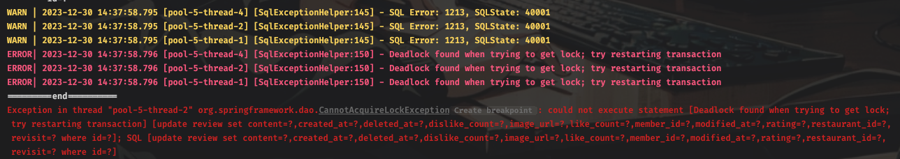
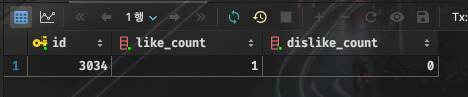
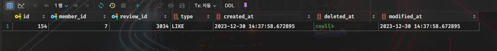
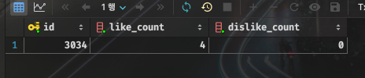
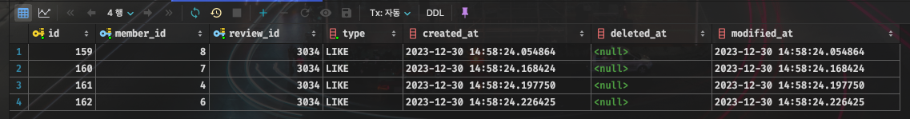

:::info
프로젝트를 진행하던 중 다음과 같은 상황에서 동시성 문제가 발생했습니다.
- [식당에 리뷰 작성] 평점, 리뷰 개수를 업데이트하는 로직
- [리뷰에 좋아요/싫어요] 좋아요/싫어요 개수를 업데이트하는 로직

__해결한 방법은 똑같아서 좋아요/싫어요 로직을 예시로 설명하겠습니다.__
:::

## 1. 동시성 문제 발생

```java
/// title: ReviewService.java
    @Transactional
    public void addReviewReaction(Long memberId, Long reviewId, Reaction reactionType) {
        Review review = reviewRepository.findBy(reviewId)
                                        .orElseThrow(() -> new ReviewException(NOT_FOUND_REVIEW));
        Member member = memberRepository.findById(memberId)
                                        .orElseThrow(() -> new MemberException(NOT_FOUND_MEMBER));

        // 이미 반응이 있다면 기존 반응 삭제 후 새로운 반응으로 업데이트
        if (review.hasReaction(member)) {
            updateReaction(review, member, reactionType);
        } else {
            addReaction(review, member, reactionType);
        }

        reviewRepository.save(review);
    }

    private void updateReaction(Review review, Member member, Reaction reaction) {
        ReviewReaction reviewReaction = review.getReviewReactions()
                                              .stream()
                                              .filter(r -> r.getMember().getId().equals(member.getId()))
                                              .findFirst()
                                              .orElseThrow(
                                                () -> new ReviewException(NOT_FOUND_REVIEW_REACTION));

        // 기존 반응과 같다면 반응 삭제 (아무것도 안누른 상태로 변경)
        if (reviewReaction.getReaction() == reaction) {
            reviewReactionRepository.delete(reviewReaction);
            review.removeReviewReaction(reviewReaction);
            if (reaction == Reaction.LIKE) {
                review.decreaseLikeCount();
            } else {
                review.decreaseDislikeCount();
            }
        } else { // 기존 반응과 다르다면 반응 업데이트
            reviewReaction.changeReaction(reaction);
            if (reaction == Reaction.LIKE) {
                review.increaseLikeCount();
                review.decreaseDislikeCount();
            } else {
                review.increaseDislikeCount();
                review.decreaseLikeCount();
            }
        }
    }

    private void addReaction(Review review, Member member, Reaction reaction) {
        ReviewReaction reviewReaction = ReviewReaction.from(review, member, reaction);
        review.addReviewReaction(reviewReaction);
        reviewReactionRepository.save(reviewReaction);
        if (reaction == Reaction.LIKE) {
            review.increaseLikeCount();
        } else {
            review.increaseDislikeCount();
        }
    }
```

처음엔 위 코드처럼 별다른 고민 없이 작성했습니다. 하지만 테스트를 진행하던 중 동시성 문제가 발생했습니다.

```java
/// title: 테스트 코드
    @Test
    void addReviewReaction_concurrency() throws InterruptedException {
        System.out.println("=========start==========");

        // given
        int numberOfThreads = 4;
        ExecutorService service = Executors.newFixedThreadPool(numberOfThreads);
        CountDownLatch latch = new CountDownLatch(numberOfThreads);

        Long[] memberIds = new Long[]{4L, 6L, 7L, 8L};
        // when
        for (int i = 0; i < numberOfThreads; i++) {
            int idx = i;
            service.execute(() -> {
                try {
                    // TODO: Replace with actual parameters
                    Long memberId = memberIds[idx];
                    Long reviewId = 3034L;
                    Reaction reactionType = Reaction.LIKE;

                    reviewService.addReviewReaction(memberId, reviewId, reactionType);
                } finally {
                    latch.countDown();
                }
            });
        }

        // then
        latch.await();  // wait for all threads to finish
        service.shutdown();
        System.out.println("=========end==========");

        List<ReviewReaction> reactions = reviewReactionRepository.findAll();
        Review review = reviewRepository.findById(3034L).get();

        assertSoftly(softly -> {
            softly.assertThat(reactions.size()).isEqualTo(4);
            softly.assertThat(review.getLikeCount()).isEqualTo(4);
        });

    }
```

4개의 스레드를 생성하여 4명의 유저가 동시에 좋아요를 누르는 상황을 시뮬레이션 했습니다. 그 결과 다음과 같은 에러가 발생했습니다.



해당 오류는 MySQL에서 발생하는 에러로, 동시에 여러 트랜잭션이 같은 데이터에 접근하여 `데드락`이 발생했다는 의미입니다.

:::tip
`데드락`이란?

한국말로 `교착 상태`를 뜻하며, 두 개 이상의 프로세스나 스레드가 같은 자원을 사용하려고 할 때 발생하는 상황입니다.

서로 상대방의 작업이 끝나기만을 기다리고 있기 때문에, 무한정 기다리는 상태가 됩니다.
:::

때문에 쿼리가 정상적으로 실행되지 않고, 다음과 같은 결과가 나옵니다.

```sql
select r.id, r.like_count, r.dislike_count from review r where id = 3034;

select * from review_reaction where review_id = 3034;
```




원래라면 like_count가 4가되고, review_reaction 테이블에는 4개의 row가 생성되어야 합니다.

하지만 데드락이 발생하여 like_count가 1이 되고, review_reaction 테이블에는 1개의 row만 생성되었습니다.

## 2. 해결 방법

데드락이 발생한 이유는 `동시에 같은 데이터에 접근`했기 때문입니다. 따라서 동시에 접근하지 못하도록 `Lock`을 걸어주면 해결할 수 있습니다.

많은 방법이 존재하지만, 여기서는 `Pessimistic Locking(비관적 락)`을 사용했습니다.

### 2-1. Pessimistic Locking (비관적 락)

:::info
`Pessimistic Locking`이란?

데이터를 사용하는 동안 다른 사용자가 해당 데이터를 변경하지 못하도록 데이터에 락을 거는 방법입니다.

`DB 레벨에서 락을 걸어주기 때문에, tx가 많이 발생하는 경우 성능이 저하될 수 있습니다.`

- `PESSIMISTIC_READ`: 락이 걸린 데이터를 다른 사용자가 읽을 수 있지만, 수정/삭제할 수는 없음
- `PESSIMISTIC_WRITE`: 락이 걸린 데이터를 다른 사용자가 읽을 수 없고, 수정/삭제도 할 수 없음
:::

```java
@Repository
public interface ReviewRepository extends JpaRepository<Review, Long> {

    // ...

    @Lock(LockModeType.PESSIMISTIC_READ)
    @Query("select r from Review r where r.id = :reviewId")
    Optional<Review> findByIdWithPessimisticLock(Long reviewId);
}
```

JPA에서는 `@Lock` 어노테이션을 사용하여 락을 걸 수 있습니다. 처음엔 `PESSIMISTIC_READ`를 사용해봤는데, 똑같이 데드락이 발생했습니다.

이유는 `PESSIMISTIC_READ`는 데이터를 읽을 때만 락을 걸기 때문입니다. 따라서 데이터를 읽은 후에는 락이 풀리기 때문에, 다른 사용자가 데이터를 수정할 수 있습니다.

그래서 `PESSIMISTIC_WRITE`를 사용하여 데이터를 읽고 수정할 때까지 락을 걸어주었습니다.

```java
/// title: ReviewService.java
    @Transactional
    public void addReviewReaction(Long memberId, Long reviewId, Reaction reactionType) {
        Review review = reviewRepository.findByIdWithPessimisticLock(reviewId)
                                        .orElseThrow(() -> new ReviewException(NOT_FOUND_REVIEW));
        Member member = memberRepository.findById(memberId)
                                        .orElseThrow(() -> new MemberException(NOT_FOUND_MEMBER));

        // 이미 반응이 있다면 기존 반응 삭제 후 새로운 반응으로 업데이트
        if (review.hasReaction(member)) {
            updateReaction(review, member, reactionType);
        } else {
            addReaction(review, member, reactionType);
        }

        reviewRepository.save(review);
    }

    // ...
```

만들어준 `findByIdWithPessimisticLock` 메서드를 사용하여 데이터가 변경되는 Review 테이블에 락을 걸어주었습니다.

그 결과 데드락이 발생하지 않고, 정상적으로 테스트가 통과되었습니다.




## 마치며

`Pessimistic Locking`을 사용하여 동시성 문제를 해결했지만, DB 레벨에서 락을 거는 방법이기 때문에 성능이 저하될 수 있습니다.

또한 실무에서는 잘 사용하지 않는다하고, 서비스 레이어에서 락을 거는 방법을 이용한다는데 [다음 글](https://k-devlog.vercel.app/troubleshooting-concurrency2)에서 Redis를 활용한 분산 락을 구현해보겠습니다.
