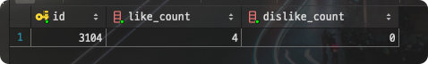
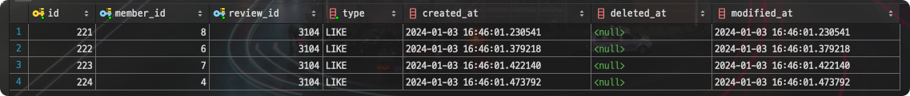
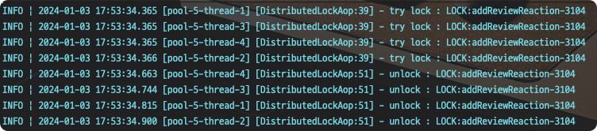

:::info
[이전 글](https://k-devlog.vercel.app/troubleshooting-concurrency1)에서는 `Pessimistic Locking`을 이용해 동시성 문제를 해결하는 방법을 정리했습니다.

이번 글에서는 Redis를 이용해 `Distributed Locking`을 구현하는 방법에 대해 알아보겠습니다.
:::
        
## Distributed Lock (분산 락)

앞 서 살펴본 `Pessimistic Locking`은 DB 레벨에서 락을 거는 방법이었습니다.

한번에 한 개의 트랜잭션만 접근할 수 있기 때문에, 데이터 정합성과 데드락 문제는 해결되지만 tx가 많이 발생하는 경우 긴 대기시간으로 인해 성능이 저하될 수 있습니다.
또한, 데이터베이스 자체적으로 애플리케이션은 모르는 이런 저런 락(X-lock, S-lock 등)을 걸어주기 때문에, 애플리케이션에서 어떤 부작용이 발생할지 예측하기 어렵습니다.

이런 문제를 해결하기 위해 자바에서는 Redis를 활용하여 동시성 문제를 해결할 수 있는데, **Lettuce**와 **Redisson**이 대표적인 라이브러리입니다.

### Lettuce

하지만 Lettuce를 사용하여 레디스 분산 락을 구현하면, 일반적으로 스핀 락 형태로 구현됩니다. 스핀 락은 락을 획득할 수 있을 때까지 계속 시도하는 방식입니다. 이를 위해 `SETNX` 명령어를 사용하여 락을 설정하고, 락이 해제될 때까지 `GET` 명령어를 사용하여 락의 상태를 확인합니다.
때문에 **Redis에 많은 부하가 발생**하게 됩니다.

:::tip
`SETNX` : SET if Not eXists의 줄임말로 키가 존재하지 않을 때만 값을 저장하는 명령어입니다.
:::

### Redisson

반면에 Redisson은 Lettuce처럼 주기적으로 락 획득 요청을 보내는 것이 아니라, 락을 획득할 때까지 대기하는 방식으로 구현됩니다. (Pub/Sub 방식)

또한, 락을 획득했을 때의 타임아웃과, 락 대기 타임아웃을 설정할 수 있어서 효과적으로 락을 관리할 수 있습니다.

:::tip
`Pub/Sub` : Publisher/Subscriber의 줄임말로, 메시지를 발행하는 Publisher와 메시지를 수신하는 Subscriber로 구성된 메시지 패턴
:::

#### Redisson 구현

우선 Redisson을 사용하기 위해 의존성을 추가해줍니다.

```groovy
/// title: build.gradle
    // redisson
    implementation 'org.redisson:redisson-spring-boot-starter:3.23.1'
```

그리고 Redisson을 사용하기 위해 `RedissonClient`를 빈으로 등록해줍니다.

```java
/// title: RedisConfig.java
@Configuration
public class RedisConfig {

    private static final String REDISSON_HOST_PREFIX = "redis://";
    @Value("${spring.data.redis.host}")
    private String host;
    @Value("${spring.data.redis.port}")
    private int port;

    @Bean
    public RedissonClient redissonClient() {
        RedissonClient redisson;
        Config config = new Config();
        config.useSingleServer()
              .setAddress(REDISSON_HOST_PREFIX + host + ":" + port);
        redisson = Redisson.create(config);
        return redisson;
    }
}
```

또한 분산락을 편리하게 사용하기 위해 어노테이션 기반으로 AOP를 이용합니다.

```java
/// title: DistributedLock.java
import java.lang.annotation.ElementType;
import java.lang.annotation.Retention;
import java.lang.annotation.RetentionPolicy;
import java.lang.annotation.Target;
import java.util.concurrent.TimeUnit;

@Target(ElementType.METHOD)
@Retention(RetentionPolicy.RUNTIME)
public @interface DistributedLock {

    // 락의 이름
    String key();

    // 락의 시간 단위
    TimeUnit timeUnit() default TimeUnit.SECONDS;

    // 락을 기다리는 시간 (기본값 5s)
    long waitTime() default 5L;

    // 락을 유지하는 시간 (기본값 3s)
    long leaseTime() default 3L;
}
```

해당 어노테이션을 사용하여 커스텀하게 분산락을 사용할 수 있습니다.

```java
/// title: DistributedLockAop.java
import java.lang.reflect.Method;
import lombok.RequiredArgsConstructor;
import lombok.extern.slf4j.Slf4j;
import matgo.global.lock.annotation.DistributedLock;
import matgo.global.lock.util.CustomSpringELParser;
import org.aspectj.lang.ProceedingJoinPoint;
import org.aspectj.lang.annotation.Around;
import org.aspectj.lang.annotation.Aspect;
import org.aspectj.lang.reflect.MethodSignature;
import org.redisson.api.RLock;
import org.redisson.api.RedissonClient;
import org.springframework.stereotype.Component;

@Aspect
@Component
@RequiredArgsConstructor
@Slf4j
public class DistributedLockAop {

    private static final String REDISSON_LOCK_PREFIX = "LOCK:";

    private final RedissonClient redissonClient;
    private final AopForTransaction aopForTransaction;

    @Around("@annotation(matgo.global.lock.annotation.DistributedLock)")
    public Object lock(final ProceedingJoinPoint joinPoint) throws Throwable {
        MethodSignature signature = (MethodSignature) joinPoint.getSignature();
        Method method = signature.getMethod();
        DistributedLock distributedLock = method.getAnnotation(DistributedLock.class);

        String key = REDISSON_LOCK_PREFIX + CustomSpringELParser.getDynamicValue(signature.getParameterNames(),
          joinPoint.getArgs(), distributedLock.key());
        RLock rLock = redissonClient.getLock(key); // 1. 락 이름으로 RLock 인스턴스 생성

        try {
            log.info("try lock : {}", key);
            boolean available = rLock.tryLock(distributedLock.waitTime(), distributedLock.leaseTime(),
              distributedLock.timeUnit()); // 2. 락 획득 시도
            if (!available) {
                return false;
            }
            return aopForTransaction.proceed(joinPoint); // 3. 트랜잭션 분리
        } catch (InterruptedException e) {
            log.error("Redisson Lock Interrupted in {} / {}", method.getName(), key);
            throw new InterruptedException("락 획득 실패");
        } finally {
            try {
                log.info("unlock : {}", key);
                rLock.unlock(); // 4. 락 해제
            } catch (IllegalMonitorStateException e) {
                log.error("Redisson Lock Already UnLock in {} / {}", method.getName(), key);
            }
        }
    }
}
```

다음은 `@DistirbutedLock` 어노테이션 선언 시 수행되는 aop 클래스입니다.

1. 락 이름으로 RLock 인스턴스 생성
2. 정의된 waitTime동안 락 획득 시도, leaseTime이 지나면 락 해제
3. `@DistirbutedLock` 어노테이션을 사용한 메서드를 별도의 트랜잭션으로 분리
4. 락 해제

여기서 `CustomSpringELParser`는 `@DistirbutedLock` 어노테이션의 key에 SpEL 표현식을 사용할 수 있도록 도와주는 클래스입니다.

```java
/// title: CustomSpringELParser.java
public class CustomSpringELParser {
    private CustomSpringELParser() {
    }

    public static Object getDynamicValue(String[] parameterNames, Object[] args, String key) {
        ExpressionParser parser = new SpelExpressionParser();
        StandardEvaluationContext context = new StandardEvaluationContext();

        for (int i = 0; i < parameterNames.length; i++) {
            context.setVariable(parameterNames[i], args[i]);
        }

        return parser.parseExpression(key).getValue(context, Object.class);
    }
}
```

그리고 AopForTransaction 클래스를 이용하여 전달받은 메서드를 별도의 트랜잭션으로 분리해줍니다.

```java
/// title: AopForTransaction.java
/**
 * AOP에서 트랜잭션 분리를 위한 클래스
 */
@Component
public class AopForTransaction {

    @Transactional(propagation = Propagation.REQUIRES_NEW) // REQUIRES_NEW : 부모 트랜잭션의 유무에 상관없이 새로운 트랜잭션을 생성
    public Object proceed(final ProceedingJoinPoint joinPoint) throws Throwable {
        return joinPoint.proceed();
    }
}
```

`@Transactional(propagation = Propagation.REQUIRES_NEW)` 옵션을 통해 별도의 트랜잭션으로 분리해줍니다.

`DistributedLockAop` 클래스를 보면

1. `@Around` 어노테이션으로 분산 락이 적용된 메서드를 감쌈
2. 이 메서드 내에서 먼저 락을 획득
3. 그 다음에 AopForTransaction 클래스를 이용하여 메서드를 별도의 트랜잭션으로 분리
   - 메서드가 실행되는 동안 수행되는 모든 데이터베이스 작업은 하나의 트랜잭션으로 묶임
   - 이 트랜잭션은 proceed 메서드가 종료될 때 커밋됨 
4. finally 블록에서 락을 해제

이런 식으로 동작하는데, 트랜잭션 커밋 후에 락이 해제되기 때문에 **데이터의 정합성을 보장**할 수 있습니다.

이제 분산 락을 적용하기 위한 준비가 끝났습니다.

### Test

```java
@DistributedLock(key = "'addReviewReaction-' + #reviewId")
public void addReviewReaction(Long memberId, Long reviewId, Reaction reactionType) {
    Review review = reviewRepository.findById(reviewId)
                                    .orElseThrow(() -> new ReviewException(NOT_FOUND_REVIEW));
    Member member = memberRepository.findById(memberId)
                                    .orElseThrow(() -> new MemberException(NOT_FOUND_MEMBER));

    // 이미 반응이 있다면 기존 반응 삭제 후 새로운 반응으로 업데이트
    if (review.hasReaction(member)) {
        updateReaction(review, member, reactionType);
    } else {
        addReaction(review, member, reactionType);
    }

    reviewRepository.save(review);
}
```

제 서비스코드에는 다음과 같은 메서드가 있습니다.

1. 리뷰에 좋아요/싫어요를 추가할 수 있음
2. 리뷰에 좋아요/싫어요를 추가할 때, 이미 반응이 있다면 기존 반응 삭제 후 새로운 반응으로 업데이트
3. 첫 반응이라면 새로운 반응을 추가

기존에는 동시성 문제를 고려하지 않아서 여러 유저가 동시에 같은 리뷰에 반응을 추가할 경우, 데이터의 정합성이 깨지는 문제가 있었습니다.

이제 분산 락을 적용하여 동시성 문제를 해결해보겠습니다.

```java
/// title: LockTest.java
@SpringBootTest
public class ReviewServiceLockTest {

    @Autowired
    private ReviewService reviewService;
    @Autowired
    private ReviewReactionRepository reviewReactionRepository;
    @Autowired
    private ReviewRepository reviewRepository;

    @Test
    void addReviewReaction_concurrency() throws InterruptedException {
        // given
        int numberOfThreads = 4;
        ExecutorService service = Executors.newFixedThreadPool(numberOfThreads);
        CountDownLatch latch = new CountDownLatch(numberOfThreads);

        Long reviewId = 3104L;
        Reaction reactionType = Reaction.LIKE;
        Long[] memberIds = new Long[]{4L, 6L, 7L, 8L};
        // when
        for (int i = 0; i < numberOfThreads; i++) {
            int idx = i;
            service.execute(() -> {
                try {
                    Long memberId = memberIds[idx];
                    reviewService.addReviewReaction(memberId, reviewId, reactionType);
                } finally {
                    latch.countDown();
                }
            });
        }

        // then
        latch.await();  // wait for all threads to finish
        service.shutdown();

        List<ReviewReaction> reactions = reviewReactionRepository.findAll().stream()
                                                                 .filter(reviewReaction -> reviewReaction.getReview()
                                                                                                         .getId()
                                                                                                         .equals(
                                                                                                           reviewId))
                                                                 .toList();
        Review review = reviewRepository.findById(reviewId).get();

        assertSoftly(softly -> {
            softly.assertThat(reactions.size()).isEqualTo(4);
            softly.assertThat(review.getLikeCount()).isEqualTo(4);
        });

    }
}
```

4명의 유저가 동시에 같은 리뷰에 좋아요를 누르는 상황을 시뮬레이션 했습니다.

```sql
select r.id, r.like_count, r.dislike_count from review r where id = 3104;

select * from review_reaction where review_id = 3104;
```




위와 같이 정상적으로 데이터가 업데이트 되었습니다.



그리고 4개의 락이 생성되고 해제되는 것도 확인할 수 있습니다.

## Reference

- [kurly 기술 블로그](https://helloworld.kurly.com/blog/distributed-redisson-lock/#5-%EB%A7%88%EC%B9%98%EB%A9%B0)

