# 들어가기 앞서..

:::info
이 글은 제로베이스 백엔드 취업 스쿨을 수강하고 느낀 점을 회고하는 글입니다.

**100%** 주관적인 내용이며, 6개월간의 과정을 통해 얻은 경험과 지식을 글로 작성해두기 위한 목적으로 작성되었습니다.
:::

---

## 개발자를 꿈꾸게 된 이유

간단히 저의 소개를 하자면, 대학교에서 전기분야를 전공하고 전력 공기업을 준비하던 공대생이었습니다.

열심히 스펙을 쌓고 목표였던 공기업의 인턴생활을 하게 되었지만, 막상 일을 하고 나니 제가 생각했던 회사의 모습과는 많이 다르다는 것을 느꼈습니다.
그제서야 **"내가 하고 싶은 일이 무엇일까?"** 라는 생각이 들었고, 취업이 늦어지더라도 하고 싶은 일을 찾아보았습니다.

그러던 중, 대학교 때 배웠던 프로그래밍 언어(C언어), 운영체제, 네트워크 과목이 생각나서 코딩을 해보기로 결심했습니다.

단순히 코드 좀 따라쳐보고, 함수 몇개 만들어보면서 실행시켜봤을 뿐인데 **"이게 너무 재밌다."** 라는 생각이 들었습니다.
단순 암기 위주의 공부가 아닌, **문제를 해결하는 과정**이 재밌었고, 이를 통해 내가 만들고 싶은 것을 만들 수 있다는 것이 매력적으로 느껴졌습니다.

---

## 비전공자에게 개발 공부란?

대학교에서 들었던 프로그래밍 언어(C언어)와 운영체제, 네트워크 과목을 다시 공부하고 싶었지만, **어떻게 공부해야할지** 감이 잡히지 않았습니다.
그렇게 1~2달의 시간을 허비하고 나니, **"혼자서는 안되겠다."** 라는 생각이 들었습니다.

길잡이가 필요했고, 전문적인 교육을 받고 싶었지만 **비용적인 부담**이 있었습니다. 그래서 **무료 국비과정**을 찾아보게 되었습니다.
그렇게 무료 국비과정으로 스X르타 코딩클럽에서 4개월간 Node 백엔드 과정을 수강하였습니다.

---

## 왜 다시 제로베이스 백엔드 취업 스쿨을 수강하게 되었나?

국비과정을 수강하면서 시간이 지날수록 단순히 코딩을 하는게 아니라, 기본 개념을 이해하면서 코딩을 해야한다는 것을 느꼈습니다.

**CS 공부의 필요성**을 느끼게 되었고, JS, Node 뿐아니라 `Java`, `Springboot`를 공부하고 싶었습니다. (여러 언어를 써보고 싶었고 한국에선 Springboot를 많이 사용한다고 해서..)

독학을 할 수 있었지만, 효율적인 공부를 위해 새로 교육과정을 찾아보게 됐고 취준생인 저에겐 조건이 있었습니다.

:::info 조건
1. **온라인**으로 수강할 수 있어야 했습니다.
   - 지방에 거주하고 있어서 오프라인 수업은 불가능했습니다.
2. **비용적인 부담**이 적어야 했습니다.
   - 다른 부트캠프들은 선불과정밖에 없었고, 취준생인 저에겐 부담이었습니다.
:::

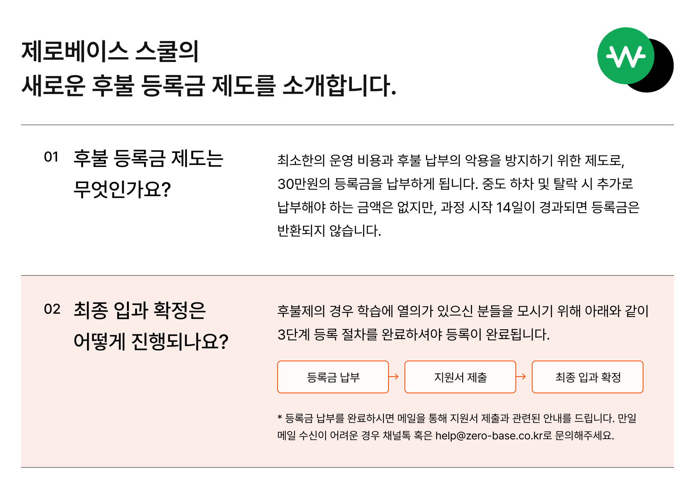

그러던 중, 제로베이스 백엔드 취업 스쿨을 알게 되었고 위 조건에 부합하여 선택하게 되었습니다.

또한, 선발절차가 복잡하지 않아서 부담없이 신청할 수 있어서 비전공자인 저에게는 좋은 기회였습니다.

(다른 부트캠프들은 코딩테스트, 면접 등의 절차가 있었는데, 제로베이스는 간단한 자기소개서로 지원할 수 있었습니다.)

---

# 그래서 제로베이스 백엔드 취업 스쿨은 어땠을까?

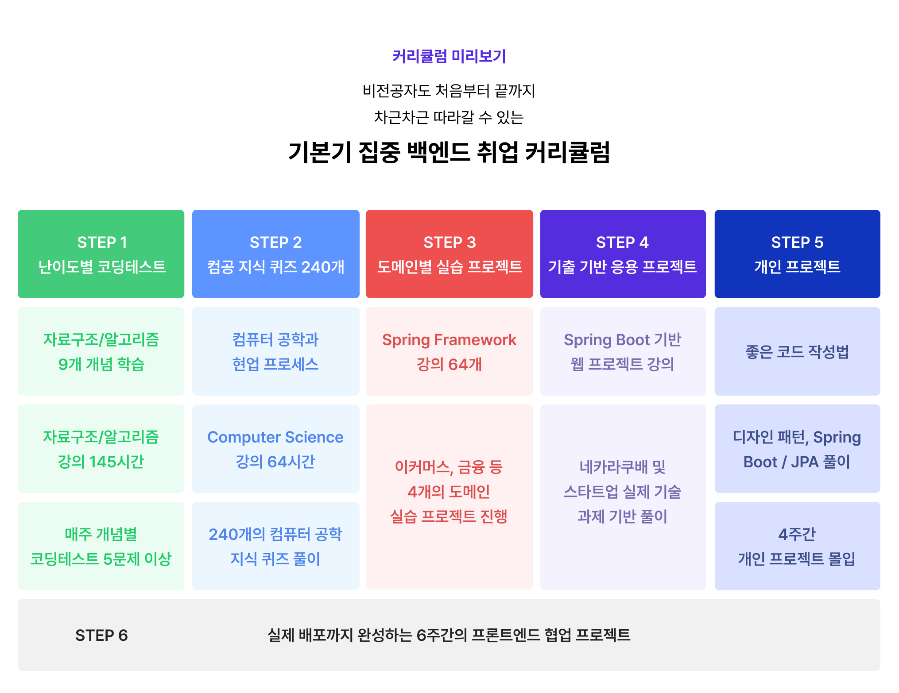

## 커리큘럼

### Step 1. 코딩테스트

제로베이스 백엔드 스쿨의 첫인상은 **빡쌔다..** 였습니다.

첫 과정부터 `자료구조/알고리즘`을 배우고 매주 모의 코딩테스트를 진행했습니다. 

Java 언어를 배운지 얼마 안돼서 코드로 구현하는 것이 많이 서툴었고 테스트를 보고 매주 점수가 기록되니까 많이 부담스러웠습니다.

그래도 제공되는 강의들과 매 코딩테스트 후에 올라오는 해설강의를 보면서 완벽하게 이해하진 못해도 조금씩 성장해가는 것을 느낄 수 있었습니다.
또한, 코딩테스트 플랫폼이 [프로그래머스](https://programmers.co.kr/)였는데 실제 기업들과 같은 환경에서 테스트를 해볼 수 있는게 좋았습니다.

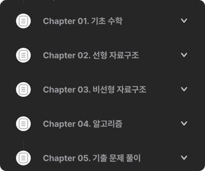
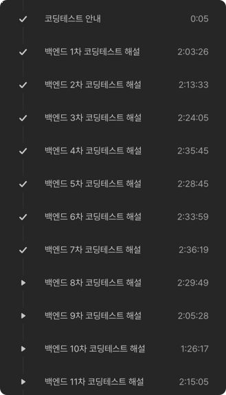

### Step 2. CS 공부

이렇게 매주 Java 강의를 듣고, 코딩테스트 후에는 전반적인 `CS` 지식을 배웠습니다.

`운영체제`, `네트워크`, `데이터베이스`, `웹` 등의 기본적인 지식을 배웠고, 이론을 배운 후에는 코딩테스트와 같이 매주 객관식 퀴즈를 풀면서 복습을 할 수 있었습니다.
CS 퀴즈도 매주 점수가 기록되고 순위가 매겨져서 다른 수강생들과 경쟁하면서 공부할 수 있었습니다.

**제로베이스 과정 중에서 가장 마음에 들었던 부분**이기도 합니다. 물론 짧은 시간동안 방대한 CS 지식을 완벽히 이해하면서 습득하긴 어려웠지만
앞으로 어떻게 공부를 해야할지 방향성을 잡을 수 있었고 애초에 CS 공부는 전문서적을 보면서 다시 공부해야겠다는 생각을 했었는데, 이 과정을 통해 책을 봐도 이해할 수 있게 되었습니다.

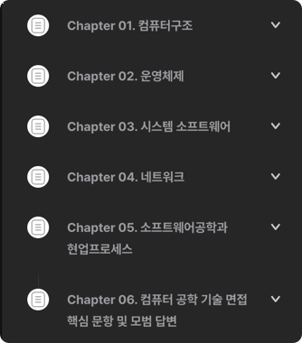

### Step 3. 도메인별 실습 프로젝트

앞선 Step 1,2 부분을 약 3개월동안 진행하는데, 전에 수강했던 국비과정과는 다르게 **기초부분을 철저히 다지고 넘어가는 것**이 좋았습니다.
개인별로 초반 3개월이 지루할 수도, 어려울 수도 있겠지만 이 부분이 **제로베이스의 강점**이라고 생각합니다.

전에 수강했던 국비과정은 기초부분을 빠르게 넘어가고 실습 프로젝트 위주로 진행되었는데, 이 부분이 제로베이스와 다른 부분이었습니다.
맨땅에 헤딩하는 식으로 프로젝트 위주로 진행해서 빠르게 프레임워크 사용법을 배울 수 있었지만, 기초부분을 제대로 이해하지 못한 상태에서 프로젝트를 진행하다보니 이해가 안되는 부분이 많았습니다.

단순히 프레임워크 사용법을 익히는 것이 아니라, 작동 원리를 이해하고 사용하는 것이 중요하다고 생각하기 때문에 이 부분이 제로베이스의 강점이라고 생각합니다.
Step 1,2에서 배운 지식을 바탕으로 Java 언어에 대한 이해도가 높아졌고 이를 바탕으로 Springboot 프레임워크를 배우니 이해가 빠르게 되었습니다.

특히 제로베이스 **양세열 강사님의 강의**가 개인적으로 도움이 많이 되었습니다. 전반적인 스프링 프레임워크 작동원리를 배울 수 있었고, 이 강의에서 배운
`예외처리`, `AOP` 등의 내용들을 이따 소개할 최종 프로젝트에서도 똑같이 사용할 수 있었습니다.

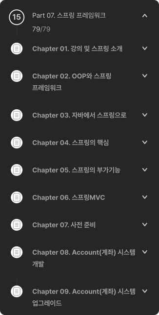

이 외에도 스크래핑, docker, AWS 등 다양한 스택들을 배울 수 있는 강의들로 구성되어 있어서 많은 것을 배울 수 있었습니다.

### Step 4. 기출 기반 응용 프로젝트

Step 3에선 강의를 듣고 실습을 통해 스프링 프레임워크의 사용법을 익혔다면 Step 4에서는 과제를 통해 배운 내용을 **응용**하는 것이 중요했습니다.

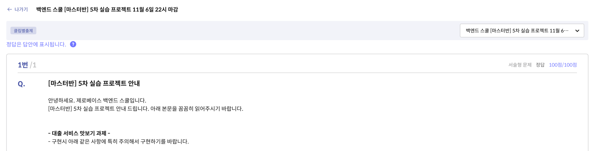

각 과제 별로 요구사항이 주어지고, 이를 바탕으로 구현하는건데 다 구현하고 **멘토님의 피드백**을 받을 수 있었습니다. 피드백을 통해 현업에서 
어떤식으로 코드를 작성해야하는지, 어떤식으로 프로젝트를 진행해야하는지 등을 배울 수 있었습니다.

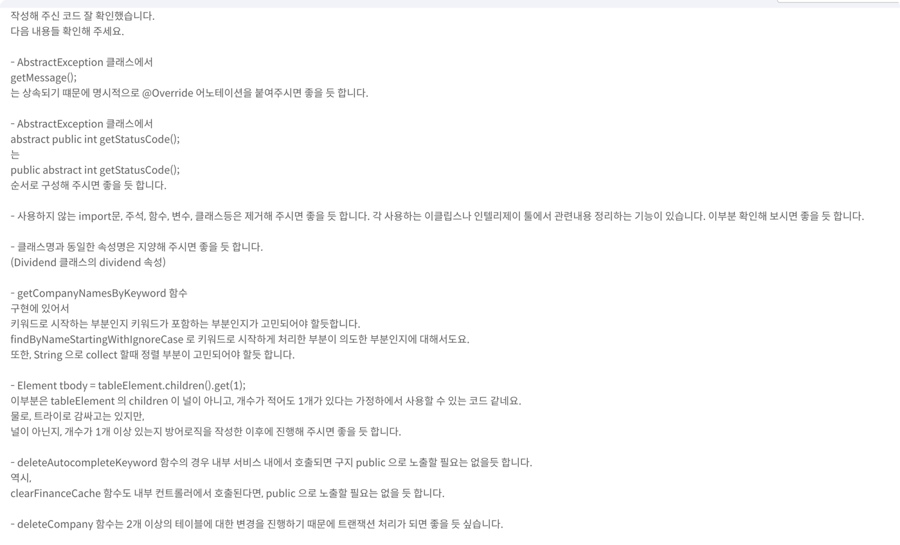

### Step 5. 개인 프로젝트

최종 프로젝트에 들어가기 전에 각자가 원하는 주제로 프로젝트를 진행하는데, 이때는 `Slack`, `Github`를 통해 멘토님과 소통하면서 프로젝트를 진행했습니다.

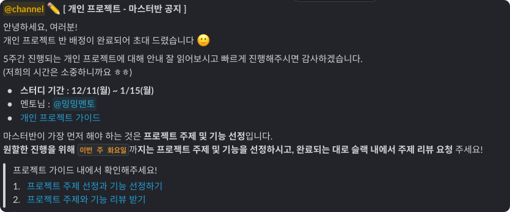

본인이 정한 주제에 대해 기획, 설계를 하고 멘토님에게 피드백을 받으며 진행합니다. 기획 단계를 통과하면 프로젝트를 진행하는데,
이때부턴 **PR을 통해 코드리뷰**를 받고 **다른 수강생들의 프로젝트도 리뷰**하는 등 현업에서 개발을 진행할 때 필요한 역량을 키울 수 있었습니다.

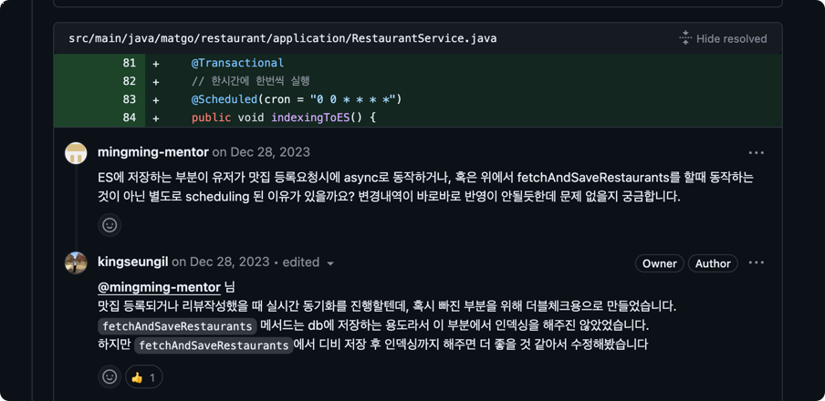

이처럼 PR을 통해 멘토님에게 리뷰받을 수 있는데 지금와서 생각해보니 질문을 많이 하지않고 채점하는 식으로 진행했던 것 같아서 아쉬웠습니다.
최대한 질문을 많이하고 멘토님을 귀찮게(?)하면서 리뷰를 받았다면 더 많은 것을 배울 수 있었을 것 같습니다.

### Step 6. 최종 프로젝트 (프론트엔드와 협업)

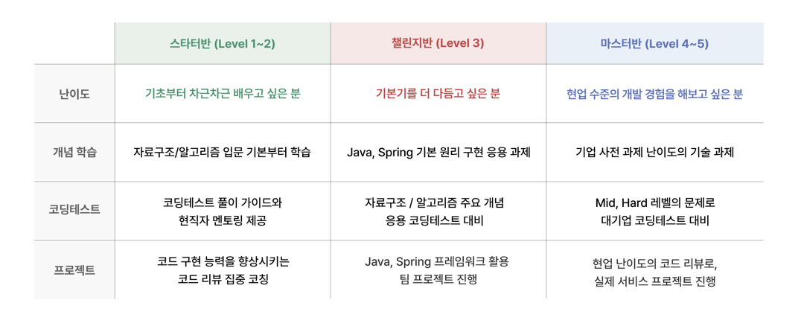

최종 프로젝트는 **챌린지반**과 **마스터반**으로 나뉘어서 진행되는데 코딩테스트, CS 퀴즈, 과제들의 점수에서 상위권에 든 수강생들이 마스터반에 배정되어 프로젝트를 진행합니다.
저는 운이 좋아서 마스터반에 배정되어 프로젝트를 진행했는데, 이때 **프론트엔드** 수강생들과 협업을 통해 프로젝트를 진행할 수 있는 기회를 가졌습니다.

하지만 개인프로젝트는 혼자서 모든 것을 결정하고 진행했는데, 팀 프로젝트는 시작부터 난관이 많았습니다.
다들 처음보는 사람들이라 어색했는데 바로 팀장을 정해야 했습니다.
당연히 자진해서 팀장을 하겠다는 사람은 없었고, 사다리 타기를 통해 정할까 했는데 그냥 제가 팀장을 하겠다고 했습니다..ㅎㅎ
전에 국비과정에서 팀 프로젝트를 해본 경험이 있었고, 이왕 프로젝트 할거면 제대로 해보자는 마음으로 팀장을 자진했습니다.

그래서 어떻게 프로젝트를 효율적으로 진행할 수 있을까? 고민하다가 `Notion`과 `Github` 기능을 최대한 활용하고자 했습니다.
그래서 [팀 노션](https://www.notion.so/Let-Eat-go-f60f67d10788445a9a32db3105b74506)을 만들어서 모든 회의 내용, 일정 등을 기록하고
[Github](https://github.com/orgs/let-eat-go/projects?query=is%3Aopen) Project, milestone, issue 등을 활용해서 프로젝트를 진행했습니다.

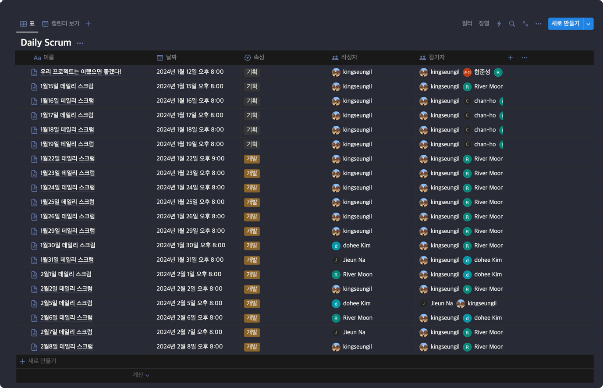

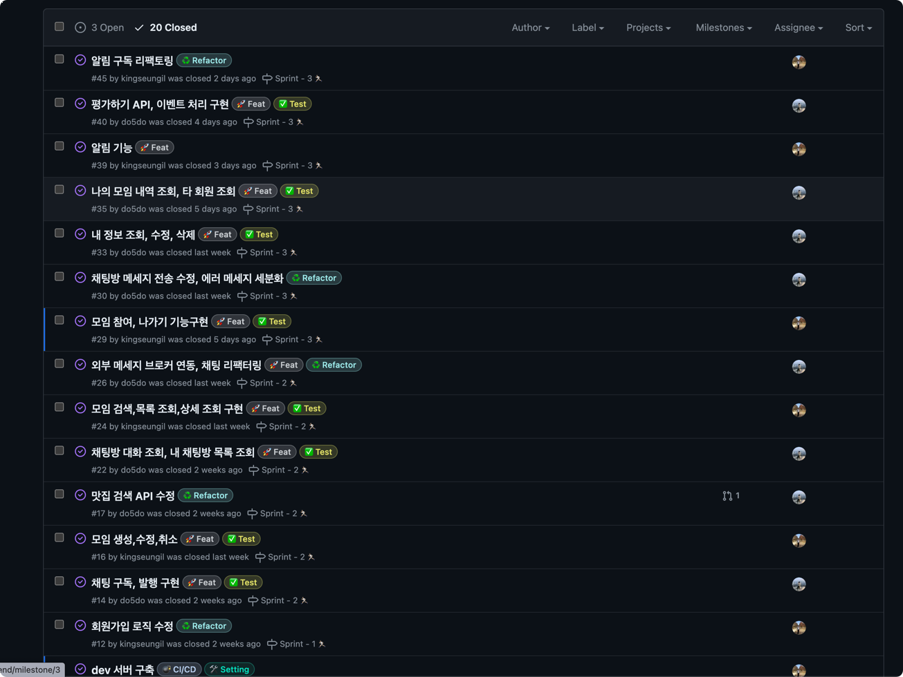

이렇게 실제 협업에서 사용하는 툴들을 사용하면서 팀원들과 소통하고 프로젝트를 관리하는 방법을 배울 수 있었고 특히 **문서화의 중요성**을 배울 수 있었습니다. 

그리고 1주일에 한번씩 멘토님과의 **멘토링**을 통해 질문을 할 수 있었고, 코드리뷰도 받을 수 있었습니다. 현업 개발자분의 조언을 받는다는 것이 흔치 않은 기회인데 
제로베이스 백엔드 스쿨을 통해 이런 기회를 가질 수 있었습니다.

---

# 마치며

제로베이스 백엔드 취업 스쿨을 수강하면서 많은 것을 배웠습니다. **코딩테스트, CS 지식, Springboot 프레임워크, 협업** 등 다양한 것을 배울 수 있었고
앞으로 있을 커리어 서비스 (취업 지원 서비스)를 통해 성공적인 취업을 할 수 있을거라 생각합니다.

[제로베이스 백엔드 스쿨](https://zero-base.co.kr/category_dev_camp/school_BE)에 대한 자세한 정보는 링크를 통해 확인할 수 있습니다.

또한 상세한 교육과정을 확인하고 싶다면 [제로베이스 백엔드 스쿨 교육과정](https://zero-base.notion.site/23546ef8df7545ad90d51d7a84d64bda)을 통해 확인할 수 있습니다.

긴 글 읽어주셔서 감사합니다. 😊